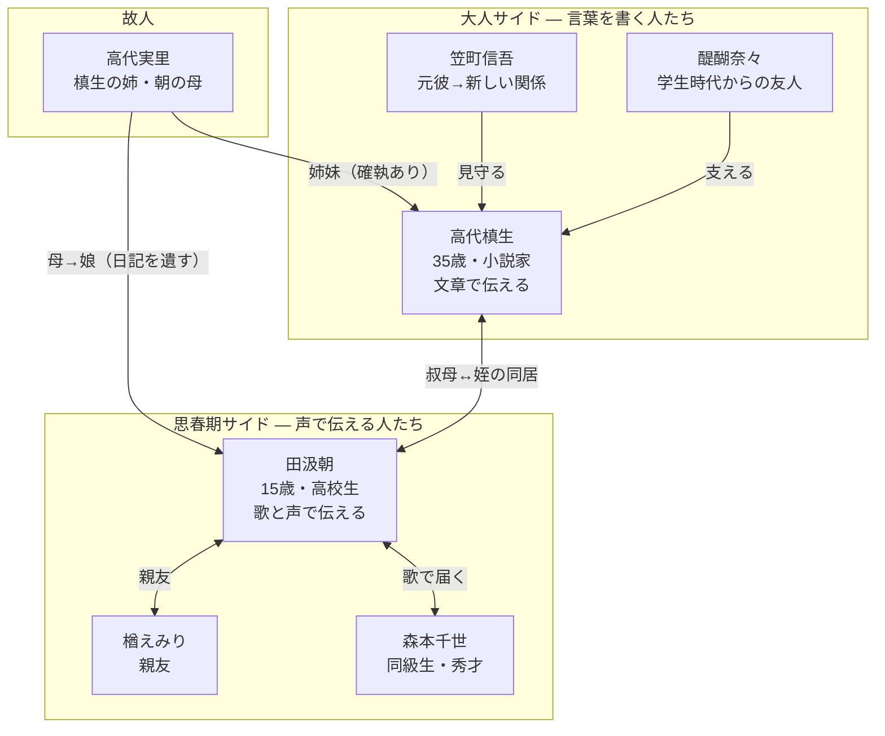

# 違国日記 OP・ED歌詞分析 — 15歳のノートと35歳の原稿用紙

TVアニメ『違国日記』（2026年1月〜3月放送）のOP「ソナーレ」とED「言伝」。もし**OP を15歳の朝が書いた歌詞**として、**ED を35歳のプロの小説家・槙生が書いた歌詞**として読んだら、何が見えてくるだろうか。

同じ「あなたに届けたい」という気持ちを、思春期の少女はスマホのメモ帳に走り書きし、小説家は推敲を重ねた原稿用紙に刻む。その**言葉の違いにこそ、「違国」が宿っている**。

本記事では、OPとEDの歌詞を**同じ分析軸で横並びに対比**しながら、二人の「違国語」を読み解いていく。

## 登場人物と相関図

まずは物語の主要人物を整理しよう。この作品の核心は、**コミュニケーションの仕方がまるで違う二人**の同居にある。

| 人物 | 立場 | 性格・特徴 |
|------|------|-----------|
| [高代槙生](https://ja.wikipedia.org/wiki/%E9%81%95%E5%9B%BD%E6%97%A5%E8%A8%98)（こうだい まきお） | 35歳・少女小説家（CV: 沢城みゆき） | 人見知りで不器用。**文章で考え、文章で伝える人**。直接の対話は苦手だが、たった一言の裏にある感情を読み取る想像力は鋭い |
| [田汲朝](https://ja.wikipedia.org/wiki/%E9%81%95%E5%9B%BD%E6%97%A5%E8%A8%98)（たくみ あさ） | 15歳・高校生（CV: 森風子） | 人懐っこく素直。**声と表情で伝え、肌感覚で受け取る人**。歌が得意で、槙生の鼻歌に感心される場面も |
| 高代実里（こうだい みのり） | 故人・槙生の姉、朝の母（CV: 大原さやか） | 朝に日記を遺す。槙生には高圧的だった |
| 笠町信吾（かさまち しんご） | 槙生の元彼（CV: 諏訪部順一） | 月日を経て槙生と「新しい関係」へ |
| 楢えみり（なら えみり） | 朝の親友（CV: 諸星すみれ） | 小学校からの付き合い。一時関係が悪化するも同じ高校に進学 |
| 森本千世（もりもと ちよ） | 朝の同級生（CV: 青木瑠璃子） | 秀才。世の中に絶望していたが、最終回で朝の歌に心を動かされる |



注目してほしいのは、**槙生の人間関係は「書く」ことを軸に回り、朝の人間関係は「声を出す」ことを軸に回っている**ということだ。この違いが、そのままOP・EDの歌詞の質感の違いになっている。

**参考ソース:**
- [違国日記 - Wikipedia](https://ja.wikipedia.org/wiki/%E9%81%95%E5%9B%BD%E6%97%A5%E8%A8%98)
- [『違国日記』とは？ 年の差20歳の叔母・姪の同居生活に癒されてときめく10の理由](https://booklive.jp/bkmr/ikokunikki)
- [『違国日記』から考えた他者理解の方法：槙生と朝の気になる"謎"](https://note.com/sakunary/n/n7fb2d5151711)

## 作品の核 — 「わかりあえない」を肯定する物語

『違国日記』は、[ヤマシタトモコ](https://ja.wikipedia.org/wiki/%E3%83%A4%E3%83%9E%E3%82%B7%E3%82%BF%E3%83%88%E3%83%A2%E3%82%B3)による漫画作品（『FEEL YOUNG』にて2017年〜2023年連載、全11巻、[累計205万部突破](https://ja.wikipedia.org/wiki/%E9%81%95%E5%9B%BD%E6%97%A5%E8%A8%98)）。2024年6月に実写映画（新垣結衣・早瀬憩出演）、2026年1月〜3月に[TVアニメ全13話](https://ja.wikipedia.org/wiki/%E9%81%95%E5%9B%BD%E6%97%A5%E8%A8%98)（監督: 大城美幸、脚本: 喜安浩平、制作: 朱夏）が放送された。

物語の始まりは残酷だ。中学3年の冬、[田汲朝は交通事故で両親を突然失う](https://booklive.jp/bkmr/ikokunikki)。葬儀の場で親戚中をたらい回しにされそうになった朝を、勢いで引き取ったのが叔母の槙生だった。

ここからが面白い。**この二人は、同じ日本語を話しているのに、まるで「違う国」の住人**なのだ。

たとえば原作1巻で、朝の親友・えみりから「最近どう？」というメッセージが届く場面。槙生はその一言の裏に、[「『元気？』『大丈夫？』『どうなった？』…いかにも心配そうに聞くのも、なんでもないふうに連絡するのも難しい。『最近どう？』って…その全部をがんばって詰め込んでくれたみたいな」](https://note.com/sakunary/n/n7fb2d5151711)という膨大な感情を読み取る。これは**文章のプロ**だからこそできる芸当だ。一方の朝なら、きっとそのメッセージを読んで「えみり、やさしいな」とただ感じるだろう。

日常生活で例えるなら、こういうことだ。友達から「ごめんね」と言われたとき、朝は声のトーンと表情で「あ、本当に申し訳なく思ってるんだな」と感じ取る。槙生はその「ごめんね」の語順、助詞の選び方、言い淀みのパターンから相手の心理を解析する。**同じ言葉を、身体で受け取るか、テキストとして分析するか**。まさに「違国」の住人だ。

作者のヤマシタトモコは、[「そもそも私はコミュニケーションというものが成立するとは全く思っていなくて、その差をどう埋めていくかみたいな話を『違国日記』はずっとやっています」](https://note.com/sakunary/n/n7fb2d5151711)と語っている。

この**「わかりあえなさ」を絶望ではなく、出発点にする物語**。そのOP・EDの歌詞もまた、見事に「わかりあえない二人の言語」で書かれている。

**参考ソース:**
- [違国日記 - Wikipedia](https://ja.wikipedia.org/wiki/%E9%81%95%E5%9B%BD%E6%97%A5%E8%A8%98)
- [アニメ『違国日記』は朝＆槙生の成長にどう向き合ったのか 喜安浩平が明かす脚色術](https://realsound.jp/movie/2026/03/post-2326164.html)
- [『違国日記』から考えた他者理解の方法：槙生と朝の気になる"謎"](https://note.com/sakunary/n/n7fb2d5151711)
- [『違国日記』とは？ 年の差20歳の叔母・姪の同居生活に癒されてときめく10の理由](https://booklive.jp/bkmr/ikokunikki)

## 歌詞テクスト並列比較 — 一行ずつ並べて見る

OP[「ソナーレ」（TOMOO）](https://www.uta-net.com/song/385924/)とED[「言伝」（Bialystocks）](https://www.uta-net.com/song/385824/)の歌詞を、テーマごとに対応するフレーズで並べてみよう。同じ感情を表現しているのに、**ここまで言葉が違う**ことに驚くはずだ。

| テーマ | OP「ソナーレ」（朝の言葉） | ED「言伝」（槙生の言葉） |
|--------|--------------------------|------------------------|
| **孤独の始まり** | 「ひらかれたページの上にひとり / 見回せど見えない / あても 出口も」 | 「いつか見た風景 呆然と / いずれ見える流星 / いつも見ていたい」 |
| **過去との向き合い** | （直接触れない — 朝は過去より「今ここ」を見る） | 「過去を掴み捨てて未来 / 出会いし続けて目を逸らしたい / あの自分よりも時空よりも」 |
| **相手に手を伸ばす** | 「名前を呼んでるあなたの声 / 手探りの言葉と歩き出した」 | 「闇に日が差して手を伸ばしたい / あなたと今話したい」 |
| **日常の温かさ** | 「壁越しに届くような / あなたの話にもたれる夜 / さわれないのにどうして / あたたかいんだろう」 | （具体的な日常描写なし — 槙生は日常を抽象化する） |
| **朝/目覚め** | 「世界がほどける音がかけてくる / かけてくる　朝がくる」 | 「朝日を見て染まりだす / もう自由に　もう自由に」 |
| **未来へ** | 「どこへ行こう？ / どこへでも。」 | 「もう自由に　もう自由に飛ぶ」 |

この表を眺めると、はっきりした傾向が浮かぶ。**朝の歌詞は「見えるもの・触れるもの・聞こえるもの」で世界を描き、槙生の歌詞は「風景・流星・運命・時空」という概念で世界を捉えている**。

もっと分かりやすく言えば、こういうことだ。同じ「寂しい夜」を書くとき、朝は「壁の向こうからあなたの声が聞こえて、なんだかあったかかった」と書く。槙生は「闇に日が差して手を伸ばしたい」と書く。**前者はその夜の部屋にいるような感覚を与え、後者はその感情の構造を見せる**。

**参考ソース:**
- [TOMOO ソナーレ 歌詞 - 歌ネット](https://www.uta-net.com/song/385924/)
- [Bialystocks 言伝 歌詞 - 歌ネット](https://www.uta-net.com/song/385824/)

## 語彙の対比 — 手触りの言葉 vs 書斎の言葉

二つの歌詞に登場する単語を分類してみると、まるで違う辞書を使って書かれたかのような差が見える。

| 分類 | OP「ソナーレ」の語彙 | ED「言伝」の語彙 |
|------|-------------------|----------------|
| **場所・物** | ページ、マグカップ、テーブル、岸辺、壁 | 風景、高原、情景 |
| **身体感覚** | 声、手探り、口ずさむ、息をする、さわれない | 手を伸ばす（※1回のみ） |
| **感情表現** | あたたかい、きいて、繋ぎたいよ | 呆然、当然、悠然 |
| **時間** | 今日、夜、朝（具体的な時間帯） | 過去、未来、時空、運命（概念としての時間） |
| **動詞の質** | 見回す、歩き出す、口ずさむ、漕いで行く | 掴み捨てる、逸らす、染まりだす、飛ぶ |

```chart
{
  "type": "bar",
  "data": {
    "labels": ["具象語\n(物・場所・身体)", "抽象語\n(概念・感情)", "疑問文・呼びかけ", "文学的修飾語"],
    "datasets": [
      {
        "label": "OP「ソナーレ」（朝）",
        "data": [12, 3, 4, 1],
        "backgroundColor": "rgba(255, 183, 77, 0.7)",
        "borderColor": "#FFB74D",
        "borderWidth": 1
      },
      {
        "label": "ED「言伝」（槙生）",
        "data": [3, 10, 0, 5],
        "backgroundColor": "rgba(100, 149, 237, 0.7)",
        "borderColor": "#6495ED",
        "borderWidth": 1
      }
    ]
  },
  "options": {
    "plugins": {
      "title": { "display": true, "text": "OP vs ED 語彙の傾向比較（フレーズ数）" }
    },
    "scales": {
      "y": { "beginAtZero": true, "title": { "display": true, "text": "出現数" } }
    }
  }
}
```

グラフを見れば一目瞭然だ。**朝の語彙は「触れるもの」に偏り、槙生の語彙は「考えるもの」に偏っている**。

これは二人のキャラクターそのものだ。朝は、[マンションで一人暮らしの槙生のもとに身を寄せ](https://booklive.jp/bkmr/ikokunikki)、不揃いなマグカップで向かい合い、壁越しに聞こえる話し声に安心する。彼女の世界は**手が届く半径の中にある**。だから歌詞にも「マグカップ」「テーブル」「壁」という、手で触れるものが並ぶ。

槙生は違う。[人見知りで不器用な小説家](https://ja.wikipedia.org/wiki/%E9%81%95%E5%9B%BD%E6%97%A5%E8%A8%98)である彼女は、感情を言語化し、構造化し、物語に組み込むことで世界を理解する。だから「呆然」「悠然」「時空」「運命」という、辞書の奥のほうにある語彙が自然に出てくる。

例えるなら、**朝の歌詞はスマホのメモ帳に書いた日記**。その場で感じたことを、感じた順番に書いている。**槙生の歌詞は何度も書き直した原稿**。感情を一度バラバラにして、最も効果的な順番に組み直している。

**参考ソース:**
- [TOMOO ソナーレ 歌詞 - 歌ネット](https://www.uta-net.com/song/385924/)
- [Bialystocks 言伝 歌詞 - 歌ネット](https://www.uta-net.com/song/385824/)
- [TOMOO「ソナーレ」は『違国日記』と呼応し"孤独"を包み込む](https://realsound.jp/2026/01/post-2268515.html)
- [心がふわりと軽くなる Bialystocks "言伝"](https://note.com/kashimamoe/n/n70ed3e7de307)

## 修辞の対比 — 疑問文で叫ぶ朝 vs 構造で語る槙生

語彙の違いだけではない。**文章の組み立て方**そのものが、思春期の少女と職業作家で決定的に異なっている。

### 朝の修辞 — 素朴な疑問と直接の呼びかけ

朝の歌詞で最も印象的なのは、**疑問文と命令文の多さ**だ。

> さわれないのにどうして / あたたかいんだろう

> どこへ行こう？ / どこへでも。

> ばらばらのリズムで / 口ずさめたら　きいて

「どうして？」「どこへ？」「きいて」「繋ぎたいよ」。これは**答えを求めているのではなく、感情をそのまま口に出している**状態だ。15歳の子がノートに「なんでこんなに胸がいっぱいなんだろう」と書くのと同じ。思考が整理される前に、感情が言葉になって飛び出している。

そして「きいて」という一語。これは**聞いてくれる相手がいることを前提にした言葉**だ。朝は声を出す子だから、「きいて」と言える。ここに15歳のまっすぐさがある。

### 槙生の修辞 — パラレル構造と矛盾の同居

一方、槙生の歌詞は**意識的な構造**で組み上げられている。

> いつか見た**風景**　**呆然**と　いずれ見える**流星**
>
> いつか見た**終演**　**当然**と　いずれ見える**運命**
>
> いつかいた**高原**　**悠然**と　滲んで消える**情景**

「いつか見た○○ / ○然と / いずれ見える○○」という同じ型を3回変奏する。**これは詩の技法であり、小説家の推敲の痕跡だ**。風景→終演→高原と場面が移り、呆然→当然→悠然と感情が変化し、流星→運命→情景とスケールがシフトする。

さらに注目すべきは、**矛盾する感情を一つの文に同居させる技巧**だ。

> 過去を掴み捨てて未来 / 出会いし続けて**目を逸らしたい**

> 闇に日が差して**手を伸ばしたい**

「目を逸らしたい」のに「手を伸ばしたい」。これは論理的に矛盾している。しかし槙生ならこう書くだろう。**人間の感情はそもそも矛盾しているのだから、矛盾のまま書くのが誠実だ**、と。15歳の朝にはできない芸当だ。朝なら「逃げたいけど、でも、やっぱりそばにいたい」と素直に書く。槙生は矛盾を矛盾のまま一文に圧縮する。

### タイトルが語る伝え方の違い

| | OP「ソナーレ」 | ED「言伝」 |
|--|-------------|----------|
| **意味** | イタリア語で「奏でる」「鳴り響く」 | 日本語で「ことづて」= 人に託して伝える言葉 |
| **伝達方法** | **直接**: 自分で音を出す、鳴らす | **間接**: 直接言えないから第三者に託す |
| **キャラとの対応** | 朝 = 歌が得意、声で伝える子 | 槙生 = 小説（= 読者を介して届く間接伝達）を書く人 |

TOMOOは「ソナーレ」について[「風にノートのページが捲られ、過去へ、未来へひらかれていくようなメロディが聴こえて」](https://www.lisani.jp/0000294981/)と語り、Bialystocksは「言伝」について[「この曲が誰かを否定も肯定もせず、登場人物のひとりのように鳴ってくれたら嬉しいです」](https://www.lisani.jp/0000295058/)と語っている。

「ソナーレ」= 自分が鳴り響く。「言伝」= 誰かに託して届ける。**朝は声を上げて歌い、槙生は文字を通じて伝える**。タイトルからして、二人のコミュニケーション特性が刻印されている。

**参考ソース:**
- [TOMOO ソナーレ 歌詞 - 歌ネット](https://www.uta-net.com/song/385924/)
- [Bialystocks 言伝 歌詞 - 歌ネット](https://www.uta-net.com/song/385824/)
- [TOMOO、新曲「ソナーレ」がTVアニメ『違国日記』のOPテーマに決定！](https://www.lisani.jp/0000294981/)
- [Bialystocks、新曲「言伝」がTVアニメ『違国日記』EDテーマに決定！](https://www.lisani.jp/0000295058/)
- [TOMOO「ソナーレ」は『違国日記』と呼応し"孤独"を包み込む](https://realsound.jp/2026/01/post-2268515.html)

## 「朝」という一語の対比 — 名前 vs 比喩

OP・EDの両方に「朝」という言葉が登場する。しかしその使い方が、**15歳と35歳で決定的に違う**。

### OPの「朝がくる」 — 無意識のダブルミーニング

> 世界がほどける音がかけてくる　かけてくる　**朝がくる**

朝（あさ）は主人公の名前であり、同時に夜が明けることでもある。[「世界がほどける音がかけてくる　朝がくる」というサビでは、閉ざされていた心の世界が音とともに静かにほどけ、新しい朝が訪れる風景が浮かぶ](https://realsound.jp/2026/01/post-2268515.html)。

もし朝がこの歌詞を書いたのだとしたら、この一致は**おそらく無意識**だ。「朝が来る」と書いたとき、彼女は「自分の名前が新しい始まりと同じだ」とは計算していない。ただ、朝が好きなのだ。夜が明けるのが好き。暗い部屋から抜け出して、光の中に出るのが好き。その感覚を書いたら、たまたま自分の名前と重なった。**15歳の自己表現は、こういう偶然の美しさを持つ**。

### EDの「朝日を見て染まりだす」 — 意識的なメタファー

> **朝日を見て**染まりだす　もう自由に　もう自由に

槙生の歌詞では「朝」は「朝日」として登場する。これは**太陽の比喩**であり、姪の朝を太陽になぞらえている。「朝日を見て染まりだす」とは、「朝という存在を見て、私の世界が色づき始める」ということだ。

小説家・槙生がこう書いたのだとすれば、これは**完全に意識的な技巧**だ。姪の名前「朝」を、直接書くのではなく「朝日」という自然現象にスライドさせて、間接的に語る。人づきあいが苦手で、[「書くというのは対外的にどう見せたいかという行為」](https://note.com/sakunary/n/n7fb2d5151711)だと考える槙生らしいメタファーの使い方だ。

### 「朝」の使い方を並べてみる

| | OP「ソナーレ」（朝） | ED「言伝」（槙生） |
|--|-------------------|-----------------|
| **語** | 「朝がくる」 | 「朝日を見て」 |
| **意味の層** | 新しい朝 + 自分の名前（無意識の一致） | 姪・朝を太陽に重ねる（意識的な比喩） |
| **話者の姿勢** | 自分が「来る」側 — 世界に飛び込む | 「見る」側 — 相手の存在に照らされる |
| **技巧の意識** | 低い（感覚的に書いたら名前と重なった） | 高い（名前を自然現象にスライドさせている） |

同じ「朝」という一文字に、**思春期の無意識の自己投影**と、**大人の意識的な慈しみ**が宿っている。この一語の対比だけで、違国日記という作品のテーマが凝縮されている。

**参考ソース:**
- [TOMOO ソナーレ 歌詞 - 歌ネット](https://www.uta-net.com/song/385924/)
- [Bialystocks 言伝 歌詞 - 歌ネット](https://www.uta-net.com/song/385824/)
- [TOMOO「ソナーレ」は『違国日記』と呼応し"孤独"を包み込む](https://realsound.jp/2026/01/post-2268515.html)
- [違国日記 最終話 朝(あした)が来る](https://note.com/sakuraigo/n/n8655021240d5)

## 感情の処理法 — 吐露する朝 vs 構造化する槙生

最後に、二人の**感情の処理方法**の違いを見てみよう。これが最も深い対比であり、最終回の感動に直結する部分だ。

### 朝 — 感情が先、言葉が後

> さわれないのにどうして / あたたかいんだろう

この2行は、**今まさに胸に湧いた感情をそのまま言葉にしている**。壁越しに槙生の話し声が聞こえる。触れられない。でもあたたかい。なぜだろう？ — 答えは出ない。出ないまま「なぜだろう」と書く。15歳はそれでいい。感情を理解する前に、感情が言葉になって飛び出す。

> 不揃いなマグカップと / 向かい合うテーブルの岸辺で / 知らない言葉だって　繋ぎたいよ

「知らない言葉」とは、小説家の叔母が使う、自分にはまだ理解できない語彙のことだろう。でも朝は「分からないから諦める」とは書かない。**「繋ぎたいよ」と書く**。分からなくても、繋がりたい。この「〜たいよ」という語尾の切実さは、推敲では生まれない。

### 槙生 — 言葉で感情を彫刻する

> わたしは今**目を覚ました**　あなたと今話したい

> わたしは今**目を覚ましたい**　あなたと今話したい

ED歌詞の最大のトリックがここにある。サビの繰り返しの中で、「目を覚ました」（完了形）が、最後に「目を覚まし**たい**」（願望形）に変わる。

**たった一文字「い」の追加**。しかしこれは、小説家にしかできない時制の操作だ。

「覚ました」= もう目を覚ましている。事実として確定している。
「覚ましたい」= まだ覚めきっていない。願望にとどまっている。

最初は「私は変われた」と宣言していたのが、歌詞の最後で「本当に変われたのだろうか。変わりたいと願っている最中なのではないか」と自問に戻る。**この一文字のシフトに、槙生の知的誠実さがすべて詰まっている**。朝なら「変われた！」と言い切るか、「まだ変われてない…」と落ち込むか、どちらかだ。槙生は**「変われた」と「変わりたい」の間で揺れている自分を、そのまま構造として書く**。

### 最終回 — 朝が歌い、槙生が聞く

アニメ最終話「[朝（あした）が来る](https://eeo.today/media/2026/03/25/328594/)」で、朝はコンコースでライブを行い、歌を歌う。それを聞いた友人の千世は[「世界を変えようともがく姿」](https://note.com/sakuraigo/n/n8655021240d5)を見る。

一方、槙生は最終話でこう語る。

> [「誰のために何をしたって / 人の心も行動も決して / 動かせるものではない / ほとんどの行動は実を結ばない / まして感謝も見返りもない」](https://note.com/sakuraigo/n/n8655021240d5)

これはED「言伝」の「あなたと今話したい」と表裏一体だ。**ほとんどの行動は実を結ばない。それでも話したい。届かないと知っていて、それでも言葉を差し出す**。小説家はこの矛盾を矛盾のまま受け入れる。

ある視聴者はこう書いている。[「伝わるのは言葉じゃない。その思いが、その必死さが伝わるのだ」](https://note.com/sakuraigo/n/n8655021240d5)。

朝はコンコースで**声を上げて歌う**（= ソナーレ = 奏でる）。槙生は書斎で**文字に託す**（= 言伝 = ことづて）。それぞれの方法で、それぞれの「違国語」で、同じことを言っている。**あなたに届け**。

**参考ソース:**
- [TOMOO ソナーレ 歌詞 - 歌ネット](https://www.uta-net.com/song/385924/)
- [Bialystocks 言伝 歌詞 - 歌ネット](https://www.uta-net.com/song/385824/)
- [TVアニメ『違国日記』最終回のあらすじ公開！ 朝は槙生の言葉を胸にライブに臨む](https://eeo.today/media/2026/03/25/328594/)
- [違国日記 最終話 朝(あした)が来る](https://note.com/sakuraigo/n/n8655021240d5)
- [違国日記#13 感想](https://k-ani.com/anime/769/episode/13)

## まとめ — 二つの「違国語」で歌い合う

OP・EDの対比を、一枚の表にまとめよう。

| 分析軸 | OP「ソナーレ」（朝 = 15歳） | ED「言伝」（槙生 = 35歳） |
|--------|--------------------------|------------------------|
| 語彙 | 具象語中心（マグカップ、壁、声、息） | 抽象語中心（運命、時空、呆然、悠然） |
| 修辞 | 疑問文・呼びかけ（「きいて」「繋ぎたいよ」） | パラレル構造・矛盾の同居（「逸らしたい」⇔「伸ばしたい」） |
| タイトル | 「奏でる」= 直接音を出す | 「言伝」= 人に託す間接伝達 |
| 「朝」の使い方 | 名前と朝の無意識の一致 | 姪を朝日に重ねる意識的な比喩 |
| 感情処理 | 感じたまま吐露する | 矛盾を構造化する |
| 時間感覚 | 「今ここ」（今日、夜、朝） | 過去→未来→現在を行き来 |
| 伝達方法 | 声を上げる（コンコースで歌う） | 文字に託す（小説を書く） |

15歳の朝は、**うまく言えない感情をそのまま歌にする**。マグカップも、壁越しの声も、「どこへでも。」という最後の一言も、磨かれていないからこそ光っている。思春期の言葉は、原石のまま届く力を持っている。

35歳の槙生は、**わかりあえない苦しさを知った上で、それでも言葉を差し出す**。「目を覚ましたい」という最後の一文字の変化に、20年分の傷と知恵が凝縮されている。プロの小説家の言葉は、何度も削って磨いた宝石のように届く。

そして驚くべきことに、**どちらも同じことを言っている**。「あなたに届けたい」。「あなたと話したい」。語彙も修辞も時間感覚も違う。でも核心は同じだ。

それこそが『違国日記』という作品のテーマそのものだ。[「コミュニケーションというものが成立するとは全く思っていない。その差をどう埋めていくか」](https://note.com/sakunary/n/n7fb2d5151711)。朝と槙生は「違う国の言語」で、同じ想いを歌い合っている。OPとEDという形式が、それを毎週13回、視聴者に体験させてくれた。

朝の「どこへ行こう？　どこへでも。」と、槙生の「もう自由に飛ぶ」。違う言葉で、同じ空へ。

**参考ソース:**
- [TOMOO「ソナーレ」は『違国日記』と呼応し"孤独"を包み込む](https://realsound.jp/2026/01/post-2268515.html)
- [Bialystocks、新曲「言伝」がTVアニメ『違国日記』EDテーマに決定！](https://www.lisani.jp/0000295058/)
- [違国日記 最終話 朝(あした)が来る](https://note.com/sakuraigo/n/n8655021240d5)
- [『違国日記』から考えた他者理解の方法：槙生と朝の気になる"謎"](https://note.com/sakunary/n/n7fb2d5151711)
