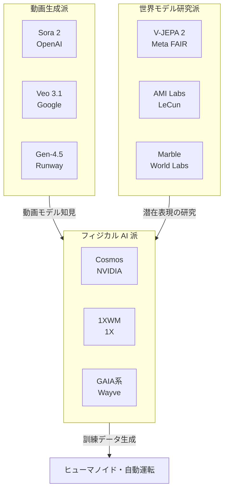
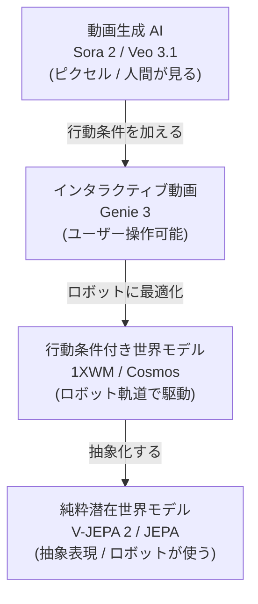

# 動画生成 AI が、ロボットの先生になる ― 世界モデルとフィジカル AI の現在地

2026 年は「フィジカル AI 元年」と呼べる空気感が漂っている。1X の家庭用ヒューマノイド NEO が出荷準備に入り、Figure AI と Agility Robotics が工場ラインに本格参入し、Wayve や Waabi が世界モデルベースの自動運転を商用化しつつある。

その派手な見出しの裏で、もう一つ静かな転用が進んでいる。エンタメ用に作られたはずの動画生成 AI ― OpenAI の Sora 2、Google の Veo 3.1 ― が、**ロボットの訓練データ生成器**として再利用され始めているのだ。NVIDIA の [Cosmos](https://www.nvidia.com/en-us/ai/cosmos/) は 1X、Agility、Figure AI、XPENG、Uber といった企業に採用され、1X 自身は [独自の世界モデル「1XWM」](https://www.1x.tech/discover/redwood-ai-world-model) を公開した。Yann LeCun は 12 年在籍した Meta を去り、世界モデル専業の [AMI Labs](https://www.technologyreview.com/2026/01/22/1131661/yann-lecuns-new-venture-ami-labs/) を立ち上げ、製品を 1 つも出さないうちから [評価額 30 億ユーロでシード 5 億ユーロを集めた](https://introl.com/blog/world-models-race-agi-2026)。欧州 AI 史上でも最大級の調達だ。

この記事は、「世界モデル」と「動画生成 AI」を分けて整理した上で、両者がフィジカル AI（ロボット・自動運転）にどう流れ込んでいるかを順を追って見ていく。

例え話で言うと、LLM は「巨大な図書館で本を組み合わせて答える司書」、動画生成 AI と世界モデルは「物理シミュレーターを頭の中に持つ実演家」のような存在。前者は単語の連なりを予測し、後者は世界の状態の連なりを予測する。

**参考ソース:**
- [Yann LeCun's new venture is a contrarian bet against large language models | MIT Technology Review](https://www.technologyreview.com/2026/01/22/1131661/yann-lecuns-new-venture-ami-labs/)
- [Neo humanoid maker 1X releases world model to help bots learn what they see | TechCrunch](https://techcrunch.com/2026/01/13/neo-humanoid-maker-1x-releases-world-model-to-help-bots-learn-what-they-see/)
- [Physical AI with World Foundation Models | NVIDIA Cosmos](https://www.nvidia.com/en-us/ai/cosmos/)
- [World Models Race 2026: How LeCun, DeepMind, and World Labs Are Redefining the Path to AGI](https://introl.com/blog/world-models-race-agi-2026)

## フィジカル AI とは何か ― LLM だけでは足りない理由

**フィジカル AI（Physical AI）** とは、物理世界の中で行動する AI の総称だ。ヒューマノイドロボット、自動運転車、産業ロボット、ドローン、配送ロボットなどが含まれる。チャット画面の中でテキストを返すだけの AI（LLM）と違い、物理 AI は「コップを倒さずに持つ」「段差につまずかない」「歩行者を轢かない」といった、**身体性を伴うスキル**を要求される。

ここで LLM だけでは行き詰まる、というのが業界の共通認識になりつつある。LeCun は MIT Technology Review のインタビューで [明確にこう述べている](https://www.technologyreview.com/2026/01/22/1131661/yann-lecuns-new-venture-ami-labs/)。

> 「LLMs are limited to the discrete world of text. They can't truly reason or plan, because they lack a model of the world. They can't predict the consequences of their actions. This is why we don't have a domestic robot that is as agile as a house cat, or a truly autonomous car.」
> （LLM はテキストという離散的な世界に閉じ込められている。世界モデルを持たないため、行動の結果を予測できず、本当の意味で推論も計画もできない。だからこそ、家猫のように敏捷な家庭用ロボットや、真に自律的な自動車がまだ存在しないのだ。）

物理 AI を作るには、LLM とは異なる 3 種類のリソースが必要になる。[Meta が V-JEPA 2 の解説で整理した](https://ai.meta.com/blog/v-jepa-2-world-model-benchmarks/) 世界モデルが備えるべき能力に対応する。

| 必要なもの | 役割 | 例え |
|----------|------|-----|
| 物理法則を理解した「次の状態」予測 | 行動の結果が事前にわかる | 物理学者の頭の中 |
| 安全に試行錯誤できるシミュレーション環境 | 壊れたり轢いたりせずに練習できる | フライトシミュレーター |
| 大量の「行動 + 結果」データ | 何が起きるかを学ぶ教科書 | スポーツの試合録画 |

例え話: 子供に自転車の乗り方を「文章だけで」教えるのは無理だ。実際にこいで、転んで、体で覚えるしかない。フィジカル AI も同じで、ピクセルや物理を含む「経験」を大量に必要とする。LLM が読んできた文章の量と、ロボットが体験できた物理世界の量には、桁違いの差がある。

**参考ソース:**
- [Physical AI with World Foundation Models | NVIDIA Cosmos](https://www.nvidia.com/en-us/ai/cosmos/)
- [Yann LeCun's new venture is a contrarian bet against large language models | MIT Technology Review](https://www.technologyreview.com/2026/01/22/1131661/yann-lecuns-new-venture-ami-labs/)
- [Introducing the V-JEPA 2 world model and new benchmarks for physical reasoning](https://ai.meta.com/blog/v-jepa-2-world-model-benchmarks/)
- [World Models Race 2026: How LeCun, DeepMind, and World Labs Are Redefining the Path to AGI](https://introl.com/blog/world-models-race-agi-2026)

## 主要プレイヤーと勢力図

フィジカル AI まわりの主要プレイヤーは、思想と製品形態によって 3 つのレイヤーに分けて整理できる。一見ライバルのようでいて、データや成果は派閥をまたいで流れ込んでいる。

| レイヤー | 主なプレイヤー | 代表的な製品・技術 | スタンス |
|---------|--------------|-----------------|---------|
| 動画生成派 | OpenAI / Google DeepMind / Runway / Kuaishou | Sora 2 / Veo 3.1 / Gen-4.5 / Kling 2.0 | 「ピクセルで世界を作る」 |
| 世界モデル研究派 | Meta FAIR / AMI Labs (LeCun) / World Labs (Fei-Fei Li) | V-JEPA 2 / 未公開 / Marble | 「抽象表現で世界を理解する」 |
| フィジカル AI 派 | NVIDIA / 1X / Figure AI / Agility / Wayve | Cosmos / 1XWM / 各社の世界モデル | 「ロボット訓練データ生成」 |



派閥同士は対立しているように見えるが、実際には相互補完的だ。NVIDIA Cosmos は [1X、Agility、Figure AI、Waabi、XPENG、Uber などに採用されている](https://introl.com/blog/world-models-race-agi-2026) し、Meta の V-JEPA 2 はオープンソース公開されているため、フィジカル AI 派は世界モデル研究派の成果を自由に使える。

例え話: 3 つの派閥は「同じ山の登り方」をめぐる対立に近い。山頂は「物理世界を理解する AI」だが、動画生成派は「絵を描きながら登る」、世界モデル研究派は「等高線地図を作りながら登る」、フィジカル AI 派は「みんなにロープを売る」。山頂で合流するか、誰かが脱落するかは、まだ誰にも分からない。

**参考ソース:**
- [Yann LeCun's new venture is a contrarian bet against large language models | MIT Technology Review](https://www.technologyreview.com/2026/01/22/1131661/yann-lecuns-new-venture-ami-labs/)
- [From 'AI slop' to world models, bubbles and small models: What to expect from AI in 2026](https://www.euronews.com/next/2026/01/01/from-ai-slop-to-world-models-bubbles-and-small-models-what-to-expect-from-ai-in-2026)
- [World Models Race 2026: How LeCun, DeepMind, and World Labs Are Redefining the Path to AGI](https://introl.com/blog/world-models-race-agi-2026)

## 動画生成 AI とは何か ― Sora 2 と Veo 3.1 の技術的な中身

このセクションでは、動画生成 AI の SNS 的・エンタメ的な側面はあえて脇に置く。後の章で「ロボットの先生になる」話につながる**技術的な中身**だけを取り出す。

### Sora 2 ― 失敗を正しく描けるようになった

OpenAI は 2024 年 2 月、Sora の公開と同時に [「Video generation models as world simulators」](https://openai.com/index/video-generation-models-as-world-simulators/) という技術レポートを発表し、「動画生成モデルは物理世界の汎用シミュレーターを作る有望な道筋である」と主張した。これが業界に「動画生成 = 世界モデル候補」という議論を持ち込んだ起点になる。

[Sora 2](https://openai.com/index/sora-2/) は OpenAI 自身が「動画における GPT-3.5 の瞬間」と位置づけた次世代モデルで、Sora 1 が「願望充足的（wishful）」、つまりバスケのシュートが入らないと突然ボールが消えてゴールに移動するような物理に反する動画を作っていたのに対し、Sora 2 は **失敗の挙動も正しく表現する**。

> 「Sora is a World Simulator, not a generator. ... It's not about looking correct but about making reasonable mistakes.」
> （Sora は生成器ではなくワールドシミュレーターだ。正しく見えることではなく、もっともらしい失敗をすることが重要だ。）
> [OpenAI Sora 2 Team, Sequoia podcast](https://sequoiacap.com/podcast/openai-sora-2-team-how-generative-video-will-unlock-creativity-and-world-models/)

[報告されている挙動の例](https://eu.36kr.com/en/p/3540834406357382):

- バスケのシュートが外れた場合、リングやバックボードに正しく跳ね返る
- パドルボードの上でバックフリップを実行できる
- オリンピック級の体操競技をモーション破綻なく描写する
- 失敗が「内部のエージェントの失敗」として現れる ― モデルが暗黙にエージェントをモデル化していることを示唆

技術的には [Diffusion Transformer (DiT)](https://eu.36kr.com/en/p/3540834406357382) と「Spacetime patches（時空間パッチ）」と呼ばれるトークン化手法を採用。OpenAI の Bill Peebles が提案した DiT は「ノイズから動画全体を一気に復元する」アプローチで、トークンを 1 つずつ生成する LLM 系とは根本的に異なる。

### Veo 3.1 ― 物理リアリズムの王

Google DeepMind の [Veo 3.1](https://deepmind.google/models/veo/) は、1080p / 4K、8 秒、ネイティブ音声生成（対話・効果音・環境音）に対応した動画生成モデル。MovieGenBench、VBench で「visually realistic physics（視覚的にリアルな物理）」のベンチマーク上 SOTA（state-of-the-art）を取っている。

> 「Greater realism and fidelity, made possible by Veo 3's real world physics and audio.」
> （Veo 3 のリアルな物理表現と音声によって、よりリアリズムと忠実度が高まった。）
> [Google DeepMind, Veo](https://deepmind.google/models/veo/)

ガラスが落ちたら正しく割れる、布が物理的に揺れる、流体が自然に流れる ― これらの物理ルールが**明示的にプログラムされていない**にもかかわらず、訓練データから学習されている点が肝心だ。2026 年には [Veo 3.1 Lite](https://deepmind.google/models/veo/) もリリースされ、Veo 3.1 Fast の 50% 未満のコストで高ボリュームアプリケーション向けに展開されている。

### 主要動画生成モデル比較

| モデル | 提供者 | 解像度 | 長さ | 音声 | 物理整合性 |
|-------|--------|-------|-----|-----|-----------|
| Sora 2 | OpenAI | 1080p | 〜60 秒 | あり | 高 |
| Veo 3.1 | Google DeepMind | 1080p / 4K | 8 秒 | あり | 高 |
| Veo 3.1 Lite | Google DeepMind | 1080p | 8 秒 | あり | 中 |
| Gen-4.5 | Runway | 1080p | 10 秒 | あり | 高（[Video Arena #1](https://introl.com/blog/world-models-race-agi-2026)） |
| Kling 2.0 | Kuaishou | 1080p | 10 秒 | あり | 中 |

例え話: 動画生成 AI は「映画監督が次のシーンを頭の中で想像する」のと近い。違いは、AI が頭の中で物理法則も含めてシーンを描こうとしている点だ。「絵を描く」ことが副作用として「物理を理解する」ことにつながり始めた、というのが Sora 2 / Veo 3.1 が示した出来事になる。

**参考ソース:**
- [Video generation models as world simulators (OpenAI Technical Report)](https://openai.com/index/video-generation-models-as-world-simulators/)
- [Sora 2 (OpenAI公式発表)](https://openai.com/index/sora-2/)
- [Veo — Google DeepMind](https://deepmind.google/models/veo/)
- [OpenAI Sora 2 Team: How Generative Video Will Unlock Creativity and World Models | Sequoia Capital](https://sequoiacap.com/podcast/openai-sora-2-team-how-generative-video-will-unlock-creativity-and-world-models/)
- [The Next Step for AI Videos: Simulation, Not Editing](https://eu.36kr.com/en/p/3540834406357382)

## 世界モデルとは何か ― 「次の世界の状態」を予測する AI

動画生成 AI が華やかに進化する一方、AI 業界の一部はまったく別のアプローチで「世界を予測する AI」を作ろうとしている。それが **世界モデル（World Models）** だ。

### 定義: LLM との違い

世界モデルとは、観測された世界の状態と、エージェントが取り得るアクションを入力として、**次にどんな世界の状態になるか**を予測するモデルだ。LLM が「次のトークン」を予測するのに対し、世界モデルは「次の物理状態」を予測する。

[Meta が公開した V-JEPA 2 の解説](https://ai.meta.com/blog/v-jepa-2-world-model-benchmarks/) によると、世界モデルが備えるべき能力は次の 3 つだ。

1. **理解 (Understanding)**: 動画内の物体・行動・動きを認識する
2. **予測 (Prediction)**: 世界がどう変化するか、エージェントの行動でどう変わるかを予測する
3. **計画 (Planning)**: 予測能力を使って、目標を達成するアクション列を組み立てる

| 項目 | LLM (GPT, Claude, Gemini) | 世界モデル (V-JEPA 2, Cosmos, 1XWM) |
|-----|-----|-----------|
| 入力 | テキストトークン | 動画・センサー・行動軌道 |
| 出力 | 次のトークン | 次の世界状態（潜在表現 or ピクセル） |
| 学習データ | テキストコーパス（数兆トークン） | 動画（数百万時間）・ロボット操作データ |
| 予測の対象 | 文字の並び | 物体の位置・速度・状態変化 |
| 評価軸 | 文章の自然さ・正解率 | 物理的整合性・予測精度 |

例え話: LLM は「Wikipedia をすべて暗記した友人」、世界モデルは「物理の実験を毎日見て育った子供」に近い。前者は言葉では何でも答えられるが、コップを倒した時に何が起きるかを「実感」してはいない。後者はコップを倒したらどうなるかを「体感」している。

### Yann LeCun の主張: JEPA という対案

LeCun は「LLM は限界に達している」と公言してきた研究者だ。MIT Technology Review のインタビューで、彼は世界モデルのアーキテクチャ「JEPA」のエッセンスを次のように説明している。

> 「The world is unpredictable. If you try to build a generative model that predicts every detail of the future, it will fail. JEPA is not generative AI. It is a system that learns to represent videos really well. The key is to learn an abstract representation of the world and make predictions in that abstract space, ignoring the details you can't predict.」
> （世界は予測不可能だ。未来のすべてのディテールを予測しようとする生成モデルは必ず失敗する。JEPA は生成 AI ではなく、動画を上手く「表現する」ことを学ぶシステムだ。鍵は世界の抽象表現を学び、その抽象空間で予測を行うこと ― 予測できないディテールは無視する。）
> [Yann LeCun, MIT Technology Review (2026/1/22)](https://www.technologyreview.com/2026/01/22/1131661/yann-lecuns-new-venture-ami-labs/)

JEPA = **Joint Embedding Predictive Architecture**（同時埋め込み予測アーキテクチャ）。Meta が 2022 年に提唱し、その後 I-JEPA（画像）、V-JEPA（動画）、[V-JEPA 2](https://ai.meta.com/blog/v-jepa-2-world-model-benchmarks/)（2025 年 6 月、12 億パラメータ）へと進化した。

JEPA の核は「**ピクセル単位で予測しない**」点にある。動画の次のフレームをピクセル一個一個予測するのではなく、抽象的な潜在空間（embedding）に射影してから、その空間の中で予測を行う。これにより、雲の形のような「予測不可能なディテール」に学習リソースを使わずに済む。

例え話: 落ち葉が地面に落ちる動画を予測するとき、ピクセル予測派は「葉脈一本一本の動き」まで予測しようとするが、JEPA は「葉が下に落ちる」という抽象だけを予測する。物理学者が世界をニュートン方程式で記述するのと同じ発想だ。

LeCun は 2025 年 12 月に Meta を退社して [AMI Labs (Advanced Machine Intelligence)](https://www.technologyreview.com/2026/01/22/1131661/yann-lecuns-new-venture-ami-labs/) を共同創業した（CEO は Alex LeBrun）。本社はパリ。プロダクトを 1 つもリリースしないうちから、[シードラウンドで 5 億ユーロ、評価額 30 億ユーロ規模](https://introl.com/blog/world-models-race-agi-2026) という、欧州 AI 史上でも最大級の調達となった。

### V-JEPA 2 の実力

[V-JEPA 2](https://ai.meta.com/blog/v-jepa-2-world-model-benchmarks/) は動画から自己教師あり学習で訓練される 12 億パラメータのモデル。100 万時間以上の動画と 100 万枚の画像で「アクション無し」の事前学習を行った後、わずか **62 時間のロボット動画** を使って「アクション条件付き」の追加訓練を行うだけで、Franka ロボットアームを使った未知環境での **65〜80% の成功率** で物体のピック&プレース（つかんで置く）を実現した。これは「ゼロショット」、つまり配備先のロボットからの追加データを一切収集せずに達成された数字だ。

純粋な世界モデルが実機ロボットで一定の成功率を出した、という実証は世界モデル派にとって重要な金字塔になった。

**参考ソース:**
- [Introducing the V-JEPA 2 world model and new benchmarks for physical reasoning](https://ai.meta.com/blog/v-jepa-2-world-model-benchmarks/)
- [Yann LeCun's new venture is a contrarian bet against large language models | MIT Technology Review](https://www.technologyreview.com/2026/01/22/1131661/yann-lecuns-new-venture-ami-labs/)
- [Our New Model Helps AI Think Before it Acts | Meta](https://about.fb.com/news/2025/06/our-new-model-helps-ai-think-before-it-acts/)
- [World models could unlock the next revolution in artificial intelligence | Scientific American](https://www.scientificamerican.com/article/world-models-could-unlock-the-next-revolution-in-artificial-intelligence/)

## 接続点 ― 動画生成 AI が、ロボットの先生になる

ここまで読むと、「動画生成 AI」と「世界モデル」は別物のように感じるかもしれない。事実、目的も技術も提供形態も異なる。しかし 2026 年の現場では、両者が**ロボット訓練という出口**で静かに合流し始めている。

### スペクトラムとして見ると話が通る

OpenAI 自身が 2024 年に [「Video generation models as world simulators」](https://openai.com/index/video-generation-models-as-world-simulators/) という技術レポートで「動画生成モデルは物理世界の汎用シミュレーターを作る有望な道筋」と主張していた。同社のレポートは、スケールアップによって 3D 一貫性、オブジェクト永続性、世界とのインタラクションといった性質が**創発的（emergent）**に現れる、と論じている。

その後、各社の取り組みを俯瞰すると、「ピクセルを生成する AI」と「潜在空間で予測する AI」が連続的なスペクトラムを成していることが見えてくる。



スペクトラムを上から下へ見ていくと、**「人間が見て楽しめる」から「ロボットが使う」へ**、そして**「ピクセル」から「抽象表現」へ**と特徴が変化する。

| 位置 | 代表モデル | 出力 | 主な用途 |
|-----|----------|-----|---------|
| 動画生成 | Sora 2 / Veo 3.1 | ピクセル動画 | 映像制作・物理学習 |
| インタラクティブ | Genie 3 | リアルタイム 3D 環境 | エージェント訓練環境 |
| 行動条件付き | 1XWM / Cosmos Predict | 動画 + ロボット軌道 | ロボット訓練 |
| 純粋潜在 | V-JEPA 2 / JEPA | 抽象ベクトル | エージェント計画 |

[arxiv の「Is Sora a World Simulator?」](https://arxiv.org/abs/2405.03520) というサーベイ論文は、動画生成モデルが世界モデルとして機能するかを検証し、「動画モデルの進化方向は明らかに世界モデル化へ向かっている」と結論づけている。

### LeCun vs OpenAI ― 同じゴールへの違うルート

OpenAI が「Sora は世界シミュレーター」と主張したことに対し、LeCun は[繰り返し反論してきた](https://www.technologyreview.com/2026/01/22/1131661/yann-lecuns-new-venture-ami-labs/)。LeCun の論点は「ピクセル予測は計算資源の浪費だ」というもの。動画の中で予測可能な構造（物体の位置）と予測不可能なディテール（雲の形）を**同じ重みで予測する**動画生成モデルは、本質的に効率が悪い、という主張だ。

一方、OpenAI 派の主張は「**スケールすればできる**」というもの。Sora 2 が示したように、十分な計算資源とデータを投入すれば、ピクセル予測モデルも物理ルールを獲得する。実際、Sora 2 のバスケのリバウンドや体操の挙動は、物理を**明示的に教えていない**にもかかわらず学習された。

この論争は哲学ではなく、実証で決着がつくフェーズに入りつつある。そして決着の場は、エンタメではなく **ロボットの工場と家庭** だ。

例え話: 映画を作るための AI が、気づいたらロボットの教科書になっていた、というような転用が静かに進んでいる。派手な発見というより、現場で気づいたら使われていた、という流用に近い。

**参考ソース:**
- [Video generation models as world simulators (OpenAI Technical Report)](https://openai.com/index/video-generation-models-as-world-simulators/)
- [Genie 3: A new frontier for world models — Google DeepMind](https://deepmind.google/blog/genie-3-a-new-frontier-for-world-models/)
- [Physical AI with World Foundation Models | NVIDIA Cosmos](https://www.nvidia.com/en-us/ai/cosmos/)
- [1X World Model | 1X](https://www.1x.tech/discover/redwood-ai-world-model)
- [Is Sora a World Simulator? A Comprehensive Survey on General World Models and Beyond](https://arxiv.org/abs/2405.03520)
- [The Next Step for AI Videos: Simulation, Not Editing](https://eu.36kr.com/en/p/3540834406357382)

## ロボティクス応用の最前線

接続点が見えたところで、現場で何が起きているのかを見ていく。

### NVIDIA Cosmos ― 物理 AI の基盤プラットフォーム

[NVIDIA Cosmos](https://www.nvidia.com/en-us/ai/cosmos/) は CES 2025 で発表された世界基盤モデル（World Foundation Models）プラットフォーム。[9,000 兆トークン、2,000 万時間相当の実世界データで訓練](https://introl.com/blog/world-models-race-agi-2026) され、2026 年 1 月時点で **200 万回以上のダウンロード** を記録している。

3 種類のモデルで役割分担している。

- **Cosmos Predict**: テキスト・画像・動画プロンプトから多様な動画シーンを生成
- **Cosmos Transfer**: シミュレーター（NVIDIA Omniverse 等）の物理ベース動画にスタイル転送（照明・環境変更）
- **Cosmos Reason**: 動画・画像入力に対して推論。Predict / Transfer のデータをアノテーションする vision-language-action (VLA) モデル

採用企業は [1X、Agility Robotics、Figure AI、Waabi、XPENG、Uber](https://introl.com/blog/world-models-race-agi-2026) など。ヒューマノイドから自動運転トラックまで、フィジカル AI 全般のインフラとして機能している。

例え話: Cosmos は「ロボット業界向けの架空ハリウッドスタジオ」のような存在。実際には起こりにくいレアな事故シーン、悪天候、混雑時の歩行者行動などを、無限にバリエーションを変えて「撮影」できる。

### V-JEPA 2 ― 純粋世界モデルのロボット応用

[V-JEPA 2](https://ai.meta.com/blog/v-jepa-2-world-model-benchmarks/) は動画生成を一切行わず、潜在空間で予測するだけだが、ロボット制御で実用的な性能を出している。

短期タスク（物体ピック&プレース）の手順:

1. ゴール画像を指定する（「このコップをこの位置に置く」）
2. V-JEPA 2 のエンコーダで現状とゴールの埋め込みを取る
3. 候補となるアクションそれぞれについて、未来の埋め込みを予測する
4. ゴールに最も近づくアクションを選ぶ
5. 実行 → 再計画（model-predictive control）

これだけで未知環境・未学習物体に対して **65〜80% の成功率** を達成。ピクセルを生成しないため、Sora 2 や Veo 3.1 と比べて**桁違いに速く・軽い**。

### 1X World Model ― ヒューマノイド向け予測エンジン

[1X World Model (1XWM)](https://www.1x.tech/discover/redwood-ai-world-model) は、ヒューマノイドロボット NEO 用の予測モデル。動画フレーム + ロボット観測 + アクション軌道のシーケンスで訓練され、「このロボットがこの行動を取ったら、世界はどう変わるか」を予測する。

普通の動画生成モデルとの決定的な違いは、**テキストプロンプトではなく正確なロボット軌道で駆動される**点。「冷蔵庫を開けて」ではなく、「関節 X を Y 度回転させて、Z 秒後にハンドを掴む形にする」という入力を受け取る。

訓練の効果は具体的だ。エアフライヤーとのインタラクションを訓練すると、訓練前は「エアフライヤー本体とトレイを 1 つの物体として扱う」誤りをするが、訓練後は「トレイが本体から正しく分離する」挙動をモデル化できるようになる。[1X は NEO のプリオーダーを 2025 年 10 月に開始し、出荷を 2026 年に予定している](https://techcrunch.com/2026/01/13/neo-humanoid-maker-1x-releases-world-model-to-help-bots-learn-what-they-see/)。1XWM はその大量配備を支える「シミュレーター兼テストベンチ」として位置づけられる。

### ロボティクス応用例まとめ

| 応用例 | 採用モデル | ベネフィット |
|-------|-----------|-------------|
| 家庭内ヒューマノイド (1X NEO) | 1XWM + Redwood AI | 家ごとの個別最適化を実環境テストなしで |
| 工場用ヒューマノイド (Agility / Figure) | NVIDIA Cosmos + Isaac GR00T | 訓練データの無限生成 |
| 自動運転 (Wayve / Waabi) | Cosmos Predict 系 | レアシナリオ（事故・悪天候）合成 |
| 研究用ロボットアーム (Franka) | V-JEPA 2-AC | 62 時間で新環境にゼロショット適応 |

例え話: ロボットの世界モデルは「フライトシミュレーターでパイロット訓練するようなもの」。実機を壊すことなく、危険な状況を無限に再現できる。違いは、世界モデルは「シナリオ」も AI が無限生成する点だ。

各社のアプローチには違いがあって面白い。NVIDIA は基盤モデル + パートナー網（インフラ売り）、1X は自社ロボット直結（垂直統合）、Meta は研究公開（オープンソース）。同じゴールに対する戦い方の違いが、そのまま 2026 年の世界モデル市場の形になっている。

**参考ソース:**
- [Physical AI with World Foundation Models | NVIDIA Cosmos](https://www.nvidia.com/en-us/ai/cosmos/)
- [Introducing the V-JEPA 2 world model and new benchmarks for physical reasoning](https://ai.meta.com/blog/v-jepa-2-world-model-benchmarks/)
- [1X World Model | 1X](https://www.1x.tech/discover/redwood-ai-world-model)
- [Neo humanoid maker 1X releases world model to help bots learn what they see | TechCrunch](https://techcrunch.com/2026/01/13/neo-humanoid-maker-1x-releases-world-model-to-help-bots-learn-what-they-see/)
- [World Models Race 2026: How LeCun, DeepMind, and World Labs Are Redefining the Path to AGI](https://introl.com/blog/world-models-race-agi-2026)

## 課題と展望 ― 物理の壁、データ、計算コスト

ここまで派手な話を並べたが、現状はまだまだ課題が多い。

### 計算コストの壁

世界モデル / 動画生成 AI は、LLM とは桁違いの計算資源を必要とする。世界モデル推論は LLM 推論の **8 〜 32 倍の GPU** を要する [という試算がある](https://introl.com/blog/world-models-race-agi-2026)。1 秒の動画 1 フレームに含まれる情報量はテキストトークンより桁違いに大きいので、これは構造的に避けられない。

```chart
{
  "type": "bar",
  "data": {
    "labels": ["LLM 推論", "世界モデル推論"],
    "datasets": [
      {
        "label": "リクエスト当たり相対 GPU 要件（LLM = 1）",
        "data": [1, 20],
        "backgroundColor": ["#3b82f6", "#ef4444"]
      }
    ]
  },
  "options": {
    "plugins": {
      "title": { "display": true, "text": "世界モデルは LLM の 8〜32 倍の GPU を必要とする（出典: Introl 試算）" }
    },
    "scales": {
      "y": { "beginAtZero": true }
    }
  }
}
```

ロボット制御に必要な数十 ms の応答速度を、動画生成 AI ベースで実現するのはまだ遠い。だからこそ現場では、ピクセル生成しない V-JEPA 2 系の軽量アプローチが評価されている。

### 物理整合性の壁

現状、いずれのモデルもまだ物理を完璧に扱えない。OpenAI 自身が [Sora の限界](https://openai.com/index/video-generation-models-as-world-simulators/) として「ガラスが正しく割れない」「食べ物を食べても物体の状態が正しく変わらない」を挙げている。

Meta が公開した [3 つのベンチマーク](https://ai.meta.com/blog/v-jepa-2-world-model-benchmarks/)（IntPhys 2、MVPBench、CausalVQA）では、人間が 85〜95% の精度を出すのに対し、現行モデルは**ランダム選択に近い**結果しか出せない。世界モデル研究はまだまだ伸び代があるという宣言でもある。

| ベンチマーク | 評価対象 | 人間の精度 | 現行モデル |
|-----------|---------|----------|-----------|
| IntPhys 2 | 物理的にあり得るシーンの判定 | 85〜95% | ランダムに近い |
| MVPBench | 微小変化動画ペアの正解 | 85〜95% | 大幅に低い |
| CausalVQA | 物理的因果関係の質問応答 | 85〜95% | "次に起きること" は弱い |

### データの壁

「動画 + アクション + 結果」の三点セットデータが希少だ。LLM はインターネット上のテキストを使えるが、ロボットの行動軌道は誰も大量に集めていない。これが V-JEPA 2 がわずか 62 時間のロボット動画で訓練している理由でもあり、Cosmos が合成データに賭けている理由でもある。

### 展望: 「行動条件付き動画モデル」が主流に

2026 年の流れを見ると、純粋な動画生成と純粋な世界モデルの中間、すなわち **「行動条件付き動画モデル」** が主流になる兆しがある。1XWM、Cosmos Predict、V-JEPA 2-AC（Action-Conditioned）はすべてこの位置にある。

理由はシンプルだ。

- **エンタメ用途**: ピクセル必須（人間が見るため） → Sora / Veo
- **ロボット用途**: 行動の結果を予測する必要がある → 行動条件付きモデル
- **計画・推論用途**: ピクセル不要、軽さが重要 → JEPA 系

ロボット市場が動画生成市場より遥かに大きくなるという予測（Figure AI、Agility Robotics、1X 等の本格量産が始まる）を考えると、産業の重心は明らかに行動条件付きモデルへ移っている。

**参考ソース:**
- [World Models Race 2026: How LeCun, DeepMind, and World Labs Are Redefining the Path to AGI](https://introl.com/blog/world-models-race-agi-2026)
- [Video generation models as world simulators (OpenAI Technical Report)](https://openai.com/index/video-generation-models-as-world-simulators/)
- [Introducing the V-JEPA 2 world model and new benchmarks for physical reasoning](https://ai.meta.com/blog/v-jepa-2-world-model-benchmarks/)
- [From 'AI slop' to world models, bubbles and small models: What to expect from AI in 2026](https://www.euronews.com/next/2026/01/01/from-ai-slop-to-world-models-bubbles-and-small-models-what-to-expect-from-ai-in-2026)

## まとめ ― フィジカル AI を支える両輪

世界モデルと動画生成 AI は、別技術ではなく、**「世界を予測する」という共通ゴールへの異なるアプローチ**だ。

- **動画生成派**（Sora 2、Veo 3.1）はピクセルで世界を再現する。人間が見て楽しめるが、計算コストが重い
- **世界モデル研究派**（LeCun の JEPA、V-JEPA 2）は抽象表現で世界を理解する。軽量で速く、ロボット制御に強い
- **フィジカル AI 派**（Cosmos、1XWM）は両者を取り込み、行動条件付きでロボット訓練に最適化する

派手な動画モデルが SNS で消費される横で、それと同じ技術が NVIDIA Cosmos や 1X の研究室でロボットの教科書になっている。これが 2026 年に静かに起きている、フィジカル AI を巡る転用だ。

確実に言えるのは、**LLM だけでは AGI に到達しない**という点について業界の主要プレイヤーがほぼ合意したこと。次の AI 革命は、テキストではなく動画と物理から来る。そしてその到達地点は、ChatGPT のような対話アプリではなく、家庭にいるヒューマノイドや、街を走る無人車の側にある可能性が高い。

**参考ソース:**
- [Yann LeCun's new venture is a contrarian bet against large language models | MIT Technology Review](https://www.technologyreview.com/2026/01/22/1131661/yann-lecuns-new-venture-ami-labs/)
- [World Models Race 2026: How LeCun, DeepMind, and World Labs Are Redefining the Path to AGI](https://introl.com/blog/world-models-race-agi-2026)
- [World models could unlock the next revolution in artificial intelligence | Scientific American](https://www.scientificamerican.com/article/world-models-could-unlock-the-next-revolution-in-artificial-intelligence/)
- [From 'AI slop' to world models, bubbles and small models: What to expect from AI in 2026](https://www.euronews.com/next/2026/01/01/from-ai-slop-to-world-models-bubbles-and-small-models-what-to-expect-from-ai-in-2026)
