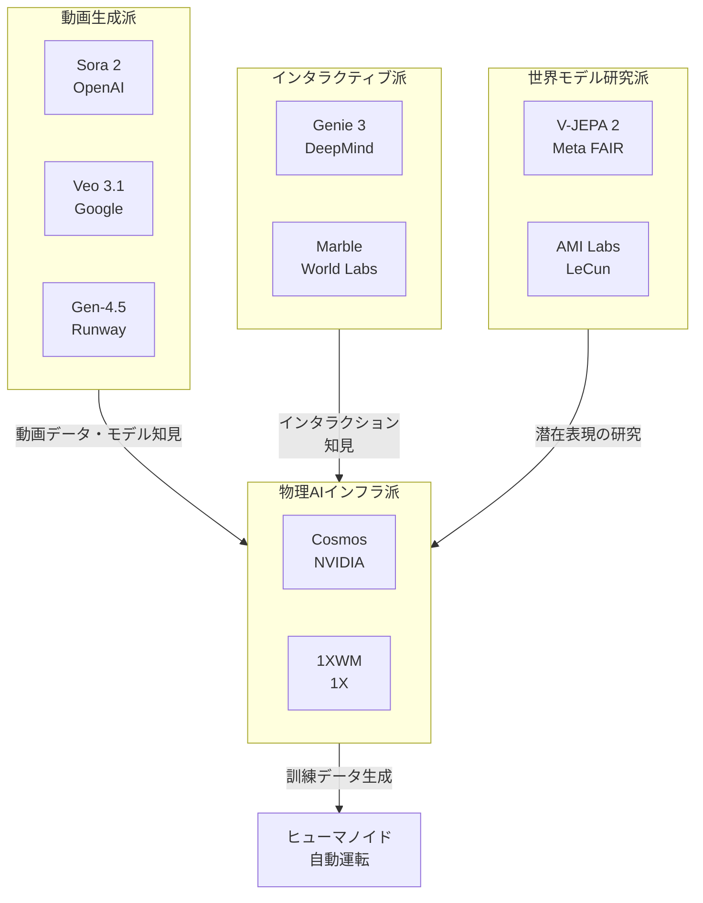
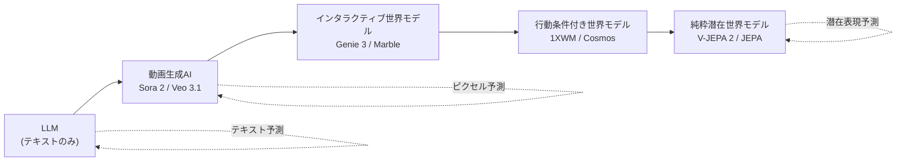

# 世界モデルと動画生成AI ― 同じ夢を見る2つのアプローチ

2026 年、AI 業界の関心は「次の単語」から「次の世界」へ移った。Yann LeCun は 12 年間在籍した Meta を去り、自身の世界モデル企業 [AMI Labs](https://www.technologyreview.com/2026/01/22/1131661/yann-lecuns-new-venture-ami-labs/) を立ち上げた。Google DeepMind は [Genie 3](https://deepmind.google/blog/genie-3-a-new-frontier-for-world-models/) を一般公開し、テキストプロンプトから 24fps のインタラクティブな 3D 世界を生成できることを示した。OpenAI の [Sora 2](https://openai.com/index/sora-2/) は「ただの動画生成ツール」から「世界シミュレーター」へと立ち位置を変え、Microsoft Azure AI Foundry にも統合された。

これらは別々のニュースのように見えるが、実は同じゴールを別の方角から目指している。本記事では「世界モデル」と「動画生成AI」をそれぞれ整理し、両者がどう関係しているのかを解きほぐす。

例え話で言うと、LLM は「巨大な図書館で本を組み合わせて答えを返す司書」だとすると、世界モデルは「物理シミュレーターを頭の中に持つ科学者」のような存在。前者は単語の連なりを予測し、後者は世界の状態の連なりを予測する。

## 主要プレイヤーと勢力図

世界モデル / 動画生成AI 領域の主要プレイヤーは、思想と製品形態によって 4 つの派閥に分けて整理できる。

| レイヤー | 主なプレイヤー | 代表的な製品・技術 | 思想 |
|---------|--------------|-------------------|------|
| 動画生成派 | OpenAI / Google DeepMind / Runway / Kuaishou | Sora 2 / Veo 3.1 / Gen-4.5 / Kling 2.0 | 「ピクセルで世界を作る」 |
| 世界モデル研究派 | Meta FAIR / AMI Labs (LeCun) / World Labs (Fei-Fei Li) | V-JEPA 2 / 未公開 / Marble | 「抽象表現で世界を理解する」 |
| インタラクティブ派 | Google DeepMind | Genie 3 / Project Genie | 「リアルタイム探索可能な世界」 |
| 物理AIインフラ派 | NVIDIA / 1X / Figure AI / Agility | Cosmos / 1XWM / 各社の世界モデル | 「ロボット訓練データ生成」 |

派閥同士はライバル関係にあるだけでなく、データや成果を共有してもいる。たとえば、NVIDIA Cosmos は 1X、Agility、Figure AI、Waabi、XPENG、Uber といった他派閥のロボット企業に [採用されており](https://introl.com/blog/world-models-race-agi-2026)、動画生成派の知見が物理AIインフラ派に流れ込んでいる。



例え話で言えば、4 つの派閥は「同じ山の登り方」をめぐる対立に近い。山頂は「物理世界を理解する AI」だが、動画生成派は「絵を描きながら登る」、世界モデル研究派は「等高線地図を作りながら登る」、インタラクティブ派は「VR ガイド付きで登る」、インフラ派は「みんなにロープを売る」。

**参考ソース:**
- [Yann LeCun's new venture is a contrarian bet against large language models](https://www.technologyreview.com/2026/01/22/1131661/yann-lecuns-new-venture-ami-labs/)
- [World Models Race 2026](https://introl.com/blog/world-models-race-agi-2026)
- [From 'AI slop' to world models, bubbles and small models: What to expect from AI in 2026](https://www.euronews.com/next/2026/01/01/from-ai-slop-to-world-models-bubbles-and-small-models-what-to-expect-from-ai-in-2026)

## 世界モデルとは何か ― 「次の世界」を予測するAI

### 定義: LLM との違い

世界モデルとは、観測された世界の状態と、エージェントが取り得るアクションを入力として、**次にどんな世界の状態になるか**を予測するモデルだ。LLM が「次のトークン」を予測するのに対し、世界モデルは「次の物理状態」を予測する。

[Meta が公開した V-JEPA 2 の解説](https://ai.meta.com/blog/v-jepa-2-world-model-benchmarks/) では、世界モデルが備えるべき 3 つの能力を次のように定義している。

1. **理解 (Understanding)**: 動画内の物体・行動・動きを認識する
2. **予測 (Prediction)**: 世界がどう変化するか、エージェントの行動でどう変わるかを予測する
3. **計画 (Planning)**: 予測能力を使って、目標を達成するアクション列を組み立てる

| 項目 | LLM (GPT, Claude, Gemini) | 世界モデル (V-JEPA 2, Genie 3, Cosmos) |
|-----|-----|-----------|
| 入力 | テキストトークン | 動画・センサー・行動軌道 |
| 出力 | 次のトークン | 次の世界状態（潜在表現 or ピクセル） |
| 学習データ | テキストコーパス（数兆トークン） | 動画（数百万時間）・ロボット操作データ |
| 予測の対象 | 文字の並び | 物体の位置・速度・状態変化 |
| 評価軸 | 文章の自然さ・正解率 | 物理的整合性・予測精度 |
| 代表モデル | GPT-5 / Claude 4.5 / Gemini 3 | V-JEPA 2 / Genie 3 / Cosmos / 1XWM |

例え話: LLM は「Wikipedia をすべて暗記した友人」、世界モデルは「物理の実験を毎日見て育った子供」に近い。前者は言葉では何でも答えられるが、コップを倒した時に何が起きるかを「実感」してはいない。後者はコップを倒したらどうなるかを「体感」している。

### Yann LeCun の主張: JEPA という対案

LeCun は「LLM は限界に達している」と公言してきた研究者だ。MIT Technology Review のインタビューで、彼は次のように述べた。

> 「The world is unpredictable. If you try to build a generative model that predicts every detail of the future, it will fail. JEPA is not generative AI. It is a system that learns to represent videos really well. The key is to learn an abstract representation of the world and make predictions in that abstract space, ignoring the details you can't predict.」
> [Yann LeCun, MIT Technology Review (2026/1/22)](https://www.technologyreview.com/2026/01/22/1131661/yann-lecuns-new-venture-ami-labs/)

JEPA = **Joint Embedding Predictive Architecture**（同時埋め込み予測アーキテクチャ）。Meta が 2022 年に提唱し、その後 [I-JEPA](https://ai.meta.com/blog/yann-lecun-ai-model-i-jepa/)（画像）、V-JEPA（動画）、[V-JEPA 2](https://ai.meta.com/blog/v-jepa-2-world-model-benchmarks/)（2025年6月、12 億パラメータ）へと進化した。

JEPA の核は「**ピクセル単位で予測しない**」点にある。動画の次のフレームをピクセル一個一個予測するのではなく、抽象的な潜在空間（embedding）に射影してから、その空間の中で予測を行う。これにより、雲の形のような「予測不可能なディテール」に学習リソースを使わずに済む。

例え話: 落ち葉が地面に落ちる動画を予測するとき、LLM 系のアプローチは「葉脈一本一本の動き」まで予測しようとするが、JEPA は「葉が下に落ちる」という抽象だけを予測する。物理学者が世界をニュートン方程式で記述するのと同じ発想だ。

LeCun は 2025 年 12 月に Meta を退社して [AMI Labs (Advanced Machine Intelligence)](https://www.technologyreview.com/2026/01/22/1131661/yann-lecuns-new-venture-ami-labs/) を共同創業した（CEO は Alex LeBrun）。本社はパリ。プロダクトを 1 つもリリースしないうちから、[シードラウンドで 5 億ユーロ、評価額 30 億ユーロ規模](https://introl.com/blog/world-models-race-agi-2026) という、欧州 AI 史上でも最大級の調達となった。

### V-JEPA 2 の実力

[V-JEPA 2 は](https://ai.meta.com/blog/v-jepa-2-world-model-benchmarks/) 動画から自己教師あり学習で訓練される 12 億パラメータのモデル。100 万時間以上の動画と 100 万枚の画像で「アクション無し」の事前学習を行った後、わずか **62 時間のロボット動画** を使って「アクション条件付き」の追加訓練を行うだけで、Franka ロボットアームを使った未知環境での **65〜80% の成功率** で物体のピック&プレース（つかんで置く）を実現した。これは「ゼロショット」、つまり配備先のロボットからの追加データを一切収集せずに達成された数字だ。

Meta は同時に 3 つのベンチマーク（IntPhys 2、MVPBench、CausalVQA）を公開し、人間が 85〜95% の精度を出すのに対し、現行モデルが**ランダム選択に近い性能**しか出せないことを示した。世界モデル研究はまだまだ伸び代があるという宣言でもある。

**参考ソース:**
- [Introducing the V-JEPA 2 world model and new benchmarks for physical reasoning (Meta)](https://ai.meta.com/blog/v-jepa-2-world-model-benchmarks/)
- [Our New Model Helps AI Think Before it Acts (Meta)](https://about.fb.com/news/2025/06/our-new-model-helps-ai-think-before-it-acts/)
- [Yann LeCun's new venture is a contrarian bet against large language models (MIT Tech Review)](https://www.technologyreview.com/2026/01/22/1131661/yann-lecuns-new-venture-ami-labs/)
- [World models could unlock the next revolution in artificial intelligence (Scientific American)](https://www.scientificamerican.com/article/world-models-could-unlock-the-next-revolution-in-artificial-intelligence/)
- [World Models Race 2026 (Introl)](https://introl.com/blog/world-models-race-agi-2026)

## 動画生成AIの現在地 ― Sora 2 と Veo 3.1 の戦い

### Sora 2 ― 「世界シミュレーター」への進化

OpenAI は 2024 年 2 月、Sora の公開と同時に [「Video generation models as world simulators」](https://openai.com/index/video-generation-models-as-world-simulators/) という技術レポートを発表した。「動画生成モデルは物理世界の汎用シミュレーターを作る有望な道筋である」という主張は、業界全体に「動画生成 = 世界モデル候補」という議論を持ち込んだ。

[Sora 2](https://openai.com/index/sora-2/) は OpenAI 自身が「動画における GPT-3.5 の瞬間」と位置づけた次世代モデルだ。Sora 1 が「願望充足的（wishful）」、つまりバスケのシュートが入らないと突然ボールが消えてゴールに移動するような物理に反する動画を作っていたのに対し、Sora 2 は失敗の挙動も正しく表現する。

> 「Sora is a World Simulator, not a generator. ... It's not about looking correct but about making reasonable mistakes.」
> [OpenAI Sora 2 Team, Sequoia podcast](https://sequoiacap.com/podcast/openai-sora-2-team-how-generative-video-will-unlock-creativity-and-world-models/)

たとえば次のような挙動が報告されている。

- バスケのシュートが外れた場合、リングやバックボードに正しく跳ね返る
- パドルボードの上でバックフリップを実行できる
- オリンピック級の体操競技をモーション破綻なく描写する
- 失敗が「内部のエージェントの失敗」として現れる ― モデルが暗黙にエージェントをモデル化していることを示唆

技術的には [Diffusion Transformer (DiT)](https://eu.36kr.com/en/p/3540834406357382) と「Spacetime patches（時空間パッチ）」と呼ばれるトークン化手法を採用。OpenAI の Bill Peebles が提案した DiT は「ノイズから動画全体を一気に復元する」アプローチで、トークンを 1 つずつ生成する LLM 系とは根本的に異なる。

Sora 2 は招待制ソーシャル動画アプリとしてローンチされ、「Cameos」という機能で利用者本人を生成シーンに登場させられる（外見と声を再現）。しかしディープフェイク・安全性・コンテンツ品質への懸念が高まり、**2026 年 3 月に OpenAI は Sora 動画生成アプリと公開アクセスを一時停止した** と報じられている。

### Veo 3.1 ― 物理リアリズムの王

Google DeepMind の [Veo 3.1](https://deepmind.google/models/veo/) は、1080p / 4K、8 秒、ネイティブ音声生成（対話・効果音・環境音）に対応した動画生成モデル。MovieGenBench、VBench で「visually realistic physics（視覚的にリアルな物理）」のベンチマーク上 SOTA（state-of-the-art）を取っている。

> 「Greater realism and fidelity, made possible by Veo 3's real world physics and audio.」
> [Google DeepMind, Veo](https://deepmind.google/models/veo/)

特徴的なのは「ガラスが落ちたら正しく割れる」「布が物理的に揺れる」「流体が自然に流れる」など、物理ルールが**明示的にプログラムされていない**にもかかわらず、訓練データから学習されている点だ。2026 年には [Veo 3.1 Lite](https://blog.google/innovation-and-ai/technology/ai/veo-3-1-lite/) もリリースされ、Veo 3.1 Fast の 50% 未満のコストで高ボリュームアプリケーション向けに展開された。

### 主要動画生成モデル比較

| モデル | 提供者 | 解像度 | 長さ | 音声 | 物理整合性 | 公開状況 (2026/4) |
|-------|--------|-------|-----|-----|-----------|---------|
| Sora 2 | OpenAI | 1080p | 〜60 秒 | あり | 高 | 一時停止中 (2026/3〜) |
| Veo 3.1 | Google DeepMind | 1080p / 4K | 8 秒 | あり | 高 | 提供中 |
| Veo 3.1 Lite | Google DeepMind | 1080p | 8 秒 | あり | 中 | 提供中 |
| Gen-4.5 | Runway | 1080p | 10 秒 | あり | 高 | 提供中（Video Arena #1） |
| Kling 2.0 | Kuaishou | 1080p | 10 秒 | あり | 中 | 提供中 |
| Genie 3 | Google DeepMind | 720p | 数分 (リアルタイム) | なし | 中 | 限定研究プレビュー |

例え話: 動画生成 AI は「映画監督が次のシーンを頭の中で想像する」のと同じ。ただし監督は脚本（プロンプト）を読んで、観客（ユーザー）に見せる「絵」を作るのが目的だ。これに対して世界モデル研究派は、「監督ではなく物理学者になりたい」と言っている派閥だ。

**参考ソース:**
- [Video generation models as world simulators (OpenAI)](https://openai.com/index/video-generation-models-as-world-simulators/)
- [Sora 2 (OpenAI)](https://openai.com/index/sora-2/)
- [Veo (Google DeepMind)](https://deepmind.google/models/veo/)
- [OpenAI Sora 2 Team: How Generative Video Will Unlock Creativity and World Models (Sequoia)](https://sequoiacap.com/podcast/openai-sora-2-team-how-generative-video-will-unlock-creativity-and-world-models/)
- [The next step for AI videos: not editing, but simulation (36Kr)](https://eu.36kr.com/en/p/3540834406357382)

## 両者はどう関連するか ― 同じスペクトラム上の異なる位置

ここまで読むと「世界モデルと動画生成 AI は別物」のように感じるかもしれないが、実は両者は**同じスペクトラムの異なる位置**を占めている。



このスペクトラムを左から右へ見ていくと、**「人間が見て楽しめる」から「ロボットが使う」へ**、そして**「ピクセル」から「抽象表現」へ**と特徴が変化する。

| 位置 | 代表モデル | 出力 | 主な用途 | 強み |
|-----|----------|-----|---------|------|
| 動画生成 | Sora 2 / Veo 3.1 | ピクセル動画 | 映像制作・SNS | 人間が直接消費できる |
| インタラクティブ | Genie 3 / Marble | リアルタイム 3D 環境 | ゲーム・教育・VR | ユーザーが操作可能 |
| 行動条件付き | 1XWM / Cosmos Predict | 動画 + ロボット軌道 | ロボット訓練 | 行動の結果を予測 |
| 純粋潜在 | V-JEPA 2 / JEPA | 抽象ベクトル | エージェント計画 | 高速・効率的・予測力高 |

[arxiv の「Is Sora a World Simulator?」](https://arxiv.org/abs/2405.03520) というサーベイ論文は、動画生成モデルが世界モデルとして機能するかを 5 つの観点から評価している。結論は「現状の動画生成モデルは**世界モデルの一部**しか満たしていない」が、「動画モデルの進化方向は明らかに世界モデル化へ向かっている」というものだ。

例え話: スペクトラムは「絵画の写実度」と「専門ツール度」のトレードオフに似ている。Sora 2 は「写実的な油絵」、Genie 3 は「インタラクティブな絵本」、1XWM は「設計図」、JEPA は「数式」。同じ世界を表現していても、目的に応じて表現形式が変わる。

### LeCun vs OpenAI の論争

OpenAI が「Sora は世界シミュレーター」と主張したことに対し、LeCun は[繰り返し反論してきた](https://www.technologyreview.com/2026/01/22/1131661/yann-lecuns-new-venture-ami-labs/)。

> 「LLMs are limited to the discrete world of text. They can't truly reason or plan, because they lack a model of the world. They can't predict the consequences of their actions. This is why we don't have a domestic robot that is as agile as a house cat, or a truly autonomous car.」
> [Yann LeCun, MIT Technology Review](https://www.technologyreview.com/2026/01/22/1131661/yann-lecuns-new-venture-ami-labs/)

LeCun の論点は「ピクセル予測は計算資源の浪費だ」というもの。動画の中で予測可能な構造（物体の位置）と予測不可能なディテール（雲の形）を**同じ重みで予測する**動画生成モデルは、本質的に効率が悪い。これに対して JEPA は「予測可能なものだけを抽象空間で予測する」ため、計算資源を集中投入できる。

一方、OpenAI 派の主張は「**スケールすればできる**」というもの。Sora 2 が示したように、十分な計算資源とデータを投入すれば、ピクセル予測モデルも物理ルールを獲得する。実際、Sora 2 のバスケのリバウンドや体操の挙動は、物理を**明示的に教えていない**にもかかわらず学習された。

この論争は哲学ではなく、**実証で決着がつく**フェーズに入りつつある。

**参考ソース:**
- [Is Sora a World Simulator? A Comprehensive Survey on General World Models (arxiv)](https://arxiv.org/abs/2405.03520)
- [Genie 3: A new frontier for world models (DeepMind)](https://deepmind.google/blog/genie-3-a-new-frontier-for-world-models/)
- [1X World Model](https://www.1x.tech/discover/redwood-ai-world-model)
- [OpenAI Sora 2 Team (Sequoia)](https://sequoiacap.com/podcast/openai-sora-2-team-how-generative-video-will-unlock-creativity-and-world-models/)

## ロボティクス応用 ― 動画モデルから「行動するAI」へ

世界モデル / 動画生成 AI の最大の応用領域は、エンタメではなく **ロボティクスと自動運転** だ。なぜなら、ロボットの訓練には膨大な量の「物理世界での試行錯誤データ」が必要だが、現実世界での試行は時間がかかり、危険で、コストも高いからだ。

### NVIDIA Cosmos ― 物理AIの基盤プラットフォーム

[NVIDIA Cosmos](https://www.nvidia.com/en-us/ai/cosmos/) は CES 2025 で発表された世界基盤モデル（World Foundation Models）プラットフォーム。9,000 兆トークン、2,000 万時間相当の実世界データで訓練され、2026 年 1 月時点で **200 万回以上のダウンロード** を記録している。

3 種類のモデルで役割分担している。

- **Cosmos Predict**: テキスト・画像・動画プロンプトから多様な動画シーンを生成
- **Cosmos Transfer**: シミュレーター（NVIDIA Omniverse 等）の物理ベース動画にスタイル転送（照明・環境変更）
- **Cosmos Reason**: 動画・画像入力に対して推論。Predict / Transfer のデータをアノテーションする vision-language-action (VLA) モデル

採用企業: 1X、Agility、Figure AI、Waabi、XPENG、Uber。ヒューマノイドから自動運転トラックまで、物理 AI 全般のインフラとして機能している。

例え話: Cosmos は「ロボット業界向けの架空ハリウッドスタジオ」のような存在。実際には起こりにくいレアな事故シーン、悪天候、混雑時の歩行者行動などを、無限にバリエーションを変えて「撮影」できる。

### V-JEPA 2 ― 純粋世界モデルのロボット応用

[V-JEPA 2](https://ai.meta.com/blog/v-jepa-2-world-model-benchmarks/) は動画生成を一切行わず、潜在空間で予測するだけだが、ロボット制御で実用的な性能を出している。

短期タスク（物体ピック&プレース）の手順:

1. ゴール画像を指定する（「このコップをこの位置に置く」）
2. V-JEPA 2 のエンコーダで現状とゴールの埋め込みを取る
3. 候補となるアクションそれぞれについて、未来の埋め込みを予測する
4. ゴールに最も近づくアクションを選ぶ
5. 実行 → 再計画（model-predictive control）

これだけで未知環境・未学習物体に対して **65〜80% の成功率** を達成。ピクセルを生成しないため、Sora 2 や Veo 3.1 と比べて**桁違いに速く・軽い**。

### 1X World Model ― ヒューマノイド向け予測エンジン

[1X World Model (1XWM)](https://www.1x.tech/discover/redwood-ai-world-model) は、ヒューマノイドロボット NEO 用の予測モデル。動画フレーム + ロボット観測 + アクション軌道のシーケンスで訓練され、「このロボットがこの行動を取ったら、世界はどう変わるか」を予測する。

普通の動画生成モデルとの決定的な違いは、**テキストプロンプトではなく正確なロボット軌道で駆動される**点。「冷蔵庫を開けて」ではなく、「関節 X を Y 度回転させて、Z 秒後にハンドを掴む形にする」という入力を受け取る。

訓練の効果は具体的だ。例えばエアフライヤーとのインタラクションを訓練すると、訓練前は「エアフライヤー本体とトレイを 1 つの物体として扱う」誤りをするが、訓練後は「トレイが本体から正しく分離する」挙動をモデル化できるようになる。

[1X は 2026 年に NEO の年間 10 万台生産を計画](https://techcrunch.com/2026/01/13/neo-humanoid-maker-1x-releases-world-model-to-help-bots-learn-what-they-see/) しており、1XWM はその大量配備を支える「シミュレーター兼テストベンチ」として位置づけられる。

### ロボティクス応用例まとめ

| 応用例 | 採用モデル | ベネフィット |
|-------|-----------|-------------|
| 家庭内ヒューマノイド | 1XWM + Redwood AI | 家ごとの個別最適化を実環境テストなしで実現 |
| 工場用ヒューマノイド | NVIDIA Cosmos + Isaac GR00T | 訓練データの無限生成 |
| 自動運転 | Cosmos Predict 2.5 | レアシナリオ（事故・悪天候）合成 |
| 研究用ロボットアーム | V-JEPA 2-AC | 62 時間で新環境にゼロショット適応 |
| 自律配送 | Niantic 系・Waabi | 都市環境のリアルタイムマップ |

例え話: ロボットの世界モデルは「フライトシミュレーターでパイロット訓練するようなもの」。実機を壊すことなく危険な状況を無限に再現できる。違いは、世界モデルは「シナリオ」も AI が無限生成する点だ。

**参考ソース:**
- [NVIDIA Cosmos: World Foundation Models](https://www.nvidia.com/en-us/ai/cosmos/)
- [NVIDIA Releases New Physical AI Models](https://nvidianews.nvidia.com/news/nvidia-releases-new-physical-ai-models-as-global-partners-unveil-next-generation-robots)
- [Introducing the V-JEPA 2 world model (Meta)](https://ai.meta.com/blog/v-jepa-2-world-model-benchmarks/)
- [1X World Model](https://www.1x.tech/discover/redwood-ai-world-model)
- [Neo humanoid maker 1X releases world model (TechCrunch)](https://techcrunch.com/2026/01/13/neo-humanoid-maker-1x-releases-world-model-to-help-bots-learn-what-they-see/)
- [Our New Model Helps AI Think Before it Acts (Meta)](https://about.fb.com/news/2025/06/our-new-model-helps-ai-think-before-it-acts/)

## インタラクティブ世界モデル ― ゲーム・教育・訓練の新しい形

### Genie 3 ― リアルタイム 3D ワールド生成

[Genie 3](https://deepmind.google/blog/genie-3-a-new-frontier-for-world-models/) は Google DeepMind が 2025 年 8 月に発表した世界モデルで、テキストプロンプトから**リアルタイムでナビゲート可能な 3D 環境**を生成する。

| 仕様 | 値 |
|-----|---|
| 解像度 | 720p |
| フレームレート | 24 fps（リアルタイム） |
| 一貫性 | 数分間 |
| 視覚記憶 | 最大 1 分前まで |
| 物理 | 訓練から自己学習（明示的エンジン無し） |

> 「Genie 3 is the first real-time interactive general-purpose world model. It goes beyond narrow world models that existed before. It's not specific to any particular environment.」
> [Shlomi Fruchter, DeepMind](https://introl.com/blog/world-models-race-agi-2026)

ユーザーは生成された世界を歩き回るだけでなく、**プロンプトで世界そのものを変更**できる。「天候を雷雨に変える」「新しいキャラクターを登場させる」「物体を追加する」といった操作だ。

技術的には**自己回帰（auto-regressive）**で、1 フレームずつ生成される。直前まで生成した数百フレームを参照しながら次フレームを作るため、整合性が保たれる。物理（重力・衝突）も明示的にプログラムされておらず、訓練データから学習される。

### Project Genie ― 一般ユーザーへの公開

[2026 年 1 月 29 日、Google は Project Genie を Google AI Ultra 加入者（米国 18 歳以上）向けにロールアウト](https://blog.google/innovation-and-ai/models-and-research/google-deepmind/project-genie/) した。テキスト・画像から 3D 世界を作成、探索、リミックスできる初の消費者向け世界モデル製品となった。1 セッションは 60 秒に制限されている。

### Marble ― 商用世界モデル

[Fei-Fei Li](https://introl.com/blog/world-models-race-agi-2026) の World Labs が 2025 年 11 月にリリースした [Marble](https://introl.com/blog/world-models-race-agi-2026) は、商用化された世界モデルの第 1 号。テキスト・写真・動画・3D レイアウト・パノラマ画像から永続的な 3D 環境を生成し、Unreal Engine や Unity で扱えるフォーマットでエクスポートできる。

| 料金 | 月額 | 生成回数/月 | 用途 |
|------|-----|------------|------|
| Free | $0 | 4 | 試用 |
| Standard | $20 | 12 | 標準 |
| Pro | $35 | 25 | 商用 |
| Max | $95 | 75 | プレミアム |

例え話: 子供の頃、図鑑を見ながら「ここに入って探検したい」と思った経験はないだろうか。Genie 3 や Marble は、その願いを「文字で記述するだけで叶える」技術。ゲーム制作で 1 ヶ月かかる風景作成が、テキスト 1 行で済むようになる。

**参考ソース:**
- [Genie 3: A new frontier for world models (DeepMind)](https://deepmind.google/blog/genie-3-a-new-frontier-for-world-models/)
- [Project Genie: AI world model now available for Ultra users (Google blog)](https://blog.google/innovation-and-ai/models-and-research/google-deepmind/project-genie/)
- [World Models Race 2026 (Introl)](https://introl.com/blog/world-models-race-agi-2026)

## 課題と展望 ― 物理の壁、計算コスト、安全性

### 計算コストの壁

世界モデル / 動画生成 AI は、LLM とは桁違いの計算資源を必要とする。世界モデル推論は LLM 推論の **8 〜 32 倍の GPU** を要するという [試算がある](https://introl.com/blog/world-models-race-agi-2026)。

```chart
{
  "type": "bar",
  "data": {
    "labels": ["LLM 推論", "LLM 訓練", "世界モデル推論", "世界モデル訓練"],
    "datasets": [
      {
        "label": "推論時 GPU 数（リクエスト当たり）",
        "data": [4, 0, 20, 0],
        "backgroundColor": "#3b82f6"
      },
      {
        "label": "訓練時 GPU 数（千単位）",
        "data": [0, 1.5, 0, 15],
        "backgroundColor": "#ef4444"
      }
    ]
  },
  "options": {
    "plugins": {
      "title": { "display": true, "text": "LLM vs 世界モデル: GPU 要件の違い（出典: Introl 試算）" }
    },
    "scales": {
      "y": { "beginAtZero": true }
    }
  }
}
```

例え話: LLM は「文章を書く」、世界モデルは「映画を撮る」と考えると、必要な機材が違うのは当然だ。映画の方が桁違いに重い機材を要求する。

### 物理整合性の壁

現状、いずれのモデルもまだ物理を完璧に扱えない。OpenAI 自身が [Sora の限界](https://openai.com/index/video-generation-models-as-world-simulators/) として「ガラスが正しく割れない」「食べ物を食べても物体の状態が正しく変わらない」を挙げている。Meta が公開した [IntPhys 2 ベンチマーク](https://ai.meta.com/blog/v-jepa-2-world-model-benchmarks/) でも、人間が 85〜95% の精度を出すのに対し、現行モデルは**ランダム選択に近い**結果しか出せない。

| ベンチマーク | 評価対象 | 人間の精度 | 現行モデル |
|-----------|---------|----------|-----------|
| IntPhys 2 | 物理的にあり得るシーンの判定 | 85〜95% | ランダムに近い |
| MVPBench | 微小変化動画ペアの正解 | 85〜95% | 大幅に低い |
| CausalVQA | 物理的因果関係の質問応答 | 85〜95% | "起きたこと" は答えられるが "起きえたこと" や "次に何が起きるか" は弱い |

### 安全性とディープフェイク

Sora 2 が 2026 年 3 月に公開停止になったのは、ディープフェイク・本人なりすまし・コンテンツ品質の問題が深刻化したためと報じられている。Veo 3.1 は [SynthID ウォーターマーク](https://deepmind.google/models/veo/) で対応するが、業界全体でのルール整備はこれからだ。

### 展望: 「行動条件付き動画モデル」が主流に

2026 年の流れを見ると、純粋な動画生成と純粋な世界モデルの中間、すなわち **「行動条件付き動画モデル」** が主流になる兆しがある。1XWM、Cosmos Predict、V-JEPA 2-AC（Action-Conditioned）はすべてこの位置にある。

理由は明快だ。

- **エンタメ用途**: ピクセル必須（人間が見るため） → Sora / Veo
- **ロボット用途**: 行動の結果を予測する必要がある → 行動条件付きモデル
- **計画・推論用途**: ピクセル不要、軽さが重要 → JEPA 系

ロボット市場が動画生成市場より遥かに大きくなるという予測（[1X が 2026 年に 10 万台生産を計画](https://techcrunch.com/2026/01/13/neo-humanoid-maker-1x-releases-world-model-to-help-bots-learn-what-they-see/)、Figure AI、Agility Robotics 等の本格量産）を考えると、産業の重心は明らかに行動条件付きモデルへ移っている。

例え話: 動画生成 AI は「映画」、行動条件付きモデルは「フライトシミュレーター」、JEPA は「物理学者の頭の中」。映画が一番派手だが、産業として大きくなるのはシミュレーターや物理学者の方だ、というのが 2026 年の業界コンセンサスになりつつある。

**参考ソース:**
- [World Models Race 2026 (Introl)](https://introl.com/blog/world-models-race-agi-2026)
- [Video generation models as world simulators (OpenAI)](https://openai.com/index/video-generation-models-as-world-simulators/)
- [Introducing the V-JEPA 2 world model (Meta)](https://ai.meta.com/blog/v-jepa-2-world-model-benchmarks/)
- [Sora 2 (OpenAI)](https://openai.com/index/sora-2/)
- [Neo humanoid maker 1X (TechCrunch)](https://techcrunch.com/2026/01/13/neo-humanoid-maker-1x-releases-world-model-to-help-bots-learn-what-they-see/)

## まとめ ― 同じ「次の世界」を予測するゴールへ

世界モデルと動画生成 AI は別技術ではなく、**「世界を予測する」という共通ゴールへの異なるアプローチ**だ。

- **動画生成派**（Sora 2、Veo 3.1）はピクセルで世界を再現する。人間が見て楽しめるが、計算コストが重く、物理は学習に依存する
- **世界モデル研究派**（LeCun の JEPA、V-JEPA 2）は抽象表現で世界を理解する。軽量で速く、ロボット制御に強いが、人間には直接見えない
- **インタラクティブ派**（Genie 3、Marble）はその中間。リアルタイムで操作できる動画ワールドを作る
- **物理 AI インフラ派**（Cosmos、1XWM）は行動条件付きで、ロボット訓練に最適化されている

2026 年の AI 業界は、Yann LeCun が AMI Labs に [評価額 30 億ユーロでシード 5 億ユーロを集めた](https://introl.com/blog/world-models-race-agi-2026) ように、明らかに「世界モデルの年」になった。同時に、Sora 2 や Veo 3.1 のような動画生成モデルが「世界モデル」を名乗り始めたのも 2026 年の特徴だ。

両者は「ライバル」というより「同じ山の異なる登山ルート」。どちらが頂上にたどり着くか、あるいは合流点で出会うのか。それを決めるのは、これからの 2 〜 3 年の実証データだ。

確実に言えるのは、**LLM だけでは AGI に到達しない**という点について、業界の主要プレイヤーがほぼ合意したこと。次の AI 革命は、動画と物理から生まれる。

**参考ソース:**
- [Yann LeCun's new venture is a contrarian bet against large language models (MIT Tech Review)](https://www.technologyreview.com/2026/01/22/1131661/yann-lecuns-new-venture-ami-labs/)
- [World Models Race 2026 (Introl)](https://introl.com/blog/world-models-race-agi-2026)
- [World models could unlock the next revolution in artificial intelligence (Scientific American)](https://www.scientificamerican.com/article/world-models-could-unlock-the-next-revolution-in-artificial-intelligence/)
- [From 'AI slop' to world models, bubbles and small models (Euronews)](https://www.euronews.com/next/2026/01/01/from-ai-slop-to-world-models-bubbles-and-small-models-what-to-expect-from-ai-in-2026)
