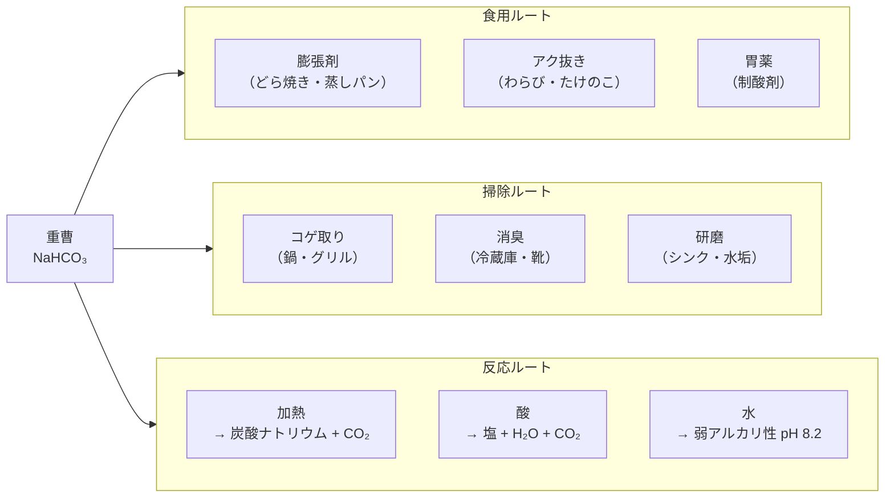
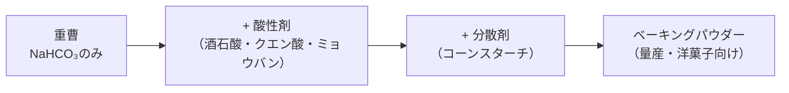

# 重曹の正体と使い道 ― 台所と掃除箱の白い粉末を化学で読み解く

「ベーキングソーダ」「タンサン」「胃薬」「掃除用粉」── 名前は違うのに、中身はぜんぶ同じ白い粉。それが**重曹（炭酸水素ナトリウム NaHCO₃）**だ。

スーパーでも100円ショップでも買える、あまりに身近すぎる粉末。けれど「結局なんなのか」「なぜアルミに使うとダメなのか」「油汚れには本当に効くのか」と聞かれると、答えに詰まる人は多い。ネット上には「掃除用は純度が低い」「万能の魔法の粉」といった、化学の目で見ると怪しい情報も混ざっている。

この記事では、重曹を以下の3つの問いで解きほぐす。

1. **正体** ── 化学的に何者なのか。食用と掃除用は何が違うのか
2. **反応・現象** ── 水・酸・熱・におい・金属に触れたとき、何が起きているのか
3. **実際の使い道** ── 料理・掃除・消臭・入浴・胃薬

化学の知識ゼロでも読めるように、各セクションに必ず1つ「日常生活に置き換えた例え話」を入れた。ぜひ最後まで読んでほしい。

## 重曹の全体像 ― 規格・呼び名・用途のマップ

重曹は「1つの物質」なのに、**呼び名・規格・用途**が多層になっていて混乱しやすい。まずは全体像を俯瞰しよう。

### 呼び名の整理

| 呼び名 | 由来・文脈 | 補足 |
|---|---|---|
| 重曹 | 「重炭酸曹達（じゅうたんさんソーダ）」の略 | 日本での日常語 |
| 炭酸水素ナトリウム | 化学名（IUPAC系の和名） | 化学式 NaHCO₃ |
| 重炭酸ソーダ／重炭酸ナトリウム | 重曹の別名 | 食品・薬品業界で使われる |
| ベーキングソーダ（baking soda） | 英語名 | 製菓の世界での標準呼称 |
| タンサン | 「炭酸」の慣用読み | 山菜のアク抜きでよく登場 |

5つの呼び名を見ても、すべて中身は **NaHCO₃** という1物質を指している。芸名の多い俳優のようなもので、舞台ごとに名前が変わるだけだ。

### 規格による3つの分類

市販されている重曹は、規格の有無で3つに分かれる。

| 規格 | 公的な裏付け | 純度の保証 | 衛生管理 | 口に入れて良いか | 主な用途 | 価格傾向 |
|---|---|---|---|---|---|---|
| 食品添加物グレード | [食品添加物公定書](https://kagakucook.com/baking-soda-standards/) | NaHCO₃ 99.0%以上 | HACCPに準拠 | ○ | 製菓・アク抜き・料理 | 中 |
| 第3類医薬品グレード | [日本薬局方](https://kagakucook.com/baking-soda-standards/) | NaHCO₃ 99.0%以上 | GMPに準拠 | ○ | 胃酸過多の制酸剤 | 高 |
| 掃除用・工業用グレード | 公的規格なし | メーカー基準（[多くは99%以上](https://kagakucook.com/baking-soda-standards/)） | 保証なし | × | 掃除・消臭・工業原料 | 安 |

ここで意外な事実がある。ネット上では「掃除用は純度が低くて不純物が多い」とよく書かれているが、[これは誤情報](https://kagakucook.com/baking-soda-standards/)だ。AGCやトクヤマといった国内大手メーカーの工業用重曹は、**いずれも純度99%以上**を保証している。

では食用と掃除用の本当の違いは何か。それは**「衛生管理と公的規格による品質保証」**の有無だ。掃除用は「食用としての安全が保証されていないから食べてはいけない」のであって、「不純物だらけだから危ない」のではない。例えるなら、同じ豚肉でも「精肉店で売られているもの」と「工業用油脂の原料として流通するもの」は同じ豚肉だが、前者だけが食用として衛生管理されている、という関係に近い。

### NaHCO₃ を中心としたルートの俯瞰



1つの粉末が、これだけ枝分かれする使い道を持っている。逆に言うと、これら全部の根っこにあるのが「炭酸水素イオン HCO₃⁻ の振る舞い」── 次の章で見る主役だ。

**参考ソース:**
- [重曹(炭酸水素ナトリウム)とは？ベーキングパウダーとの違いや使い方を解説 | 健栄生活](https://www.kenei-pharm.com/general/learn/life-style/8510/)
- [重曹の食用と掃除用の違いは「純度」ではない！規格や安全性を解説 | カガクなキッチン](https://kagakucook.com/baking-soda-standards/)
- [炭酸水素ナトリウム（重曹）の化学式NaHCO3の意味を丁寧に解説 | カガクなキッチン](https://kagakucook.com/chemical-formula-of-baking-soda/)

## 重曹の正体 ― 「炭酸水素ナトリウム」を分解して読む

化学式 **NaHCO₃** を、構成イオンに分けて読み解いてみよう。

### 2つのイオンに分かれる

重曹は水に溶けると、次のように[2つのイオン](https://kagakucook.com/chemical-formula-of-baking-soda/)に分かれる。

> NaHCO₃ → Na⁺ + HCO₃⁻

つまり「ナトリウムイオン Na⁺」と「炭酸水素イオン HCO₃⁻」のペアだ。それぞれの性格を見ると、重曹がなぜあんな振る舞いをするのかがわかる。

### Na⁺（ナトリウムイオン）― 目立たない脇役

ナトリウムイオンは、身の回りの物質に**ありふれた陽イオン**だ。

| 物質 | 化学式 | 役割 |
|---|---|---|
| 食塩 | NaCl | 食卓 |
| 石鹸 | RCOONa | 浴室 |
| 漂白剤（ハイター） | NaClO | 洗濯・台所 |
| 洗濯用アルカリ剤 | Na₂CO₃ | 洗濯 |
| 重曹 | NaHCO₃ | 台所・掃除 |

ナトリウムイオンが入る塩は「水に溶けやすい」「目立った化学的特徴を出さない」という共通点を持つ。実は[これらの物質をナトリウムからカリウムに置き換えても、化学的性質はほとんど変わらない](https://kagakucook.com/chemical-formula-of-baking-soda/)。

つまり Na⁺ は、これらの物質の「化学的な顔つき」をほとんど決めていない。物質の性格を握っているのは、もう一方の陰イオンの方だ。

### HCO₃⁻（炭酸水素イオン）― 演技派の主役

主役は **HCO₃⁻**。これがなんとも芸達者な陰イオンで、相手次第で姿を変える。

| 相手 | HCO₃⁻ がなる姿 | 結果 |
|---|---|---|
| 水（弱い相手） | 一部が「炭酸 H₂CO₃」に | OH⁻ が生まれて弱アルカリ性になる |
| 酸（H⁺をくれる相手） | 全量が「炭酸 H₂CO₃」に | 炭酸が分解してCO₂発泡 |
| 熱（強い試練） | 1分子は炭酸に、もう1分子は「炭酸イオン CO₃²⁻」に | CO₂発生 + 炭酸ナトリウム残留 |
| 強アルカリ（NaOHなど） | H⁺を奪われ「炭酸イオン CO₃²⁻」に | 重曹が"酸"として働く |

例えるなら、HCO₃⁻ は**演技派の俳優**だ。優しい相手（水）の前ではささやくようなアルカリ役を演じ、酸という強敵が現れると一気に泡まみれの大立ち回りを始め、火（熱）にあぶられると別人格に変身する。1つの陰イオンが場面ごとにここまで姿を変えるのは、化学の世界でも珍しい。

### 食用と掃除用の違い ── 純度ではなく規格と衛生管理

ここで前の章のおさらい。「食用と掃除用は同じ NaHCO₃ なのに、なぜ食用の方が高いのか？」という疑問の答えは、純度ではなく以下の2つにある。

- **公的な規格に適合した品質保証**（[食品添加物公定書](https://kagakucook.com/baking-soda-standards/)・日本薬局方）
- **製造工程の衛生管理**（HACCP、GMP）

中身の重曹そのものは、食用も工業用もほとんど同じ。違うのは「それが食べても大丈夫だという第三者保証が付いているかどうか」だ。

「同じパスタの乾麺でも、家庭向けの食品スーパーに並ぶ袋と、工場のラインで使われる業務用箱では、トレーサビリティと衛生管理の手厚さが違う」と思えばイメージしやすい。

**参考ソース:**
- [炭酸水素ナトリウム（重曹）の化学式NaHCO3の意味を丁寧に解説 | カガクなキッチン](https://kagakucook.com/chemical-formula-of-baking-soda/)
- [重曹の食用と掃除用の違いは「純度」ではない！規格や安全性を解説 | カガクなキッチン](https://kagakucook.com/baking-soda-standards/)
- [重曹(炭酸水素ナトリウム)とは？ベーキングパウダーとの違いや使い方を解説 | 健栄生活](https://www.kenei-pharm.com/general/learn/life-style/8510/)
- [重曹とは – 石鹸百科](https://www.live-science.com/honkan/partner/bicarbonate01.html)

## 重曹を使うと何が起きているのか ― 5つの反応と現象

ここからは、重曹の「使用シーン」を化学反応として読み替えていく。台所や掃除箱で起きていることが、実はぜんぶ HCO₃⁻ の振る舞いに集約されることが見えてくる。

### 1. 水に溶かす → 弱アルカリ性（pH 8.2）

重曹を水に溶かすと、[pH 8.2 程度のごく弱いアルカリ性](https://www.live-science.com/honkan/partner/bicarbonate01.html)（2%水溶液、20℃）になる。

仕組みはこうだ。HCO₃⁻ の一部が水と反応して、わずかに OH⁻（水酸化物イオン）を生み出す。

> HCO₃⁻ + H₂O ⇄ H₂CO₃ + OH⁻

OH⁻ が生まれる、つまりアルカリ性。ただし「ごく一部」しか反応しないので、アルカリの強さは弱い。

```chart
{
  "type": "bar",
  "data": {
    "labels": ["重曹", "セスキ炭酸ソーダ", "炭酸ソーダ", "水酸化ナトリウム"],
    "datasets": [{
      "label": "pH（水溶液）",
      "data": [8.2, 9.8, 11.2, 14],
      "backgroundColor": ["#8b0000", "#b8860b", "#4682b4", "#2f4f4f"]
    }]
  },
  "options": {
    "plugins": {
      "title": { "display": true, "text": "アルカリ剤のpH比較" },
      "legend": { "display": false }
    },
    "scales": {
      "y": { "beginAtZero": true, "max": 14, "title": { "display": true, "text": "pH" } }
    }
  }
}
```

例えるなら、重曹は**「ささやき声で文句を言うアルカリ」**だ。同じアルカリ剤でも、炭酸ソーダ（pH 11.2）が「大声で説教するおじさん」で、水酸化ナトリウム（pH 14）が「怒鳴り散らす上司」だとすれば、重曹は「廊下の隅で小声でぼやく後輩」くらいの強さしかない。

この「弱さ」が、肌にやさしい・素材を傷めにくいという長所になる一方で、ある誤解の原因にもなっている。それが次の節につながる。

### 重要な訂正:「重曹で油汚れが落ちる」は控えめに

ネット上では「重曹は油汚れを中和する」と説明されることが多いが、化学的には[これはほぼ間違い](https://kagakucook.com/chemical-formula-of-baking-soda/)だ。重曹の弱アルカリ性は、油脂の分解（鹸化）には弱すぎる。

油汚れにしっかり効かせたいなら、重曹より pH の高い**セスキ炭酸ソーダ（pH 9.8）**や**炭酸ソーダ（pH 11.2）**の方が向いている。重曹で油汚れを落としたつもりでも、実際は研磨力で「物理的にこすり落としている」ことが多い。

ただし、皮脂汚れ（脂肪酸）はわずかに中和されるので、軽い手垢や床の足あとくらいなら重曹水で対応できる。「重曹は油に弱い」と覚えておくと、掃除の失敗が減る。

### 2. 酸と混ざる → 発泡（CO₂発生）

重曹に酸を加えると、シュワッと泡立つ。これが**酸との中和反応**で、反応式は次のとおり。

> NaHCO₃ + 酸 → 塩 + H₂O + CO₂

具体例として、酢の主成分である酢酸との反応はこうだ。

> CH₃COOH + NaHCO₃ → CH₃COONa + H₂O + CO₂

ここで起きているのは、HCO₃⁻ が酸からH⁺を受け取って炭酸 H₂CO₃ になり、それが分解して CO₂ と H₂O に分かれる、という流れ。発泡の正体は CO₂ の気泡だ。

クエン酸・酢・レモン汁・ヨーグルト（乳酸）など、酸性の食材なら何でも反応する。

例えるなら、これは**ラムネ菓子が口の中で泡立つのと同じ仕組み**だ。実際、市販のラムネ菓子の多くは「重曹＋クエン酸」で作られている。唾液の水分で2つが反応して、口の中で CO₂ が出る。バスボム（発泡入浴剤）も同じ原理で、重曹＋[フマル酸やコハク酸などの有機酸](https://kagakucook.com/chemical-formula-of-baking-soda/)を組み合わせて作られている。

### 3. 加熱する → 二酸化炭素を放出して炭酸ナトリウムに

重曹を熱すると、こんな反応が起きる。

> 2NaHCO₃ → Na₂CO₃ + H₂O + CO₂

固体の重曹が分解し、**炭酸ナトリウム（Na₂CO₃）**と水と二酸化炭素が出てくる。乾いた重曹の分解には[かなりの高温が必要だが、水を充分に加えると65℃以上で急速に分解](https://www.live-science.com/honkan/partner/hikaku.html)が起こる。

これは2つの大事な実用例につながっている。

| シーン | 起きていること | 結果 |
|---|---|---|
| ケーキ・パン・どら焼き | 生地の中で重曹が熱分解 → CO₂ が生地を膨らませる | ふっくら焼き上がる |
| 鍋のコゲ取り | 重曹水を沸かす → CO₂ の泡がコゲと鍋底の間に入り込む | コゲが浮き上がる |

例えるなら、これは**お餅を焼くと内側からプクッと膨らむ**のと同じだ。お餅は内部の水分が水蒸気になって殻を押し上げるが、重曹の場合は CO₂ ガスが生地（あるいはコゲと鍋の隙間）を内側から押し広げる。「気体が膨らむ力」を使って何かを変形させる、という共通点で結ばれている。

ちなみに、出来上がった炭酸ナトリウム Na₂CO₃ は重曹より強いアルカリ性なので、[「重曹水を沸騰させると洗浄力が上がる」というのは化学的には正しい](https://kagakucook.com/chemical-formula-of-baking-soda/)。ただ、最初から炭酸ソーダを買ってきて使う方が手っ取り早い、という話でもある。

### 4. におい分子を中和する → 消臭

重曹は消臭剤として置かれているのを見かけるが、ここで何が起きているのか。

実は重曹は**酸性のにおい分子だけを選んで中和する**。代表例は次の通り。

| におい | 主な原因物質 | 性質 | 重曹が効くか |
|---|---|---|---|
| 汗・足・靴のにおい | [3-メチルブタン酸](https://norox.jp/blog/101) | 酸性 | ○ |
| 生ゴミ・腐敗臭 | 脂肪酸類 | 酸性 | ○ |
| シンク・排水溝の悪臭 | [硫化水素・メチルメルカプタン](https://norox.jp/blog/101) | 酸性 | ○ |
| トイレのおしっこ臭 | アンモニア | アルカリ性 | × |
| 魚の腐敗臭 | トリメチルアミン | アルカリ性 | × |

ポイントは「酸性のにおいには中和反応で効くが、アルカリ性のにおいには効かない」ということ。重曹自体が弱アルカリ性なので、同じアルカリ性のにおいとは反応のしようがないからだ。

例えるなら、重曹は**「言い争っている2人の真ん中に立って黙らせる仲裁役」**だ。ただし、仲裁できるのは「酸性vs自分」のケンカだけ。同じアルカリ性が相手だと、ケンカにならず気まずい沈黙が続く（＝においが残る）。

なお、重曹は[湿気を吸う作用](https://norox.jp/blog/101)もあり、これも消臭に間接的に効く。湿気が多い場所はにおいの原因菌が繁殖しやすいので、湿気を吸い取ることで菌の増殖を抑え、においが発生しにくい環境にしてくれる。

### 5. アルミに触れる → 黒変

重曹をアルミ鍋やアルミ容器に使うと、表面が**黒く変色**してしまう。

仕組みはこうだ。アルミの表面は普段、薄い酸化皮膜（Al₂O₃）で守られている。この皮膜が「両性酸化物」── 酸にもアルカリにも溶ける性質を持っているため、ごく弱いアルカリの重曹でも、長時間触れていると皮膜が溶けて、その下のアルミが反応してしまう。結果、黒っぽい変色が残る。

[コジカジ](https://cojicaji.jp/cleaning/cleaning-goods/965)が指摘しているように、ふれた瞬間に変色するわけではない。けれど大切な無水鍋や煮物用の大鍋を長く使いたいなら、重曹は避けるべきだ。

例えるなら、これは**「優しい言葉でも、特定の人にだけ刺さってしまう」**現象に似ている。重曹自体は穏やかなアルカリで、ほとんどの素材には無害だ。けれど両性酸化物という"刺さる相手"には、その穏やかさが意外と効いてしまう。

ちなみに同じ理由で、銅・真鍮・大理石・漆器・無垢材・畳なども重曹と相性が悪い。詳しくは後の判定表で整理する。

**参考ソース:**
- [炭酸水素ナトリウム（重曹）の化学式NaHCO3の意味を丁寧に解説 | カガクなキッチン](https://kagakucook.com/chemical-formula-of-baking-soda/)
- [重曹の消臭効果はどれくらい？消臭のメカニズムと重曹を使った4つの消臭対策方法 | norox](https://norox.jp/blog/101)
- [重曹をアルミ素材に使うのはNG！？どう使うのが正解？ | コジカジ](https://cojicaji.jp/cleaning/cleaning-goods/965)
- [重曹・セスキ・炭酸ソーダ（炭酸塩）の比較 – 石鹸百科](https://www.live-science.com/honkan/partner/hikaku.html)
- [重曹を使って掃除をする際の5つの注意点！効果的な掃除方法も解説 | ライオンケミカル](https://www.lionchemical.jp/trivia/baking-soda-caution)

## 実際の使い道 ― シーン別の処方箋

ここまでの「反応の知識」を、具体的なシーン別の使い方に落とし込んでいこう。

### 料理での使い道

#### 膨張剤として

[重曹の膨張作用は、横方向に広がるのが特徴](https://www.kenei-pharm.com/general/learn/life-style/8510/)。一方、ベーキングパウダーは縦方向に膨らむ。さらに、重曹を多く入れると「特有の苦味とアルカリ臭、黄色っぽい焼き色」が出やすい。

このため、重曹は次のような「素朴系・和菓子寄り」のお菓子に向いている。

- どら焼き
- 蒸しパン
- 甘食
- 黒糖まんじゅう

逆にバターを使ったマフィンやスポンジケーキなど、洋菓子寄りの繊細な仕上がりには[ベーキングパウダーの方が向いている](https://www.kenei-pharm.com/general/learn/life-style/8510/)。

#### ベーキングパウダーとの違い

両者の関係は、次の図のようになっている。



つまり、ベーキングパウダーは**「重曹に予め酸性剤を混ぜて、苦味と色味を改良した量産モデル」**だ。重曹だけで作ると生地に酸性成分（ヨーグルト・レモン・ココアなど）を加える必要があるが、ベーキングパウダーなら水と熱だけで反応が起きる。

代用するときの目安は[次の通り](https://www.kenei-pharm.com/general/learn/life-style/8510/)。

| 元のレシピ | 代用するもの | 量 |
|---|---|---|
| 重曹 | ベーキングパウダー | 約2倍量 |
| ベーキングパウダー | 重曹 | 約1/2量 |

ベーキングパウダーから重曹に置き換える場合、苦味が気になるならヨーグルトやレモンなど酸性食材を加えると中和されて目立たなくなる。

例えるなら、重曹は**「老舗の甘味処の素朴な蒸しパン」**、ベーキングパウダーは**「コンビニで売っている華やかなマフィン」**。どちらが優れているかではなく、目指す味に応じて使い分ける道具だ。

#### アク抜き

わらびやぜんまいなど、アクの強い山菜の下処理に重曹はよく使われる。

[関西スーパーの解説](https://www.kansaisuper.co.jp/memo/motto12)によると、わらびのアク抜きの目安は次の通り。

> 鍋に水と重曹を（5カップ：小さじ1）の割合で入れ、煮立ったら火を止めます。この中に、わらびを入れてフタをしたまま一晩おき、その後、何回か水洗いします。

仕組みはこうだ。お湯を沸騰させると重曹は炭酸ナトリウム（より強いアルカリ）に変化し、[植物の細胞壁にあるペクチンやヘミセルロースを軟化させる](https://kagakucook.com/chemical-formula-of-baking-soda/)。すると細胞内のアク成分（シュウ酸・ポリフェノール類など）が外に溶け出しやすくなる。

例えるなら、これは**「冷たい水に浸した雑巾より、お湯に漬けた雑巾の方が汚れが落ちやすい」**のと似ている。アルカリ性のお湯が植物の組織を緩め、中に閉じ込められたアクを引き出してくれる。ちなみに、入れすぎると独特の苦味やヌルつきが出るので、レシピ通りの分量を守るのが肝心だ。

#### タンパク質の軟化

[Wikipedia](https://ja.wikipedia.org/wiki/炭酸水素ナトリウム)によると、重曹はタンパク質分解作用を持ち、豆・肉・イカ・エビ・タコなどを柔らかく煮るためにも使われる。中華麺打ちで使う「かん水」（炭酸ナトリウム主体）の代用としても利用できる。

**参考ソース:**
- [重曹(炭酸水素ナトリウム)とは？ベーキングパウダーとの違いや使い方を解説 | 健栄生活](https://www.kenei-pharm.com/general/learn/life-style/8510/)
- [山菜のアク抜き｜関西スーパー](https://www.kansaisuper.co.jp/memo/motto12)
- [炭酸水素ナトリウム（重曹）の化学式NaHCO3の意味を丁寧に解説 | カガクなキッチン](https://kagakucook.com/chemical-formula-of-baking-soda/)
- [炭酸水素ナトリウム - Wikipedia](https://ja.wikipedia.org/wiki/炭酸水素ナトリウム)

### 掃除での使い道

#### 基本のレシピ

[ダスキンの解説](https://www.duskin.jp/merrymaids/column/detail/00028/)を参考にすると、用途別の重曹レシピは次のようにまとめられる。

| 形 | 配合 | 用途 |
|---|---|---|
| 重曹水スプレー | 水100ml + 重曹小さじ1 | 軽い汚れ・拭き掃除・消臭 |
| 重曹ペースト | 重曹大さじ3 + 水大さじ1 | コンロ・換気扇のしつこい汚れ |
| 煮沸液 | 水500ml + 重曹大さじ2 | 鍋のコゲ・グリルの油汚れ |
| 粉のまま | そのまま振りかけ | シンクのぬめり・布製品の消臭 |

#### コゲ取り（鍋・グリル）

鍋にコゲた焦げ付きがある場合、水を張って重曹を溶かし、火にかける。65℃以上で重曹が分解して **CO₂の泡**が発生し、コゲと鍋底の隙間に入り込んで持ち上げてくれる。さらに、固体の重曹粒子が研磨剤としても働く。

ただし**アルミ鍋には絶対に使わないこと**。前節で見たように、表面の酸化皮膜が溶けて黒変する。

#### シンク・排水口のぬめり

[noroxの解説](https://norox.jp/blog/101)に従うと、排水溝やシンクには「水で予洗い → 重曹を粉のまま満遍なく振りかける → 30分から1時間放置 → スポンジでこする → 水で流す」という手順が良い。弱アルカリ性とぬめりの中和、研磨力、そして消臭が同時に効く。

#### 電子レンジ庫内

耐熱容器に水と重曹小さじ1ほどを入れて、電子レンジで加熱（数分）。重曹水の湯気が庫内に行き渡り、油汚れがふやけて拭き取りやすくなる。

#### 重曹・セスキ・炭酸ソーダの使い分け

「アルカリ剤3兄弟」と呼ぶべき関係を整理すると、次のような[使い分け表](https://www.live-science.com/honkan/partner/hikaku.html)になる。

| 項目 | 重曹 | セスキ炭酸ソーダ | 炭酸ソーダ |
|---|---|---|---|
| 化学式 | NaHCO₃ | Na₂CO₃・NaHCO₃・2H₂O | Na₂CO₃ |
| pH | 8.2 | 9.8 | 11.2 |
| 水への溶けやすさ | △ やや溶けにくい | ◎ 非常に溶けやすい | ○ 溶けやすい |
| 油汚れ | △ | ◎ | ◎ |
| 洗濯 | × | ◎ | ◎ |
| 鍋のコゲ落とし | ◎ | ○ | × |
| 研磨力（クレンザー） | ◎ | × | × |
| 消臭 | ◎ | ◎ | ◎ |
| 入浴剤 | ◎ | ◎ | ◎ |
| ゴム手袋 | 通常不要 | 短時間なら不要 | 必要 |

注: 鍋のコゲ落としで重曹が一番強いのは、加熱時に発生する **CO₂の量が3者の中で最も多い**から。研磨力で勝るのは、水に溶けにくく粒子のまま残るから。

例えるなら、3兄弟の役割分担はこうだ。

- **重曹**：「研磨力もあるオールラウンダー（ただしアルカリは弱め）」── コンビ家電
- **セスキ**：「水によく溶ける軽量級」── スプレー専用
- **炭酸ソーダ**：「強アルカリの重量級」── ガッツリ油汚れ・洗濯

レーダーチャートでも整理してみよう。

```chart
{
  "type": "radar",
  "data": {
    "labels": ["pHの強さ", "水への溶けやすさ", "油汚れ", "コゲ落とし", "研磨力", "消臭"],
    "datasets": [
      {
        "label": "重曹",
        "data": [2, 2, 2, 5, 5, 5],
        "borderColor": "#8b0000",
        "backgroundColor": "rgba(139, 0, 0, 0.2)"
      },
      {
        "label": "セスキ炭酸ソーダ",
        "data": [3, 5, 5, 4, 1, 5],
        "borderColor": "#b8860b",
        "backgroundColor": "rgba(184, 134, 11, 0.2)"
      },
      {
        "label": "炭酸ソーダ",
        "data": [5, 4, 5, 1, 1, 5],
        "borderColor": "#4682b4",
        "backgroundColor": "rgba(70, 130, 180, 0.2)"
      }
    ]
  },
  "options": {
    "plugins": {
      "title": { "display": true, "text": "アルカリ剤3兄弟の特性比較（5段階）" }
    },
    "scales": {
      "r": { "beginAtZero": true, "max": 5 }
    }
  }
}
```

#### やってはいけないこと

[ライオンケミカル](https://www.lionchemical.jp/trivia/baking-soda-caution)・[コジカジ](https://cojicaji.jp/cleaning/cleaning-goods/965)・[健栄生活](https://www.kenei-pharm.com/general/learn/life-style/8510/)に共通する注意点は次の通り。

- **アルミ・銅・真鍮**：化学反応で黒変
- **大理石**：研磨で表面が傷つく
- **漆器・無垢材・白木**：研磨で塗膜が損傷
- **畳**：吸湿性が高く、重曹が残ると変色・カビの原因
- **ガラスやプラスチックの塗装面**：研磨傷

また、長時間素手で触れ続けると[手荒れの原因](https://www.lionchemical.jp/trivia/baking-soda-caution)になる。重曹の粒子が手の表面をこする物理的刺激と、わずかなアルカリ性が皮膚の油分を奪うためだ。継続的に使うならゴム手袋の着用が無難。

**参考ソース:**
- [重曹はお掃除にも大活躍！お掃除できる場所やおすすめの使い方 | ダスキン](https://www.duskin.jp/merrymaids/column/detail/00028/)
- [重曹・セスキ・炭酸ソーダ（炭酸塩）の比較 – 石鹸百科](https://www.live-science.com/honkan/partner/hikaku.html)
- [重曹をアルミ素材に使うのはNG！？どう使うのが正解？ | コジカジ](https://cojicaji.jp/cleaning/cleaning-goods/965)
- [重曹を使って掃除をする際の5つの注意点！効果的な掃除方法も解説 | ライオンケミカル](https://www.lionchemical.jp/trivia/baking-soda-caution)
- [重曹(炭酸水素ナトリウム)とは？ベーキングパウダーとの違いや使い方を解説 | 健栄生活](https://www.kenei-pharm.com/general/learn/life-style/8510/)

### 消臭での使い道

[noroxの解説](https://norox.jp/blog/101)・[健栄生活の靴消臭ガイド](https://www.kenei-pharm.com/general/learn/life-style/8174/)を参考に、シーン別の使い方をまとめると次の通り。

| 場所 | 使い方 | 効果の持続 |
|---|---|---|
| 冷蔵庫 | 口の広い容器に重曹を7分目まで → ガーゼをかけて輪ゴム → 庫内へ | 2〜3ヶ月 |
| 下駄箱・クローゼット | 同上、奥に置く | 2〜3ヶ月 |
| 靴 | 古い靴下に重曹を詰めて口を縛り、靴に入れて一晩 | 2〜3ヶ月 |
| ソファ・布団 | 粉のまま振りかけ → 1〜2時間放置 → 掃除機で吸引 | 1回ごと |
| 重曹スプレー | 水100ml + 重曹小さじ0.5〜1 | スプレーごと |

容器に詰める方式は、ジャムの空き瓶などが便利。ガーゼやラップ（つまようじで穴を開ける）でフタをすれば、湿気を吸って固まったタイミング（だいたい2〜3ヶ月）が交換のサインになる。

例えるなら、容器に入れた重曹は**「冷蔵庫の中の聞き役」**だ。庫内の食材から漂う酸性のグチ（においの分子）を、黙々と中和してくれる。ただし聞き役にも限界があり、湿気を吸って固まったらお役御免。新しい聞き役と交代する必要がある。

注意：**スプレーは作り置きしない**こと。[健栄生活](https://www.kenei-pharm.com/general/learn/life-style/8510/)によると重曹水は時間が経つとスプレーノズルを詰まらせる原因になる。1週間以内に使い切るのが目安だ。

**参考ソース:**
- [重曹の消臭効果はどれくらい？消臭のメカニズムと重曹を使った4つの消臭対策方法 | norox](https://norox.jp/blog/101)
- [靴の消臭には重曹が役立つ！足のにおいの原因や予防方法を紹介 | 健栄生活](https://www.kenei-pharm.com/general/learn/life-style/8174/)

### その他の使い道（入浴剤・胃薬）

#### 入浴剤として

重曹は[ごく弱いアルカリ性のお湯](https://www.live-science.com/honkan/partner/bicarbonate01.html)を作るので、皮脂汚れを浮かせる効果がある。実際、温泉成分の一部としても重曹は知られている（炭酸水素塩泉）。

発泡入浴剤（バスボム）は、重曹＋有機酸（フマル酸・コハク酸・クエン酸など）の組み合わせで、お湯に入れると CO₂ がシュワシュワ出る、というラムネ菓子と同じ仕組みだ。

#### 胃薬として

第3類医薬品の重曹は、[胃酸過多の制酸剤](https://ja.wikipedia.org/wiki/炭酸水素ナトリウム)として使われる（医療用医薬品では「メイロン」という商品名）。胃酸の主成分は塩酸（HCl）なので、重曹を飲むと胃の中でこの反応が起きる。

> NaHCO₃ + HCl → NaCl + H₂O + CO₂

胃酸が中和されて酸過多が収まり、副産物として CO₂ が発生する（これがゲップの正体）。ただし、CO₂ が胃を刺激してさらなる胃酸分泌を促すこともあり、根治療法ではなく**その場しのぎの対症療法**にとどまる。

例えるなら、体内で胃酸を中和するのも、台所のシンクで酸性のにおいを中和するのも、**重曹は「酸を中和する」という仕事を体内・体外で同じようにこなしている**だけだ。

**参考ソース:**
- [重曹(炭酸水素ナトリウム)とは？ベーキングパウダーとの違いや使い方を解説 | 健栄生活](https://www.kenei-pharm.com/general/learn/life-style/8510/)
- [炭酸水素ナトリウム（重曹）の化学式NaHCO3の意味を丁寧に解説 | カガクなキッチン](https://kagakucook.com/chemical-formula-of-baking-soda/)
- [炭酸水素ナトリウム - Wikipedia](https://ja.wikipedia.org/wiki/炭酸水素ナトリウム)

## 重曹を使うときの判定表 ― 〇 と ✕

ここまでの内容を、「向いているケース」と「向いていないケース」に整理して一覧表にしよう。

### 〇 重曹が向いているケース

| 用途 | 判定 | 理由 |
|---|---|---|
| 鍋のコゲ取り | ◎ | 加熱で CO₂ が出てコゲを浮かす + 研磨力 |
| シンク・排水溝のぬめり | ○ | 弱アルカリ + 研磨 + 消臭 |
| 電子レンジの油汚れ | ○ | 加熱した湯気で油をふやかす |
| 軽い皮脂汚れ・手垢 | ○ | 脂肪酸とは中和反応が起きる |
| 酸性のにおい消臭（汗・生ゴミ・靴） | ◎ | 酸塩基中和でにおい分子を無臭化 |
| 和菓子の膨張剤 | ◎ | 横に膨らむ・素朴な色味 |
| 山菜・たけのこのアク抜き | ◎ | アルカリで植物の細胞壁を軟化 |
| 入浴剤 | ○ | 皮脂を浮かせる + 温泉成分としての歴史 |
| 胃酸過多の応急処置 | ○ | 制酸剤として認可された医薬品グレードあり |

### ✕ 重曹が向いていないケース

| 用途 | 判定 | 理由 |
|---|---|---|
| 換気扇などのしつこい油汚れ | △〜× | アルカリが弱すぎて鹸化が進まない（炭酸ソーダ・セスキ推奨） |
| アルミ鍋・銅・真鍮 | × | 表面の酸化皮膜が溶けて黒変 |
| 大理石 | × | 研磨で艶が失われる |
| 漆器・無垢材・白木・畳 | × | 研磨と吸湿で素材が傷む |
| トイレのアンモニア臭 | × | アルカリ性同士なので中和できない（クエン酸推奨） |
| 魚のトリメチルアミン臭 | × | アルカリ性のため中和できない |
| 白くカチカチの水垢 | × | アルカリ性の水垢にはクエン酸の方が効く |
| 洗濯（汚れ落としとして） | × | 水に溶けにくくアルカリも弱い |
| 重曹水のスプレー作り置き | × | ノズル詰まり・密閉容器の破裂リスク |

ポイントは、「弱アルカリ・研磨力・酸との反応・熱分解・消臭」という重曹の5つの特性を、**正しく当てはまる場面で使えば優秀なアシスタント、使い方を間違えると素材を傷めるトラブルメーカー**になる、ということだ。

例えるなら、重曹は**「器用な万能助手」**ではなく、**「得意分野がはっきりした専門スタッフ」**に近い。何でもこなす万能感を期待すると裏切られるが、向いた仕事を任せれば最高のパフォーマンスを発揮する。

**参考ソース:**
- [重曹をアルミ素材に使うのはNG！？どう使うのが正解？ | コジカジ](https://cojicaji.jp/cleaning/cleaning-goods/965)
- [重曹を使って掃除をする際の5つの注意点！効果的な掃除方法も解説 | ライオンケミカル](https://www.lionchemical.jp/trivia/baking-soda-caution)
- [重曹・セスキ・炭酸ソーダ（炭酸塩）の比較 – 石鹸百科](https://www.live-science.com/honkan/partner/hikaku.html)
- [重曹の消臭効果はどれくらい？消臭のメカニズムと重曹を使った4つの消臭対策方法 | norox](https://norox.jp/blog/101)

## まとめ ― 重曹は「弱アルカリで、酸と熱でCO₂を出し、においを中和する塩」

長くなったので、最後に1文で要約しておこう。

> 重曹は、**弱アルカリ性**を示し、**酸と反応してCO₂**を出し、**熱で炭酸ナトリウムに分解**しながらCO₂を出し、**酸性のにおい分子を中和**する、**ナトリウムの塩**だ。

これだけ覚えておけば、重曹を見るたびに「ああ、HCO₃⁻ がまた何かの相手と反応するわけね」と読み解けるようになる。

ネット上にある「魔法の万能粉」という喧伝は実情と違うし、「掃除用は純度が低い」という情報も誤りだ。けれど、化学的な性質を正しく理解した上で使えば、重曹は確かに**台所と掃除箱の頼れる助手**になってくれる。料理にも、掃除にも、消臭にも、応急の胃薬にも。1袋500円足らずで、これだけの仕事をこなす素材は珍しい。

もし買ったまま戸棚で眠っている重曹があるなら、まずは靴下に詰めて靴箱に入れるところから始めてみてほしい。2〜3ヶ月後、固まった重曹をゴミに出すとき、「ああ、この粉は今までずっと、靴のにおいの原因物質と地味に中和反応を続けていたんだな」と思えれば、その時あなたは、もう重曹を「なんとなくよくわからない白い粉」とは見なくなっているはずだ。
