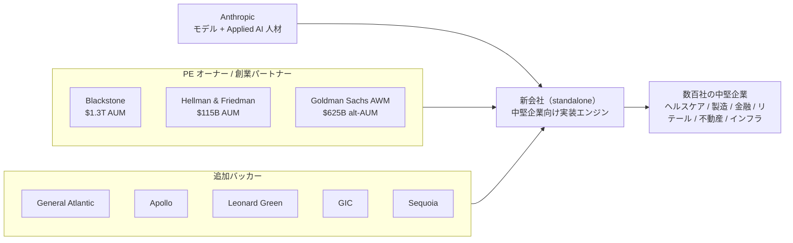
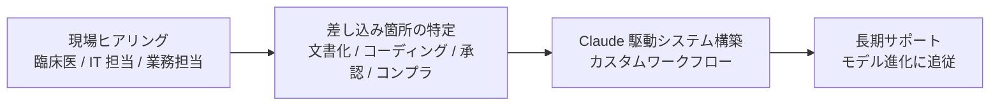

# Claudeを中堅企業の中枢に埋め込む——Anthropic新会社が再発明するコンサル業

2026年5月4日、Anthropic と Wall Street の3社（Blackstone・Hellman & Friedman・Goldman Sachs）が **約15億ドル** を出し合って、新しい AI ネイティブのサービス会社を立ち上げた。社名はまだ決まっていない。けれど、これはただの資本提携のニュースではない。

一言でいえば、**「コンサル業界そのものを作り変えてしまおう」** という挑戦だ。狙い目は3つ。
- **客** は中堅企業（年商で数百億〜数千億円クラス）
- **ライバル** は McKinsey・BCG・Bain や、TCS・Infosys・Wipro といった大手コンサル・IT 企業
- **奪う売上** はコンサル料そのもの

AI を作る最先端の会社が、ついにコンサルの仕事場に直接乗り込んできた、というニュースだ。

新会社が顧客にやることはシンプルだ。Anthropic のエンジニアを顧客企業の現場に常駐させ、Claude を業務の中枢に組み込んだシステムをその場で作り、長期的に運用までやる。レポートとロードマップを納めて帰る従来コンサルとは違い、**動いているシステムごと納品する**。

## 1. リード — いま、コンサル業が静かに書き換わっている

これまで「AI をどう業務に取り入れるか」を企業に教えてきたのは、3つのタイプの会社だった。
- 戦略コンサル：McKinsey・BCG・Bain
- 大手 SI：Accenture・Deloitte・PwC
- インドの IT サービス大手：TCS・Infosys・Wipro・HCL

仕事のやり方はどこも似ていて、「業界知識」と「汎用テクノロジー」を組み合わせ、分厚いレポートと実行プランを置いていく、というものだ。

新会社のやり方は、これとはまったく違う。Anthropic のエンジニアが顧客企業に直接入り込み、業務の中心に Claude を組み込んでいく。Anthropic 自身も「Claude を企業の中枢業務に組み込むには、現場での泥臭いエンジニアリングと、その業務への深い理解の両方が必要だ」と説明している。

そして、最初の顧客は出資した PE（プライベートエクイティ）各社のポートフォリオ企業。**「最初から数百社の中堅企業がお客様として確保されている」** という、普通のスタートアップではあり得ない出発点だ。

> 「企業からの Claude への需要は、いかなる単一の提供方式の能力をも大きく上回っている。」
> — Krishna Rao（Anthropic CFO）

つまり、需要は溢れているのに、それを業務に組み込める人材が地球上に足りない。だから自分たちで作る——そう決めた、ということだ。

**参考ソース:**

- [Building a new enterprise AI services company with Blackstone, Hellman & Friedman, and Goldman Sachs｜Anthropic](https://www.anthropic.com/news/enterprise-ai-services-company)
- [Anthropic Partners with Blackstone, Hellman & Friedman, and Goldman Sachs to Launch Enterprise AI Services Firm｜Blackstone](https://www.blackstone.com/news/press/anthropic-partners-with-blackstone-hellman-friedman-and-goldman-sachs-to-launch-enterprise-ai-services-firm/)
- [Anthropic takes shot at consulting industry in joint venture with Wall Street giants｜Fortune](https://fortune.com/2026/05/04/anthropic-claude-consulting-industry-joint-venture-blackstone-goldman-sachs/)
- [Anthropic and OpenAI are both launching joint ventures for enterprise AI services｜TechCrunch](https://techcrunch.com/2026/05/04/anthropic-and-openai-are-both-launching-joint-ventures-for-enterprise-ai-services/)

## 2. 何が発表されたのか——事実の整理

5月4日に San Francisco で発表された一次情報を、まずは数字と固有名詞で整理する。Anthropic は出資総額を正式には認めていないが、Wall Street Journal・Reuters・Financial Times が **約15億ドル** という数字を報じている。

| 項目 | 内容 |
|---|---|
| 発表日 | 2026年5月4日 |
| 当事者（創業パートナー） | Anthropic / Blackstone / Hellman & Friedman / Goldman Sachs |
| 形態 | 独立した新会社（standalone entity）。社名・評価額未公表 |
| 出資総額 | 約15億ドル（WSJ・Reuters・FT 報、Anthropic 未確認） |
| 主な出資内訳（FT 経由） | Anthropic / Blackstone / H&F が各 **3億ドル**、Goldman Sachs が **1.5億ドル**、General Atlantic が **1.5億ドル** |
| 追加バッカー | Apollo Global Management / Leonard Green / GIC（シンガポール政府投資公社）/ Sequoia Capital |
| 人材 | Anthropic のエンジニアと Applied AI スタッフが新会社に直接組み込まれる |
| 第1ターゲット | 出資各社のポートフォリオ企業（数百社）→ 独立系の中堅企業へ展開 |
| 重点産業 | ヘルスケア・製造業・金融サービス・リテール・不動産・インフラ |
| 位置づけ | Anthropic の Claude Partner Network のメンバー（Accenture・Deloitte・PwC 等と並ぶ） |

ここで一番注目すべきは「**Anthropic の一部門ではなく、独立した新会社を作った**」という点だ。Blackstone のプレスリリースには「Anthropic のエンジニアとパートナーシップ要員が、新会社のチームに直接組み込まれる」とはっきり書かれている。本体の中に置くのではなく、独立した会社の中に Anthropic 人材を常駐させる、という構造になっている。

例えるなら、これは**「本店」と「フランチャイズ専門の新ブランド」の関係**に近い。本店（Anthropic）は今まで通り API・モデルを売り、Accenture や Deloitte と組んで超大企業の店舗運営をやる。一方、新ブランド（新会社）は中堅企業の店舗を、PE のネットワークを使ってまとめて開いていく、という分担だ。

**参考ソース:**

- [Building a new enterprise AI services company with Blackstone, Hellman & Friedman, and Goldman Sachs｜Anthropic](https://www.anthropic.com/news/enterprise-ai-services-company)
- [Anthropic Partners with Blackstone, Hellman & Friedman, and Goldman Sachs to Launch Enterprise AI Services Firm｜Blackstone](https://www.blackstone.com/news/press/anthropic-partners-with-blackstone-hellman-friedman-and-goldman-sachs-to-launch-enterprise-ai-services-firm/)
- [Anthropic, Goldman and others launch $1.5 billion AI venture｜CNBC](https://www.cnbc.com/2026/05/04/anthropic-goldman-blackstone-ai-venture.html)
- [Anthropic and OpenAI are both launching joint ventures for enterprise AI services｜TechCrunch](https://techcrunch.com/2026/05/04/anthropic-and-openai-are-both-launching-joint-ventures-for-enterprise-ai-services/)
- [Blackstone and Goldman back Anthropic's $1.5bn AI joint venture｜Private Banker International](https://www.privatebankerinternational.com/news/blackstone-goldman-anthropic-joint-venture/)
- [Anthropic's new AI venture could intensify competition for Infosys, TCS and Wipro｜People Matters](https://www.peoplematters.in/news/ai-and-emerging-tech/anthropics-new-ai-venture-could-intensify-competition-for-infosys-tcs-and-wipro-49627)
- [Anthropic Partners with Blackstone, Hellman & Friedman, and Goldman Sachs to Launch Enterprise AI Services Firm｜GIC](https://www.gic.com.sg/newsroom/all/anthropic-partners-with-blackstone-hellman-friedman-and-goldman-sachs-to-launch-enterprise-ai-services-firm/)

## 3. 主要プレイヤーと勢力図

新会社の周りには、性格の違う4種類のプレイヤーが集まっている。
- **AI の作り手**：Anthropic
- **PE オーナー**：Blackstone・H&F・Goldman・General Atlantic
- **追加の出資者**：Apollo・Leonard Green・GIC・Sequoia
- **顧客**：中堅企業

それぞれの役割と規模をまとめると次の通り。

| プレイヤー | カテゴリ | 役割 | 出資額・規模感 |
|---|---|---|---|
| Anthropic | フロンティア AI 企業 | モデルと人材を提供 | 約3億ドル / 評価額9000億ドル目指す調達中 / ARR 約90億→300億ドル超（SiliconANGLE 報） |
| Blackstone | 世界最大級のオルタナ運用 | ポートフォリオ提供と経営支援 | 約3億ドル / 1.3兆ドル超 AUM |
| Hellman & Friedman | グローバル PE | 中型成長企業ポートフォリオ提供 | 約3億ドル / 1150億ドル超 AUM |
| Goldman Sachs (Asset & Wealth Management) | 投資銀行・オルタナ | 顧客ネットワーク提供 | 1.5億ドル / オルタナ AUM 6250億ドル超 |
| General Atlantic | グロース・エクイティ | 成長段階の中堅企業へのアクセス | 約1.5億ドル（FT 経由） |
| Apollo / Leonard Green / GIC / Sequoia | 共同バッカー | 追加ポートフォリオ・資本提供 | 個別額は非開示 |



この図のポイントは、**図の右下にある「数百社の中堅企業」が、左上の Anthropic と最初から線で結ばれている**こと。普通のソフトウェア会社なら、中堅企業1社ごとに営業電話をかけ、契約書を交わし、実装に入る。だが新会社の顧客は、PE オーナーたちの「号令」で動くポートフォリオ企業群だ。Goldman の Asset & Wealth Management グローバルヘッド Marc Nachmann は CNBC のインタビューでこう言い切っている。

> 「（新会社は）我々のポートフォリオ企業でかなり使うことになるだろう。」
> — Marc Nachmann（[CNBC](https://www.cnbc.com/2026/05/04/anthropic-goldman-blackstone-ai-venture.html)）

例えるなら、新会社は **「営業のいらない営業会社」** だ。普通の SaaS なら大企業 CEO に会うだけで何ヶ月もかかる。だが新会社は、「うちの大株主に指名された AI 実装パートナー」として、最初から CEO の隣の席に座っている状態でスタートする。

**参考ソース:**

- [Anthropic Partners with Blackstone, Hellman & Friedman, and Goldman Sachs to Launch Enterprise AI Services Firm｜Blackstone](https://www.blackstone.com/news/press/anthropic-partners-with-blackstone-hellman-friedman-and-goldman-sachs-to-launch-enterprise-ai-services-firm/)
- [Anthropic and OpenAI are both launching joint ventures for enterprise AI services｜TechCrunch](https://techcrunch.com/2026/05/04/anthropic-and-openai-are-both-launching-joint-ventures-for-enterprise-ai-services/)
- [Anthropic deepens Wall Street push with new AI agents, and Microsoft and Moody's partnerships｜Fortune](https://fortune.com/2026/05/05/anthropic-wall-street-financial-services-agents-jamie-dimon/)
- [Blackstone and Goldman back Anthropic's $1.5bn AI joint venture｜Private Banker International](https://www.privatebankerinternational.com/news/blackstone-goldman-anthropic-joint-venture/)
- [Anthropic and OpenAI establish joint ventures on Wall Street to accelerate enterprise AI adoption｜SiliconANGLE](https://siliconangle.com/2026/05/04/anthropic-openai-establish-joint-ventures-wall-street-accelerate-enterprise-ai-adoption/)

## 4. 15億ドルの内訳を見える化

出資の内訳をグラフにしてみると、構造がすっきり見えてくる。**Anthropic・Blackstone・Hellman & Friedman の3社が同じ額（各3億ドル）で並んでアンカーになり**、Goldman Sachs と General Atlantic が半分の1.5億ドルで支え、残りを追加バッカーが埋める、という形だ。

```chart
{
  "type": "doughnut",
  "data": {
    "labels": ["Anthropic ($300M)", "Blackstone ($300M)", "Hellman & Friedman ($300M)", "Goldman Sachs ($150M)", "General Atlantic ($150M)", "その他コンソーシアム（推計 $300M）"],
    "datasets": [
      {
        "data": [300, 300, 300, 150, 150, 300],
        "backgroundColor": ["#8b0000", "#1f4e79", "#2e7d32", "#f9a825", "#6a1b9a", "#455a64"]
      }
    ]
  },
  "options": {
    "plugins": {
      "title": { "display": true, "text": "新会社 約15億ドル コミットの内訳（単位: 百万ドル / FT・WSJ 報を基にした推計）" },
      "legend": { "position": "bottom" }
    }
  }
}
```

後でも触れるが、OpenAI 側のジョイントベンチャーは「PE 各社に高い利回りを保証して大金を集める」という、金融商品っぽい複雑な仕組みになっている。それと比べると、Anthropic 側の **「主要株主が同じ額でフラットに並ぶ」設計**はとてもシンプルだ。3社が腰を据えて長く一緒にやる、という意思の現れだろう。

H&F の CEO Patrick Healy は声明でこう語っている。

> 「この案件は稀な収束だ——巨大な市場ニーズ、Anthropic の比類ない AI 技術力、そしてスケールするための機動力を備えた投資家コンソーシアム。」
> — Patrick Healy（[Blackstone](https://www.blackstone.com/news/press/anthropic-partners-with-blackstone-hellman-friedman-and-goldman-sachs-to-launch-enterprise-ai-services-firm/)）

**参考ソース:**

- [Anthropic and OpenAI are both launching joint ventures for enterprise AI services｜TechCrunch](https://techcrunch.com/2026/05/04/anthropic-and-openai-are-both-launching-joint-ventures-for-enterprise-ai-services/)
- [Anthropic deepens Wall Street push with new AI agents, and Microsoft and Moody's partnerships｜Fortune](https://fortune.com/2026/05/05/anthropic-wall-street-financial-services-agents-jamie-dimon/)
- [Blackstone and Goldman back Anthropic's $1.5bn AI joint venture｜Private Banker International](https://www.privatebankerinternational.com/news/blackstone-goldman-anthropic-joint-venture/)

## 5. なぜ「中堅企業」が主役なのか

新会社が標的にしているのは、大企業でも中小零細でもなく、その間にある「中堅企業」だ。なぜここなのか。理由は3つある。

### 理由1：既存コンサルにとっては「うまみが薄い」帯域

Big 3（McKinsey・BCG・Bain）と Big 4（Accenture・Deloitte・PwC）は、超大企業向けの大型案件で稼いでいる。彼らはパートナークラスに高給を払うので、プロジェクト単価が一定以上ないと採算が合わない。逆に小さな SI 会社は、手作業中心で実装能力に限界がある。

その結果、**年商数百億〜数千億円の中堅企業は、「ちゃんとした AI 実装サービスを売ってくれる会社」が少ない**、いわば「ぽっかり空いた帯域」になっている。

### 理由2：PE のポートフォリオが「中堅企業の塊」そのもの

ここに、PE 各社が持っている投資先企業の一覧（ポートフォリオ）がきれいにはまる。Blackstone・H&F・Goldman・General Atlantic の保有先を合わせれば数百社規模、業種もきれいに分散している。

つまり **「新会社にとっての最初の顧客リスト」が、設立前からすでにできている**。普通のスタートアップが何年もかけて積み上げる資産が、いきなり手元にある状態だ。

### 理由3：PE 側にとっても「AI 化はもう必須」になっている

[Fortune が2025年11月に報じた](https://fortune.com/2025/11/05/private-equity-cfo-under-pressure-stay-exit-ready-boost-ai-finance/)ところによれば、PE が持っている中堅企業を売却する際、**買い手の85%** がすでに「AI 機能が入っているかどうか」を企業価値の評価に組み込み始めている。AI が入っていない企業は値引きされてしまう、ということだ。

PE 各社にしてみれば、もはや「AI を入れさせたい」ではなく「**入れないと売れない**」段階に来ている。新会社は、Big 3 を雇うよりも何分の一かのコストで「売却前の AI 化」を一括処理してくれる便利な装置、という位置づけになる。

### マクロの追い風：「ソフト1ドルに対して、サービス6ドル」

もう一歩引いて市場全体を見ると、Sequoia のパートナー Julien Bek が指摘する有名なフレーズがある：「Services are the new software（サービスこそが新しいソフトウェアだ）」。

これの肝は比率だ。**企業がソフトウェアに1ドル使うごとに、そのソフトを動かすためのサービス（実装・運用・コンサル）には6ドル使う**。だからコンサル業界は累計で数兆ドル規模に膨らんでいる。今までは AI ラボはこの「1ドル」の方だけを売ってきた。だが今、**「6ドル」側のもっと大きな池に直接釣り糸を垂らし始めた**、というのが今回のニュースの本質だ。

例え話で言えばこうなる。中堅企業は「ジムに通いたいけれど、専属のパーソナルトレーナーを年契約で雇うほどの予算はない人たち」。これまでの選択肢は、家庭用ダンベル（汎用 SaaS）か、年契約の出張トレーナー（コンサル）かの二択しかなかった。新会社のモデルは、**「ジムの大家（PE）が、入居者全員にトレーナーをまとめて派遣する」**という第三の道だ。

```chart
{
  "type": "bar",
  "data": {
    "labels": ["ソフトウェアへの支出", "サービス（実装・運用・コンサル）への支出"],
    "datasets": [
      {
        "label": "企業の支出比率（ソフト1ドルあたり）",
        "data": [1, 6],
        "backgroundColor": ["#1f4e79", "#8b0000"]
      }
    ]
  },
  "options": {
    "plugins": {
      "title": { "display": true, "text": "ソフト1ドル: サービス6ドル — Sequoia Julien Bek が示す構造（Fortune 経由）" },
      "legend": { "display": false }
    },
    "scales": {
      "y": {
        "beginAtZero": true,
        "title": { "display": true, "text": "ドル支出（ソフトを1とした相対値）" }
      }
    }
  }
}
```

参考までに、グローバル IT サービス市場は約 **3000億ドル** 規模で（[Storyboard18](https://www.storyboard18.com/brand-makers/inside-openai-and-anthropics-private-equity-push-to-drive-enterprise-ai-adoption-97360.htm)）、ここに長年 TCS・Infosys・Wipro・HCL・Accenture・Capgemini が陣取ってきた。新会社が取りに行くのは、まさにこの「サービス6ドル」側のパイ。しかも「自社で AI モデルを持っている」という、他社にはない武器を引っさげての参戦だ。

**参考ソース:**

- [Anthropic, Goldman and others launch $1.5 billion AI venture｜CNBC](https://www.cnbc.com/2026/05/04/anthropic-goldman-blackstone-ai-venture.html)
- [Anthropic takes shot at consulting industry in joint venture with Wall Street giants｜Fortune](https://fortune.com/2026/05/04/anthropic-claude-consulting-industry-joint-venture-blackstone-goldman-sachs/)
- [Anthropic deepens Wall Street push with new AI agents, and Microsoft and Moody's partnerships｜Fortune](https://fortune.com/2026/05/05/anthropic-wall-street-financial-services-agents-jamie-dimon/)
- [Why the Model Labs Became IT Services｜Thiyagarajan M](https://mtrajan.substack.com/p/why-the-model-labs-became-it-services)
- [Inside OpenAI and Anthropic's private equity push to drive enterprise AI adoption｜Storyboard18](https://www.storyboard18.com/brand-makers/inside-openai-and-anthropics-private-equity-push-to-drive-enterprise-ai-adoption-97360.htm)

## 6. 「中枢に埋め込む」とは何か — Forward-Deployed Engineer モデル

新会社の競争力の源は、**Forward-Deployed Engineer（FDE）** という働き方にある。難しそうな名前だが、要するに**「エンジニアを顧客企業の現場に常駐させ、その場で製品をカスタマイズしながら業務まで作り変える」**やり方のことだ。Palantir が15年以上磨き続けてきた手法で、今では Silicon Valley でも有数の「実装力」として知られている。

Marc Nachmann（Goldman）の CNBC でのコメントが、このモデルの本質をうまく言い表している。

> 「モデルだけ持っていても、業務フローや動き方は変わらない。テクノロジーと、その事業で実際に起きていることを組み合わせ、変化を実装できる人が必要なんだ。」
> — Marc Nachmann（[CNBC](https://www.cnbc.com/2026/05/04/anthropic-goldman-blackstone-ai-venture.html)）

従来のコンサルと新会社の違いを、要素ごとに並べて比較するとこうなる。

| 観点 | 既存コンサル（Big 3 + Big 4） | 新会社 |
|---|---|---|
| 提供物 | 戦略レポート・ロードマップ・PoC | 稼働している Claude 統合システム |
| モデル所有 | なし（ベンダー中立） | あり（Claude をパートナーに、Applied AI スタッフ常駐） |
| 主要顧客 | 超大企業（Fortune 500） | 中堅企業（PE 保有・独立系） |
| 価格モデル | T&M・固定報酬・パートナー単価 | サービス成果＋システム保有・運用 |
| 専門人材 | 業界知識 + プロジェクト管理 | FDE（業界知識 + AI モデル深堀り + ソフトウェア工学） |
| スケール手段 | 採用と教育 | PE オーナー指名＋ Claude の能力進化 |
| 顧客との関係 | プロジェクト単位 | 長期サポート・組織内常駐 |

### 1案件の典型的な流れ

Anthropic 公式は、新会社の「典型的な仕事」の流れをこう説明している。**少人数のチームが顧客のところに座り、Claude を使うと一番効きそうな場所を見つけ、そこに合わせたシステムを組み込み、その後ずっとサポートを続ける**——というシンプルな絵だ。



Anthropic 公式が事例として挙げているのが、**複数の拠点を持つクリニック（医師グループ）** の話だ。臨床医は毎日、診療記録の作成・医療コーディング・保険会社への事前承認申請・コンプライアンスレビューに何時間も取られている。新会社のエンジニアが現場の医師や IT スタッフと机を並べて座り、既存の業務の流れに溶け込むツールを Claude で組む。結果、医師は本来の患者ケアに時間を戻せる、というわけだ。

### なぜ「常駐」が決定的な意味を持つのか

ここで効いてくるのが「**動き続ける標的（moving target）**」という性質だ。Blackstone のリリースには「Claude の能力は月単位どころか週単位で変わる。これは従来のソフトウェア導入とはまったく違うエンジニアリング課題だ」と書かれている。

**毎週のように AI モデルが進化していく前提で実装し続ける**——この技術自体が、新会社の強みの正体だ。Anthropic の研究・プロダクトチームと密に連携できる立ち位置（つまり、本体のエンジニアが新会社の中に常駐している状態）でなければ、この動く標的を撃ち抜くことはできない。

ひとことで言うと、**従来コンサルは「やり方を教えて帰る」、新会社は「自分たちで作って、動かし続ける」**。しかも Claude は週単位で性能が上がっていくので、それに合わせて作り直し続ける必要がある。ベンダー中立を看板にしてきた既存コンサルでは、この動き方は構造的に真似できない。

**参考ソース:**

- [Building a new enterprise AI services company with Blackstone, Hellman & Friedman, and Goldman Sachs｜Anthropic](https://www.anthropic.com/news/enterprise-ai-services-company)
- [Anthropic Partners with Blackstone, Hellman & Friedman, and Goldman Sachs to Launch Enterprise AI Services Firm｜Blackstone](https://www.blackstone.com/news/press/anthropic-partners-with-blackstone-hellman-friedman-and-goldman-sachs-to-launch-enterprise-ai-services-firm/)
- [Anthropic takes shot at consulting industry in joint venture with Wall Street giants｜Fortune](https://fortune.com/2026/05/04/anthropic-claude-consulting-industry-joint-venture-blackstone-goldman-sachs/)
- [Anthropic and OpenAI are both launching joint ventures for enterprise AI services｜TechCrunch](https://techcrunch.com/2026/05/04/anthropic-and-openai-are-both-launching-joint-ventures-for-enterprise-ai-services/)
- [Why the Model Labs Became IT Services｜Thiyagarajan M](https://mtrajan.substack.com/p/why-the-model-labs-became-it-services)

## 7. コンサル業の再発明 — 誰が、何を、どう失うのか

Anthropic 公式は「既存パートナー（Accenture・Deloitte・PwC など）との関係は今後も縮小しない」と明言している。

> 「Claude Partner Network のシステムインテグレーターは、Claude が世界最大級の企業に届くうえでの中心的存在であり続ける。」
> — Anthropic 公式声明

つまり、**大企業向けは既存コンサル、中堅企業向けは新会社**、という棲み分けを建前としては掲げている。しかし、現場での実際の力関係は確実に動いていく。

### 既存コンサルへの圧力

Goldman や Blackstone のような PE オーナーが、自分たちのポートフォリオ企業に「うちの新会社のサービスを使え」と号令を出せば、これまで Big 4 や戦略コンサルが取っていた中堅企業案件は、すっと新会社に流れていく。

**価格・スピード・モデル所有・PE のお墨付き** ——どの軸で比べても、新会社が優位に立つ。Constellation Research のアナリスト Holger Mueller は [SiliconANGLE](https://siliconangle.com/2026/05/04/anthropic-openai-establish-joint-ventures-wall-street-accelerate-enterprise-ai-adoption/) でこう辛辣に評している：「（両社とも）どう着飾ろうと、これらの新ベンチャーはコンサルティング会社にしか見えない」。

### インド IT 大手（TCS・Infosys・Wipro・HCL）への波及

People Matters（インド）と Storyboard18 が指摘するのは、グローバル IT サービス市場（約3000億ドル）で長年「実装」「運用」「マネージドサービス」を担ってきたインド勢への影響だ。新会社のモデルは、彼らの十八番だった「中堅企業向けのカスタム実装」を、**自社モデル所有という追加武器付きで真正面から奪いに行く**構造になっている。

実際、年初には AI 自動化への懸念からインド IT 株が一日で4〜7%下落、Nifty IT 指数も約6%下げる場面があった。SNS では「**SaaSpocalypse（SaaS 黙示録）**」というワードまで飛び交っている。

楽観論もないわけではない。Storyboard18 のコメントでは「AI ラボの JV はインド大手を実装下請けとして使う可能性もある」とされている。総需要そのものが膨らむなら、両者にパイは行き渡る、という見方だ。

悲観論はもっとシンプルだ。アナリスト Thiyagarajan M（mtrajan）は、IT サービス業の構造的天井をこう書いている。

> 「IT サービスの中央値 EBITDA 率は10年間 13–15% に張り付いている。公開市場の倍率は EBITDA の10–13倍。私募取引もほぼ同レンジ。これは事実上、規制された公益事業の姿だ——調達部門に規制されている、というだけの違いで。」
> — Thiyagarajan M（[mtrajan substack](https://mtrajan.substack.com/p/why-the-model-labs-became-it-services)）

```chart
{
  "type": "bar",
  "data": {
    "labels": ["EBITDA 率（中央値, %）", "PER（EBITDA 倍率）", "レイバー比率（売上対比, %）"],
    "datasets": [
      {
        "label": "IT サービス業の構造的指標",
        "data": [14, 11.5, 75],
        "backgroundColor": ["#8b0000", "#1f4e79", "#2e7d32"]
      }
    ]
  },
  "options": {
    "plugins": {
      "title": { "display": true, "text": "IT サービス業の数値構造 — 中央値ベース（mtrajan の業界知見ベース）" },
      "legend": { "display": false }
    },
    "scales": {
      "y": { "beginAtZero": true }
    }
  }
}
```

mtrajan の主張をかみ砕くとこうだ。IT サービス業はこれまで実は「ソフトウェアそのもの」ではなく、**「ソフトが壊れたときに責められてくれる人」を売っていた**。発注書には「判断力30分」という欄はない。だから時間単位（人月）で売り、売上の70〜80% が人件費になり、利益率はベンチ稼働率の上限で頭打ちになる。

AI が「執筆部分」を圧縮した今、**圧縮された分のスピードで売上も縮む**。本当に怖いのは緩慢な侵食ではなく、**「2〜3年後に来るはずの更新案件が来ない」**ことだ。なぜなら、新会社の常駐エンジニアが、次の契約で発注するはずだったものを先に作り終えてしまっているから。更新サイクルそのものが蒸発する。

例え話で言うとこうだ。これまで国際会議に出席する中堅企業は、通訳（IT サービス）を雇い、聞き手（経営層）と話し手（テクノロジー）の橋渡しをさせていた。**ところが AI が両方の言語を直接話し始めた瞬間、買い手は通訳との面談を打ち切って、AI と直接話すために部屋を出てしまった**。mtrajan の表現を借りれば：「The translators are still in the room. The buyer left.（通訳は部屋に残ったが、買い手は部屋を出た）」。

**参考ソース:**

- [Building a new enterprise AI services company with Blackstone, Hellman & Friedman, and Goldman Sachs｜Anthropic](https://www.anthropic.com/news/enterprise-ai-services-company)
- [Anthropic takes shot at consulting industry in joint venture with Wall Street giants｜Fortune](https://fortune.com/2026/05/04/anthropic-claude-consulting-industry-joint-venture-blackstone-goldman-sachs/)
- [Anthropic's new AI venture could intensify competition for Infosys, TCS and Wipro｜People Matters](https://www.peoplematters.in/news/ai-and-emerging-tech/anthropics-new-ai-venture-could-intensify-competition-for-infosys-tcs-and-wipro-49627)
- [Why the Model Labs Became IT Services｜Thiyagarajan M](https://mtrajan.substack.com/p/why-the-model-labs-became-it-services)
- [Inside OpenAI and Anthropic's private equity push to drive enterprise AI adoption｜Storyboard18](https://www.storyboard18.com/brand-makers/inside-openai-and-anthropics-private-equity-push-to-drive-enterprise-ai-adoption-97360.htm)
- [Anthropic and OpenAI establish joint ventures on Wall Street to accelerate enterprise AI adoption｜SiliconANGLE](https://siliconangle.com/2026/05/04/anthropic-openai-establish-joint-ventures-wall-street-accelerate-enterprise-ai-adoption/)

## 8. 同じレースを走る OpenAI — 「The Deployment Company」

ここで対比のために1セクション割く。実は **同じ48時間のうちに、OpenAI もほとんど同じ戦略を、別パッケージで発表している**からだ。Anthropic 発表の数時間前に Bloomberg がスクープした OpenAI 側のベンチャー、それが「**The Deployment Company**」。

両社の構造を並べてみると、戦略の輪郭がよく見えてくる。

| 観点 | Anthropic 新会社 | OpenAI The Deployment Company |
|---|---|---|
| 発表 | 2026年5月4日 | 2026年5月4日（Anthropic 発表の数時間前） |
| 評価額 | 非開示 | 100億ドル |
| 総調達額 | 約15億ドル(コミットベース) | 40億ドル(PE から) |
| AI ラボ自身のコミット | 約3億ドル(Anthropic) | 最大15億ドル(5億ドルクロージング + 10億ドルオプション) |
| 主な PE / 投資家 | Blackstone, H&F, Goldman, GA, Apollo, Leonard Green, GIC, Sequoia | TPG, Brookfield, Advent, Bain Capital, Goanna, Dragoneer, SoftBank ほか計19者 |
| ガバナンス | 新会社(standalone) / Anthropic は Applied AI と人材を提供 | OpenAI が Super-voting shares を保持 |
| リターン構造 | 通常株式 | **17.5%/年×5年の保証リターン** |
| 統括責任者 | 非開示 | Brad Lightcap(OpenAI COO) |
| ポートフォリオ規模 | 数百社 | 2000社超 |
| 重点産業 | ヘルスケア・製造・金融・リテール・不動産・インフラ | ヘルスケア・物流・製造・金融サービス |

OpenAI 側の特徴を TNW は「**金融工学的**」と表現している。**「年利17.5%を5年間保証します」というクレジット商品のような条件付きで PE からお金を集め、議決権の強い株（Super-voting shares）で OpenAI が経営の支配権を握る**、という設計だ。PE 側から見ると、AI 成長のオプションを「クレジットファンドのような形」で買っている感覚になる。

一方の Anthropic 側は「3社×3億ドルでフラットにアンカー」というシンプルな対称設計で、評価額も非開示にしている。

TNW はこの2つを「**両者は鏡像（mirror images）**」と評した。**「オルタナ運用会社からお金を集めて、彼らのポートフォリオへの優先販売チャネルを作る」**という同じ戦略を、片方は対称型、もう片方は金融工学型のパッケージで実行している、ということだ。

例え話で言うなら、Anthropic は **「3者で同額を出して立ち上げる共同経営の喫茶店」**、OpenAI は **「創業者が利息保証付き社債でお金を集めて建てたチェーン本部」**、というイメージだ。

そして、両社が同時に同じ方向に動いたという事実そのものが、この記事の主役メッセージを補強する。**「1社ずつ営業して契約する従来のソフトウェア販売サイクルは、AI 採用の次の波を捕まえるには遅すぎる」**——両社がそう判断したということだ。バイアウトファームは数百社の運営企業を抱え、ポートフォリオに対して「導入しろ」と構造的に半ば強制できる。今、最も効率的な配信チャネルは、まさにそこにある。

**参考ソース:**

- [Anthropic and OpenAI are both launching joint ventures for enterprise AI services｜TechCrunch](https://techcrunch.com/2026/05/04/anthropic-and-openai-are-both-launching-joint-ventures-for-enterprise-ai-services/)
- [Anthropic deepens Wall Street push with new AI agents, and Microsoft and Moody's partnerships｜Fortune](https://fortune.com/2026/05/05/anthropic-wall-street-financial-services-agents-jamie-dimon/)
- [OpenAI closes The Deployment Company, a $10bn enterprise AI bet on private equity｜The Next Web](https://thenextweb.com/news/openai-deployco-finalized-10-billion-joint-venture)
- [Anthropic and OpenAI establish joint ventures on Wall Street to accelerate enterprise AI adoption｜SiliconANGLE](https://siliconangle.com/2026/05/04/anthropic-openai-establish-joint-ventures-wall-street-accelerate-enterprise-ai-adoption/)

## 9. 中枢に埋め込むための「道具立て」 — 5月5日 Wall Street Briefing

新会社は単独で動くわけではない。同じ48時間のうちに、Anthropic 本体は **「埋め込みのための装備一式」** を一気に披露している。5月5日 NY で開かれた招待制イベント「Briefing: Financial Services」での発表内容がそれだ。

| カテゴリ | 内容 |
|---|---|
| モデル | **Claude Opus 4.7**：Vals AI Finance Agent ベンチマークで64.4%を記録、首位 |
| プリセットエージェント | 約10種類：ピッチブック、決算分析、信用メモ、アンダーライティング、KYC、月末締め、ステートメント監査、保険クレーム など |
| 業務ソフト統合 | Microsoft 365 全面統合：Excel・PowerPoint・Word が GA、Outlook はベータ |
| データ統合 | **Moody's** がプラットフォーム全体を Claude にネイティブ組み込み（6億社の信用格付・リスクデータ）。Verisk・Third Bridge・Fiscal AI・Dun & Bradstreet・Experian・GLG・Guidepoint・IBISWorld を新規追加 |
| 既存導入 | JPMorganChase・Goldman Sachs・Citi・AIG・Visa など |
| 同席ゲスト | Jamie Dimon（JPMorganChase 会長兼 CEO）と Dario Amodei（Anthropic CEO）が初めて同じステージに |

JPMorganChase の CEO Jamie Dimon の登壇は象徴的だった。彼自身、週末に自分で Claude Code にログインして使ったという。

> 「アセットスワップとトレジャリーのビッド・アスク・スプレッド、それからマーケットの停止と投資適格について知りたかった。20分でダッシュボードができたよ。すべての裏付けと調査付きで、私が望んだ通りに正確だった。」
> — Jamie Dimon（[Fortune](https://fortune.com/2026/05/05/anthropic-wall-street-financial-services-agents-jamie-dimon/)）

Dario Amodei も同じステージで、Anthropic の成長軌道について珍しく具体的な数字を出した。

> 「会社として『10倍』の四半期成長を予想していた。実際には**80倍**だった。コーンは私が思っていたよりさらに広がっている。」
> — Dario Amodei（[Fortune](https://fortune.com/2026/05/05/anthropic-wall-street-financial-services-agents-jamie-dimon/)）

そして、イベント終盤のパネルで AIG の CEO Peter Zaffino が示した数字も面白い。**Claude を箱から出してそのまま保険クレームの判定に当てたところ、人間の専門家の精度の88%に達した**。Zaffino のコメントが効いている：「2通りの見方がある。AI はもっとよくなれるのか? もちろん。でもそれは『人間の専門家は向上しない』という前提でしかない。だからこれは、人間が学ぶための仕組みでもある——いい質問をするための、ね」。

これらが、新会社が中堅企業に売っていく「中身」そのものだ。**金融大手で磨いた装備一式（モデル＋プリセットエージェント＋データ統合＋業務ソフト連携）を、ヘルスケア・製造・リテール・不動産・インフラに横展開する**——これが構図だ。

要するに、**最も要求の厳しい顧客（JPMorgan・Goldman・AIG など）で完成度を上げた業務テンプレートを、新会社が PE オーナー経由で中堅企業にそのまま持ち込んでいく**。難所を先に攻略しているので、中堅企業向けの実装速度と精度は最初から高い水準でスタートできる、というわけだ。

**参考ソース:**

- [Anthropic deepens Wall Street push with new AI agents, and Microsoft and Moody's partnerships｜Fortune](https://fortune.com/2026/05/05/anthropic-wall-street-financial-services-agents-jamie-dimon/)
- [Building a new enterprise AI services company with Blackstone, Hellman & Friedman, and Goldman Sachs｜Anthropic](https://www.anthropic.com/news/enterprise-ai-services-company)

## 10. これから何が起きるのか — 5つの論点

ここから先は予想の領域だ。だが、これまでの整理から自然に出てくる5つの論点を挙げておく。

### 論点A：中堅企業 AI トランスフォーメーション市場の爆発

PE 保有の中堅企業数百社が「最初の実験場」になる。ここでの成功事例が Exit 時のバリュエーション上振れにつながると分かれば、他の PE も追随せざるを得ない。**他 PE は「自前の AI ラボ JV を作るか、新会社のクライアントになるかの二択」**を迫られる。

一方で、「実装人材の取り合い」がまず中堅企業層から始まる。

### 論点B：コンサル・IT サービス業界の二極化

既存コンサルは超大企業向けに集中するしかなくなる。中堅市場では新会社が優位に立つ。インド大手は「実装下請け」に押し込まれるか、もっと高度な戦略・ドメインコンサルへ移行を迫られるか、のどちらかになる。

mtrajan の予測は厳しい。**公開市場での EBITDA 倍率は今後低下方向に向かい、2〜3年後に「来るはずの更新案件が来ない」現象（renewal cycle that does not renew）が表れる**、という見立てだ。

### 論点C：AI ラボの収益構造の変化

これまで AI ラボの稼ぎ方は、モデル課金（API・Claude Code・Cowork など）が中心だった。これに加えて、これからは**「サービス収益（コンサル料）」も AI ラボ自身が取り込む時代**に入る。

つまり「AI ラボ」が「AI サービス会社」も兼ねていく。OpenAI の保証リターン構造は、この事業モデルをまるでクレジット商品のような姿に整えて PE に売った格好だ。エンタープライズ収益のストック性（継続的な売上）が、両社のバリュエーションを下から支える要素になっていく。

### 論点D：規制と独占懸念

PE 主要4社 + Anthropic の組み合わせで、数百社にいきなり Claude を「標準化」して入れていく動きは、ベンダーロックイン懸念を呼ぶ。

mtrajan が引用した Epic（電子カルテ）と SAP（ERP）の例えが鋭い：「埋め込みチームが2年いたら、その病院はもう乗り換えない」。**スイッチング・コストで顧客を縛る仕組みを、AI ラボが買いに来ている**、という指摘だ。

加えて、OpenAI 側の17.5%保証リターン構造は、SEC や会計基準上で「実質的な債務（擬似債務）」と見なされる可能性もある、と TNW は指摘している。

### 論点E：IPO 戦略との接続

両社は壮絶なペースで資金調達を続けながら、IPO の輪郭を描き始めている。

```chart
{
  "type": "bar",
  "data": {
    "labels": ["Anthropic (調達中)", "OpenAI (3月末)"],
    "datasets": [
      {
        "label": "新規調達額(億ドル)",
        "data": [500, 1220],
        "backgroundColor": "#1f4e79",
        "yAxisID": "y"
      },
      {
        "label": "目標 / 報じられた評価額(億ドル)",
        "data": [9000, 8520],
        "backgroundColor": "#8b0000",
        "yAxisID": "y1"
      }
    ]
  },
  "options": {
    "plugins": {
      "title": { "display": true, "text": "AI ラボ2社の調達と評価額(2026年3月〜5月)" },
      "legend": { "position": "bottom" }
    },
    "scales": {
      "y": { "type": "linear", "position": "left", "title": { "display": true, "text": "新規調達額(億ドル)" }, "beginAtZero": true },
      "y1": { "type": "linear", "position": "right", "title": { "display": true, "text": "評価額(億ドル)" }, "beginAtZero": true, "grid": { "drawOnChartArea": false } }
    }
  }
}
```

問いはひとつ。**AI ラボがコンサルを兼ね始めたとき、企業 IT の主役は誰になるのか**。これまでの「ベンダー」「実装パートナー」「ユーザー企業」という三角形が、新会社の登場で **「AI ラボ + PE オーナー」という統合体**にぐっと圧縮されていく。

**参考ソース:**

- [Anthropic, Goldman and others launch $1.5 billion AI venture｜CNBC](https://www.cnbc.com/2026/05/04/anthropic-goldman-blackstone-ai-venture.html)
- [Anthropic takes shot at consulting industry in joint venture with Wall Street giants｜Fortune](https://fortune.com/2026/05/04/anthropic-claude-consulting-industry-joint-venture-blackstone-goldman-sachs/)
- [Anthropic and OpenAI are both launching joint ventures for enterprise AI services｜TechCrunch](https://techcrunch.com/2026/05/04/anthropic-and-openai-are-both-launching-joint-ventures-for-enterprise-ai-services/)
- [Anthropic deepens Wall Street push with new AI agents, and Microsoft and Moody's partnerships｜Fortune](https://fortune.com/2026/05/05/anthropic-wall-street-financial-services-agents-jamie-dimon/)
- [OpenAI closes The Deployment Company, a $10bn enterprise AI bet on private equity｜The Next Web](https://thenextweb.com/news/openai-deployco-finalized-10-billion-joint-venture)
- [Why the Model Labs Became IT Services｜Thiyagarajan M](https://mtrajan.substack.com/p/why-the-model-labs-became-it-services)

## 11. リスクと不透明な点

最後に、楽観論を一度抑えるために、押さえておくべき不確実な点を簡潔に並べておく。

- **金額・ガバナンスはまだ確定情報ではない**：15億ドルや個別の出資額は WSJ・Reuters・FT の報道ベース。Anthropic は正式には金額を確認していない（Fortune 注記）。社名・取締役構成・経営責任者も未公表のまま。
- **PE が言っても、ポートフォリオ企業に強制導入はできない**：PE が「使え」と促しても、最終判断はそれぞれのポートフォリオ企業の経営判断。**ポートフォリオ規模 = 確実な売上、ではない**。
- **モデル進化のリスク**：もし Claude が GPT・Gemini に追いつかれてしまえば、新会社の差別化要素（自社モデル所有）は揺らぐ。
- **PE の「テック導入」実績はまちまち**：TNW も指摘するように、PE は財務リストラには強いが「大規模なテックロールアウト」はそれほど得意ではない。エンタープライズソフト導入の成功率は、PE 内部でも揃っていない。
- **OpenAI 側の保証リターン構造には規制リスク**：17.5%×5年の保証は、擬似債務と解釈されて SEC や会計基準上で問題視される可能性がある（TNW）。
- **そもそも、このビジネスモデル自体が未検証**：FDE モデルは Palantir で実績があるが、**「AI ラボが PE 経由で中堅企業に展開する」というパッケージは世界初に近い**。最初の数年で実装率と更新率がどう出るかが、本当の答えになる。

**参考ソース:**

- [OpenAI closes The Deployment Company, a $10bn enterprise AI bet on private equity｜The Next Web](https://thenextweb.com/news/openai-deployco-finalized-10-billion-joint-venture)
- [Blackstone and Goldman back Anthropic's $1.5bn AI joint venture｜Private Banker International](https://www.privatebankerinternational.com/news/blackstone-goldman-anthropic-joint-venture/)
- [Anthropic takes shot at consulting industry in joint venture with Wall Street giants｜Fortune](https://fortune.com/2026/05/04/anthropic-claude-consulting-industry-joint-venture-blackstone-goldman-sachs/)

## 12. まとめ — コンサル業の再発明という見立て

15億ドル。Anthropic + Wall Street 3社。新会社はまだ社名すら付いていない。それでも、構造を見れば判決はもう出ている。

これは単なる資本提携ではない。**「フロンティア AI モデル × Forward-Deployed Engineer × PE ポートフォリオ」という新しい AI 配信パッケージ**の登場だ。AI ラボがコンサル業を兼ね始めた、最初の本格事例である。

主役は超大企業ではなく、**中堅企業**。彼らの中枢業務に Claude が直接埋め込まれていく。

これまでなら、まず McKinsey や Accenture や TCS が業務再設計の提案を持ってきて、別の SI が実装を担当する、という分業だった。新会社のモデルでは、**Anthropic の Applied AI スタッフが顧客企業の Excel と Outlook と Moody's データの間に常駐し、提案から実装・運用までを一気通貫で担う**。**提案者・実装者・運用者の境界が消える**——これが核心だ。

これから数年で動いていくものを並べると、次の通り。

- 中堅企業の IT 投資の流れ：既存 SI → 新会社
- コンサル業界の二極化：超大企業向け vs 中堅企業向け
- AI ラボの収益構造の変化：モデル課金 → サービス込み
- IPO バリュエーションの構成要素：API 売上中心 → 埋め込み済みエンタープライズ収益中心
- 規制当局の関心領域：ベンダーロックイン・PE 主導の標準化・擬似債務構造

冒頭の問いに戻ろう。**「AI ラボがコンサルを兼ね始めたとき、企業 IT の主役は誰になるのか」**。

少なくとも今週時点の答えはこうだ。**主役は AI ラボと PE の連合軍であり、それを動かすのは Forward-Deployed Engineer であり、彼らが埋め込んでいくのは中堅企業の中枢業務である**。

通訳は部屋に残った。買い手は部屋を出た。Claude が両方の言語を直接話してくれるからだ。
