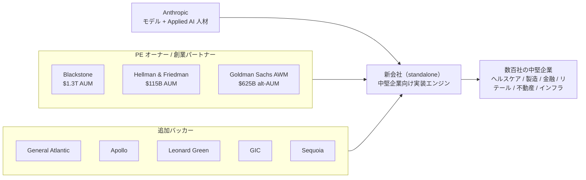
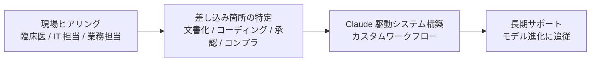

# Claudeを中堅企業の中枢に埋め込む——Anthropic新会社が再発明するコンサル業

2026年5月4日、Anthropic と Wall Street の3社（Blackstone・Hellman & Friedman・Goldman Sachs）が **約15億ドル** を投じて新しい AI ネイティブのエンタープライズサービス会社を立ち上げた。社名はまだない。だが、これは単なる資本提携のニュースではない。**コンサル業の構造そのものを書き換える試み** である。狙い撃ちにされているのは、ターゲット顧客でいうと「**中堅企業（mid-market）**」、競合でいうと「**McKinsey・BCG・Bain**」と「**TCS・Infosys・Wipro**」、そして売り物でいうと「**コンサル料そのもの**」——フロンティア AI ラボが、ついにサービス業に直接乗り込んできた。

新会社が顧客企業に対してやることはシンプルだ。Anthropic の Applied AI エンジニアを顧客の現場に常駐させ、Claude を業務の中枢に組み込んだシステムをその場で構築し、長期的に運用までサポートする。報告書とロードマップを納品して帰る従来のコンサルとは違って、**稼働しているシステムごと納品する**。

## 1. リード — いま、コンサル業が静かに書き換わっている

これまで「AI を業務にどう使うか」を企業に教えるのは、伝統的には McKinsey・BCG・Bain といった戦略コンサル、あるいは Accenture・Deloitte・PwC といった大手 SI、さらにインドの TCS・Infosys・Wipro・HCL といった IT サービス大手の仕事だった。彼らは「業務知識 × 汎用テクノロジー」を組み合わせ、報告書とロードマップを納品して帰る。

新会社のモデルは違う。Anthropic の Applied AI エンジニアが顧客企業の現場に入り込み、Claude を業務の中枢に直接組み込んでいく。Anthropic 公式の表現を借りれば「Putting Claude to work in an organization's core operations takes hands-on engineering and deep familiarity with how each business runs（Claude を組織の中枢業務で動かすには、現場での泥臭いエンジニアリングと、その事業がどう回っているかの深い理解が要る）」。

そして、最初の顧客は出資する PE 各社のポートフォリオ企業。**数百社単位の「中堅企業の塊」が、初期市場として最初から確保されている**。

> 「企業からの Claude への需要は、いかなる単一の提供方式の能力をも大きく上回っている。」
> — Krishna Rao（Anthropic CFO）

これが Anthropic の見立てだ。需要は溢れているのに、それを業務に落とし込める人材が地球上に足りない。なら自分たちで作る——そう決めたわけだ。

**参考ソース:**

- [Building a new enterprise AI services company with Blackstone, Hellman & Friedman, and Goldman Sachs｜Anthropic](https://www.anthropic.com/news/enterprise-ai-services-company)
- [Anthropic Partners with Blackstone, Hellman & Friedman, and Goldman Sachs to Launch Enterprise AI Services Firm｜Blackstone](https://www.blackstone.com/news/press/anthropic-partners-with-blackstone-hellman-friedman-and-goldman-sachs-to-launch-enterprise-ai-services-firm/)
- [Anthropic takes shot at consulting industry in joint venture with Wall Street giants｜Fortune](https://fortune.com/2026/05/04/anthropic-claude-consulting-industry-joint-venture-blackstone-goldman-sachs/)
- [Anthropic and OpenAI are both launching joint ventures for enterprise AI services｜TechCrunch](https://techcrunch.com/2026/05/04/anthropic-and-openai-are-both-launching-joint-ventures-for-enterprise-ai-services/)

## 2. 何が発表されたのか——事実の整理

5月4日に San Francisco から発表された一次情報を、まずは数字と固有名詞で整理する。Anthropic は出資総額を正式には認めていないが、Wall Street Journal・Reuters・Financial Times が **約15億ドル** という数字を報じている。

| 項目 | 内容 |
|---|---|
| 発表日 | 2026年5月4日 |
| 当事者（創業パートナー） | Anthropic / Blackstone / Hellman & Friedman / Goldman Sachs |
| 形態 | 独立した新会社（standalone entity）。社名・評価額未公表 |
| 出資総額 | 約15億ドル（WSJ・Reuters・FT 報、Anthropic 未確認） |
| 主な出資内訳（FT 経由） | Anthropic / Blackstone / H&F が各 **3億ドル**、Goldman Sachs が **1.5億ドル**、General Atlantic が **1.5億ドル** |
| 追加バッカー | Apollo Global Management / Leonard Green / GIC（シンガポール政府投資公社）/ Sequoia Capital |
| 人材 | Anthropic のエンジニアと Applied AI スタッフが新会社に直接組み込まれる |
| 第1ターゲット | 出資各社のポートフォリオ企業（数百社）→ 独立系の中堅企業へ展開 |
| 重点産業 | ヘルスケア・製造業・金融サービス・リテール・不動産・インフラ |
| 位置づけ | Anthropic の Claude Partner Network のメンバー（Accenture・Deloitte・PwC 等と並ぶ） |

注目すべきは「**スタンドアロンの新会社**」という構造だ。Blackstone のプレスリリースは、Anthropic のエンジニアと Partnership リソースが「embedded directly within its team」と明記している。Anthropic 本体の一部門ではなく、独立した会社の中に Anthropic 人材が常駐するかたち。Krishna Rao の言葉でいえば「単一の提供方式」では捌けないからこそ、新しい器を別に作った。

例え話で言うと、これは「Anthropic 本店」と「**フランチャイズ専門の新ブランド**」の関係に近い。本店（Anthropic）は引き続き API・モデルを提供し、Accenture や Deloitte と組んで超大企業の店舗運営をやる。新ブランド（新会社）は中堅企業の店舗を、出資 PE のネットワークを使ってまとめて開いていく。

**参考ソース:**

- [Building a new enterprise AI services company with Blackstone, Hellman & Friedman, and Goldman Sachs｜Anthropic](https://www.anthropic.com/news/enterprise-ai-services-company)
- [Anthropic Partners with Blackstone, Hellman & Friedman, and Goldman Sachs to Launch Enterprise AI Services Firm｜Blackstone](https://www.blackstone.com/news/press/anthropic-partners-with-blackstone-hellman-friedman-and-goldman-sachs-to-launch-enterprise-ai-services-firm/)
- [Anthropic, Goldman and others launch $1.5 billion AI venture｜CNBC](https://www.cnbc.com/2026/05/04/anthropic-goldman-blackstone-ai-venture.html)
- [Anthropic and OpenAI are both launching joint ventures for enterprise AI services｜TechCrunch](https://techcrunch.com/2026/05/04/anthropic-and-openai-are-both-launching-joint-ventures-for-enterprise-ai-services/)
- [Blackstone and Goldman back Anthropic's $1.5bn AI joint venture｜Private Banker International](https://www.privatebankerinternational.com/news/blackstone-goldman-anthropic-joint-venture/)
- [Anthropic's new AI venture could intensify competition for Infosys, TCS and Wipro｜People Matters](https://www.peoplematters.in/news/ai-and-emerging-tech/anthropics-new-ai-venture-could-intensify-competition-for-infosys-tcs-and-wipro-49627)
- [Anthropic Partners with Blackstone, Hellman & Friedman, and Goldman Sachs to Launch Enterprise AI Services Firm｜GIC](https://www.gic.com.sg/newsroom/all/anthropic-partners-with-blackstone-hellman-friedman-and-goldman-sachs-to-launch-enterprise-ai-services-firm/)

## 3. 主要プレイヤーと勢力図

俯瞰すると、新会社の周りには性格の異なる4種類のプレイヤーがいる。**フロンティア AI ラボ（Anthropic）／PE オーナー（Blackstone・H&F・Goldman・General Atlantic）／追加バッカー（Apollo・Leonard Green・GIC・Sequoia）／顧客（中堅企業）** の4階層だ。

| プレイヤー | カテゴリ | 役割 | 出資額・規模感 |
|---|---|---|---|
| Anthropic | フロンティア AI 企業 | モデルと人材を提供 | 約3億ドル / 評価額9000億ドル目指す調達中 / ARR 約90億→300億ドル超（SiliconANGLE 報） |
| Blackstone | 世界最大級のオルタナ運用 | ポートフォリオ提供と経営支援 | 約3億ドル / 1.3兆ドル超 AUM |
| Hellman & Friedman | グローバル PE | 中型成長企業ポートフォリオ提供 | 約3億ドル / 1150億ドル超 AUM |
| Goldman Sachs (Asset & Wealth Management) | 投資銀行・オルタナ | 顧客ネットワーク提供 | 1.5億ドル / オルタナ AUM 6250億ドル超 |
| General Atlantic | グロース・エクイティ | 成長段階の中堅企業へのアクセス | 約1.5億ドル（FT 経由） |
| Apollo / Leonard Green / GIC / Sequoia | 共同バッカー | 追加ポートフォリオ・資本提供 | 個別額は非開示 |



この図のキモは、「右下の数百社」が **左上の Anthropic と最初から線で結ばれている** ことだ。普通のソフトウェア会社なら、中堅企業1社ごとに営業し、契約し、実装する。だが新会社の顧客は、PE オーナーたちの命令で動くポートフォリオ企業群。Marc Nachmann（Goldman の Asset & Wealth Management グローバルヘッド）は CNBC のインタビューで率直にこう語っている。

> 「（新会社は）我々のポートフォリオ企業でかなり使うことになるだろう。」
> — Marc Nachmann（[CNBC](https://www.cnbc.com/2026/05/04/anthropic-goldman-blackstone-ai-venture.html)）

例えるなら、これは「**営業のいらない営業会社**」だ。普通の SaaS は CEO に会うだけで何ヶ月もかかるが、新会社は「うちの大株主から指名された AI 実装パートナー」として、最初から CEO の隣の席に座っている。

**参考ソース:**

- [Anthropic Partners with Blackstone, Hellman & Friedman, and Goldman Sachs to Launch Enterprise AI Services Firm｜Blackstone](https://www.blackstone.com/news/press/anthropic-partners-with-blackstone-hellman-friedman-and-goldman-sachs-to-launch-enterprise-ai-services-firm/)
- [Anthropic and OpenAI are both launching joint ventures for enterprise AI services｜TechCrunch](https://techcrunch.com/2026/05/04/anthropic-and-openai-are-both-launching-joint-ventures-for-enterprise-ai-services/)
- [Anthropic deepens Wall Street push with new AI agents, and Microsoft and Moody's partnerships｜Fortune](https://fortune.com/2026/05/05/anthropic-wall-street-financial-services-agents-jamie-dimon/)
- [Blackstone and Goldman back Anthropic's $1.5bn AI joint venture｜Private Banker International](https://www.privatebankerinternational.com/news/blackstone-goldman-anthropic-joint-venture/)
- [Anthropic and OpenAI establish joint ventures on Wall Street to accelerate enterprise AI adoption｜SiliconANGLE](https://siliconangle.com/2026/05/04/anthropic-openai-establish-joint-ventures-wall-street-accelerate-enterprise-ai-adoption/)

## 4. 15億ドルの内訳を見える化

数字を可視化すると、出資構造の「**3社アンカー型**」がひと目で分かる。Anthropic・Blackstone・Hellman & Friedman の3社が同額で並び、Goldman Sachs と General Atlantic が半額のティアを支え、残りは追加バッカーが埋める。OpenAI 側のように「保証リターン付きで PE が大量にカネを入れる」金融工学的な構造ではなく、**主要株主が同じ重みで腰を据える対称的な設計** だ。

```chart
{
  "type": "doughnut",
  "data": {
    "labels": ["Anthropic ($300M)", "Blackstone ($300M)", "Hellman & Friedman ($300M)", "Goldman Sachs ($150M)", "General Atlantic ($150M)", "その他コンソーシアム（推計 $300M）"],
    "datasets": [
      {
        "data": [300, 300, 300, 150, 150, 300],
        "backgroundColor": ["#8b0000", "#1f4e79", "#2e7d32", "#f9a825", "#6a1b9a", "#455a64"]
      }
    ]
  },
  "options": {
    "plugins": {
      "title": { "display": true, "text": "新会社 約15億ドル コミットの内訳（単位: 百万ドル / FT・WSJ 報を基にした推計）" },
      "legend": { "position": "bottom" }
    }
  }
}
```

「3社×3億ドル」が突出しているのは偶然ではない。Patrick Healy（H&F の CEO）は声明でこの設計をこう語る。

> 「この案件は稀な収束だ——巨大な市場ニーズ、Anthropic の比類ない AI 技術力、そしてスケールするための機動力を備えた投資家コンソーシアム。」
> — Patrick Healy（[Blackstone](https://www.blackstone.com/news/press/anthropic-partners-with-blackstone-hellman-friedman-and-goldman-sachs-to-launch-enterprise-ai-services-firm/)）

**参考ソース:**

- [Anthropic and OpenAI are both launching joint ventures for enterprise AI services｜TechCrunch](https://techcrunch.com/2026/05/04/anthropic-and-openai-are-both-launching-joint-ventures-for-enterprise-ai-services/)
- [Anthropic deepens Wall Street push with new AI agents, and Microsoft and Moody's partnerships｜Fortune](https://fortune.com/2026/05/05/anthropic-wall-street-financial-services-agents-jamie-dimon/)
- [Blackstone and Goldman back Anthropic's $1.5bn AI joint venture｜Private Banker International](https://www.privatebankerinternational.com/news/blackstone-goldman-anthropic-joint-venture/)

## 5. なぜ"中堅企業"が主役なのか

タイトルに据えた中堅企業（mid-market）。なぜ大企業でも零細でもなく、ここなのか。3つの構造的な理由がある。

### 理由1：既存コンサルが薄い"帯域"

Big 3（McKinsey・BCG・Bain）と Big 4（Accenture・Deloitte・PwC）は、いずれも超大企業案件で稼ぐ構造だ。プロジェクト単価が高くないと、彼らのコスト構造（パートナーレベルの高給）に見合わない。逆に小規模 SI は手作業実装の限界がある。年商数百億〜数千億円の中堅企業は、AI 実装サービスの提供者がスカスカな帯域だ。

### 理由2：PE ポートフォリオ＝「中堅企業の塊」

ここに、PE 各社の保有ポートフォリオがピタリとはまる。Blackstone・H&F・Goldman・General Atlantic の保有先を合わせれば数百社規模、業種も分散している。**「サービス事業の最初の顧客リスト」がすでに完成している** わけだ。これは普通のスタートアップが何年もかけて築く資産。

### 理由3：PE 自身の経済合理性

[Fortune が2025年11月に報じた](https://fortune.com/2025/11/05/private-equity-cfo-under-pressure-stay-exit-ready-boost-ai-finance/)ところによれば、PE バックトの中堅企業の **買い手の85%** が AI 機能を企業価値評価に織り込み始めている。Exit 時に AI が未実装の企業はディスカウントされる。**PE はもはや「AI を導入させたい」のではなく「導入させなければ Exit が成立しない」段階に来ている**。新会社は彼らにとって、Big 3 を雇う何分の一かのコストで「Exit 前の AI 化」を一括で済ませる装置だ。

そしてマクロには、Sequoia パートナー Julien Bek の言葉を借りれば「Services are the new software（サービスこそが新しいソフトウェアだ）」。Fortune が引用するこの主張のキモは比率にある——**企業がソフトウェアに1ドル使うごとに、サービスには6ドル使う**。コンサル業が累計で数兆ドル規模の市場になっている理由がここだ。**この6ドル側の池に、AI ラボが直接釣り糸を垂らし始めた**。

例え話で言えばこうだ。中堅企業は「ジムに通いたいけれど専属のパーソナルトレーナーは雇えない人たち」。これまでは家庭用ダンベル（汎用 SaaS）か、年契約の出張トレーナー（コンサル）かの二択だった。新会社は「**ジムの大家（PE）が、入居者全員にトレーナーをまとめて派遣する**」モデルだ。

```chart
{
  "type": "bar",
  "data": {
    "labels": ["ソフトウェアへの支出", "サービス（実装・運用・コンサル）への支出"],
    "datasets": [
      {
        "label": "企業の支出比率（ソフト1ドルあたり）",
        "data": [1, 6],
        "backgroundColor": ["#1f4e79", "#8b0000"]
      }
    ]
  },
  "options": {
    "plugins": {
      "title": { "display": true, "text": "ソフト1ドル: サービス6ドル — Sequoia Julien Bek が示す構造（Fortune 経由）" },
      "legend": { "display": false }
    },
    "scales": {
      "y": {
        "beginAtZero": true,
        "title": { "display": true, "text": "ドル支出（ソフトを1とした相対値）" }
      }
    }
  }
}
```

参考までに、グローバル IT サービス市場は約 **3000億ドル**（[Storyboard18](https://www.storyboard18.com/brand-makers/inside-openai-and-anthropics-private-equity-push-to-drive-enterprise-ai-adoption-97360.htm)）、ここに長年 TCS・Infosys・Wipro・HCL・Accenture・Capgemini が陣取ってきた。新会社は「ソフト1ドル」側ではなく「サービス6ドル」側のパイを、AI モデル所有という武器を持って取りに来ている。

**参考ソース:**

- [Anthropic, Goldman and others launch $1.5 billion AI venture｜CNBC](https://www.cnbc.com/2026/05/04/anthropic-goldman-blackstone-ai-venture.html)
- [Anthropic takes shot at consulting industry in joint venture with Wall Street giants｜Fortune](https://fortune.com/2026/05/04/anthropic-claude-consulting-industry-joint-venture-blackstone-goldman-sachs/)
- [Anthropic deepens Wall Street push with new AI agents, and Microsoft and Moody's partnerships｜Fortune](https://fortune.com/2026/05/05/anthropic-wall-street-financial-services-agents-jamie-dimon/)
- [Why the Model Labs Became IT Services｜Thiyagarajan M](https://mtrajan.substack.com/p/why-the-model-labs-became-it-services)
- [Inside OpenAI and Anthropic's private equity push to drive enterprise AI adoption｜Storyboard18](https://www.storyboard18.com/brand-makers/inside-openai-and-anthropics-private-equity-push-to-drive-enterprise-ai-adoption-97360.htm)

## 6. 「中枢に埋め込む」とはどういうことか — Forward-Deployed Engineer モデル

新会社の競争優位の核は、**Forward-Deployed Engineer（FDE）** という働き方だ。Palantir が15年以上磨いてきた手法で、エンジニアを顧客企業の現場に常駐させ、製品をその場でカスタマイズしながら業務を再設計する。

Marc Nachmann（Goldman）が CNBC で語った言い回しが、新会社のモデルを一番素直に表している。

> 「モデルだけ持っていても、業務フローや動き方は変わらない。テクノロジーと、その事業で実際に起きていることを組み合わせ、変化を実装できる人が必要なんだ。」
> — Marc Nachmann（[CNBC](https://www.cnbc.com/2026/05/04/anthropic-goldman-blackstone-ai-venture.html)）

従来コンサルとの違いを表で並べると、こうなる。

| 観点 | 既存コンサル（Big 3 + Big 4） | 新会社 |
|---|---|---|
| 提供物 | 戦略レポート・ロードマップ・PoC | 稼働している Claude 統合システム |
| モデル所有 | なし（ベンダー中立） | あり（Claude をパートナーに、Applied AI スタッフ常駐） |
| 主要顧客 | 超大企業（Fortune 500） | 中堅企業（PE 保有・独立系） |
| 価格モデル | T&M・固定報酬・パートナー単価 | サービス成果＋システム保有・運用 |
| 専門人材 | 業界知識 + プロジェクト管理 | FDE（業界知識 + AI モデル深堀り + ソフトウェア工学） |
| スケール手段 | 採用と教育 | PE オーナー指名＋ Claude の能力進化 |
| 顧客との関係 | プロジェクト単位 | 長期サポート・組織内常駐 |

### 1案件の典型フロー

Anthropic 公式は「**典型的なエンゲージメント**」をこう描写する: 小チームが顧客と座り、Claude をどこに差し込めば最も効くかを特定し、その上に組み込みのカスタムシステムを作り、長期サポートに入る。



公式が出しているクリニック例（複数拠点を持つ医師グループ）はこうだ。臨床医は文書作成・医療コーディング・事前承認・コンプライアンスレビューに毎日何時間も取られる。新会社のエンジニアが現場の医師と IT スタッフと一緒に座り、既存ワークフローに溶け込むツールを Claude で組む。結果、医師は患者ケアに使う時間を取り戻す。

ここで効いてくるのが「**moving target**」という性質。Blackstone のリリースは「Claude の能力は月単位どころか週単位で変わる、これは伝統的なソフトウェア導入とは違うエンジニアリング課題だ」と明言している。週次でモデルが進化する前提のもとで実装する技術自体が、新会社の競争優位の正体だ。Anthropic の研究・プロダクトチームと密に連携できる立ち位置（=本体エンジニアが社内に常駐）でなければ、この移動標的は撃ち抜けない。

違いをひとことで言えば、**既存コンサルは「やり方を教えて帰る」、新会社は「自分たちで作って動かし続ける」**。しかも Claude は週単位で能力が変わるため、その変化に追従しながら実装し続ける必要がある。Anthropic の研究・プロダクトチームと密に連携できる立ち位置（=本体エンジニアが社内に常駐）でなければ、この移動標的は撃ち抜けない——ここが、ベンダー中立を建前にしてきた既存コンサルでは到底真似できない構造的優位だ。

**参考ソース:**

- [Building a new enterprise AI services company with Blackstone, Hellman & Friedman, and Goldman Sachs｜Anthropic](https://www.anthropic.com/news/enterprise-ai-services-company)
- [Anthropic Partners with Blackstone, Hellman & Friedman, and Goldman Sachs to Launch Enterprise AI Services Firm｜Blackstone](https://www.blackstone.com/news/press/anthropic-partners-with-blackstone-hellman-friedman-and-goldman-sachs-to-launch-enterprise-ai-services-firm/)
- [Anthropic takes shot at consulting industry in joint venture with Wall Street giants｜Fortune](https://fortune.com/2026/05/04/anthropic-claude-consulting-industry-joint-venture-blackstone-goldman-sachs/)
- [Anthropic and OpenAI are both launching joint ventures for enterprise AI services｜TechCrunch](https://techcrunch.com/2026/05/04/anthropic-and-openai-are-both-launching-joint-ventures-for-enterprise-ai-services/)
- [Why the Model Labs Became IT Services｜Thiyagarajan M](https://mtrajan.substack.com/p/why-the-model-labs-became-it-services)

## 7. コンサル業の再発明 — 何がどう変わるか

Anthropic 公式は、既存パートナー（Accenture・Deloitte・PwC など）との関係を縮小しないと明言した。

> 「Claude Partner Network のシステムインテグレーターは、Claude が世界最大級の企業に届くうえでの中心的存在であり続ける。」
> — Anthropic 公式声明

つまり棲み分けが計画されている: **大企業向けは既存コンサル、中堅企業向けは新会社**。だが、現場での圧力は確実に動く。

### 既存コンサルへの圧力

Goldman・Blackstone のような PE オーナーが「うちの新会社のサービスを使え」とポートフォリオに号令を出せば、これまで Big 4 や戦略コンサルが取っていた中堅企業案件は新会社に流れる。**価格・スピード・モデル所有・PE のお墨付き** ——どれを取っても新会社優位だ。Holger Mueller（Constellation Research のアナリスト）はこの状況を [SiliconANGLE](https://siliconangle.com/2026/05/04/anthropic-openai-establish-joint-ventures-wall-street-accelerate-enterprise-ai-adoption/) でこう評した: 「（両社とも）どう着飾ろうと、これらの新ベンチャーはコンサルティング会社にしか見えない」。

### インド IT 大手（TCS・Infosys・Wipro・HCL）への波及

People Matters（インド）と Storyboard18 が指摘するのは、グローバル IT サービス市場（約3000億ドル）で長年「実装」「運用」「マネージドサービス」を担ってきたインド大手への影響だ。新会社のモデルは、彼らの十八番だった「中堅企業向けカスタム実装」をモデル所有で差別化しながら直接奪う構造。事実、年初には AI 自動化を懸念したインド IT 株が一日で4–7%下落、Nifty IT 指数も約6%下げた局面があった。SNS では「**SaaSpocalypse（SaaS 黙示録）**」という反応も出ている。

楽観論もある: Storyboard18 のコメントでは、「AI ラボの JV はインド大手を実装下請けとして使う可能性もある」とされる。総需要が大きく膨らむなら、両者にパイは行き渡る。

悲観論はもっとシンプルだ。アナリスト Thiyagarajan M（mtrajan）は、IT サービス業の構造的天井をこう書く。

> 「IT サービスの中央値 EBITDA 率は10年間 13–15% に張り付いている。公開市場の倍率は EBITDA の10–13倍。私募取引もほぼ同レンジ。これは事実上、規制された公益事業の姿だ——調達部門に規制されている、というだけの違いで。」
> — Thiyagarajan M（[mtrajan substack](https://mtrajan.substack.com/p/why-the-model-labs-became-it-services)）

```chart
{
  "type": "bar",
  "data": {
    "labels": ["EBITDA 率（中央値, %）", "PER（EBITDA 倍率）", "レイバー比率（売上対比, %）"],
    "datasets": [
      {
        "label": "IT サービス業の構造的指標",
        "data": [14, 11.5, 75],
        "backgroundColor": ["#8b0000", "#1f4e79", "#2e7d32"]
      }
    ]
  },
  "options": {
    "plugins": {
      "title": { "display": true, "text": "IT サービス業の数値構造 — 中央値ベース（mtrajan の業界知見ベース）" },
      "legend": { "display": false }
    },
    "scales": {
      "y": { "beginAtZero": true }
    }
  }
}
```

mtrajan の言い分はこうだ: IT サービス業は「ソフトウェアではなく、ソフトウェアが壊れたときに責められる人」を売っていた。発注書には「判断力30分」を書く欄がない。だから人月で売り、売上の70–80% が人件費になり、利益率は使用率（ベンチ稼働率）の上限で頭打ち。AI が「執筆部分」を圧縮した今、**圧縮分のスピードで売上が縮む**。本当に怖いのは緩慢な侵食ではなく、「**2–3年後に来るはずの更新案件が来ない**」（=新会社の常駐エンジニアが、次の契約で発注するはずだったものを先に作り終えている）という更新サイクルの蒸発だ。

例え話で言えば、こうだ。これまで国際会議の企業（中堅企業）は通訳（IT サービス）を雇い、聞き手（経営層）と話し手（テクノロジー）の橋渡しをさせていた。「**ところが AI が両方の言語を直接話し始めた瞬間、買い手は通訳との面談を打ち切って、AI と直接話すために部屋を出てしまった**」。mtrajan の表現を借りれば: 「The translators are still in the room. The buyer left.（通訳は部屋に残ったが、買い手は部屋を出た）」。

**参考ソース:**

- [Building a new enterprise AI services company with Blackstone, Hellman & Friedman, and Goldman Sachs｜Anthropic](https://www.anthropic.com/news/enterprise-ai-services-company)
- [Anthropic takes shot at consulting industry in joint venture with Wall Street giants｜Fortune](https://fortune.com/2026/05/04/anthropic-claude-consulting-industry-joint-venture-blackstone-goldman-sachs/)
- [Anthropic's new AI venture could intensify competition for Infosys, TCS and Wipro｜People Matters](https://www.peoplematters.in/news/ai-and-emerging-tech/anthropics-new-ai-venture-could-intensify-competition-for-infosys-tcs-and-wipro-49627)
- [Why the Model Labs Became IT Services｜Thiyagarajan M](https://mtrajan.substack.com/p/why-the-model-labs-became-it-services)
- [Inside OpenAI and Anthropic's private equity push to drive enterprise AI adoption｜Storyboard18](https://www.storyboard18.com/brand-makers/inside-openai-and-anthropics-private-equity-push-to-drive-enterprise-ai-adoption-97360.htm)
- [Anthropic and OpenAI establish joint ventures on Wall Street to accelerate enterprise AI adoption｜SiliconANGLE](https://siliconangle.com/2026/05/04/anthropic-openai-establish-joint-ventures-wall-street-accelerate-enterprise-ai-adoption/)

## 8. 同じレースを走る OpenAI — "The Deployment Company"

ここで対比に1セクション割く。なぜなら、同じ48時間のうちに OpenAI もほぼ同じ戦略を別パッケージで実装したからだ。Anthropic 発表の数時間前に Bloomberg がスクープした OpenAI 側のベンチャーが「**The Deployment Company**」。両社の構造を並べると、戦略の輪郭がよく見える。

| 観点 | Anthropic 新会社 | OpenAI The Deployment Company |
|---|---|---|
| 発表 | 2026年5月4日 | 2026年5月4日（Anthropic 発表の数時間前） |
| 評価額 | 非開示 | 100億ドル |
| 総調達額 | 約15億ドル（コミットベース） | 40億ドル（PE から） |
| AI ラボ自身のコミット | 約3億ドル（Anthropic） | 最大15億ドル（5億ドルクロージング + 10億ドルオプション） |
| 主な PE / 投資家 | Blackstone, H&F, Goldman, GA, Apollo, Leonard Green, GIC, Sequoia | TPG, Brookfield, Advent, Bain Capital, Goanna, Dragoneer, SoftBank ほか計19者 |
| ガバナンス | 新会社（standalone）/ Anthropic は Applied AI と人材を提供 | OpenAI が Super-voting shares を保持 |
| リターン構造 | 通常株式 | **17.5%/年×5年の保証リターン** |
| 統括責任者 | 非開示 | Brad Lightcap（OpenAI COO） |
| ポートフォリオ規模 | 数百社 | 2000社超 |
| 重点産業 | ヘルスケア・製造・金融・リテール・不動産・インフラ | ヘルスケア・物流・製造・金融サービス |

OpenAI 側の特徴は、TNW の表現を借りれば「**金融工学的**」だ。17.5%/年×5年の保証リターン、Super-voting で OpenAI がガバナンス支配、PE 側にとっては成長オプションを"クレジットファンド化"した格好。一方の Anthropic 側は「3社×3億ドルでアンカー」というシンプルな対称設計で、評価額も非開示にとどめている。

TNW の評は「**両者は鏡像（mirror images）**」。同じ戦略——「オルタナ運用会社からカネを集めて、彼らのポートフォリオへの優先販売チャネルを作る」——を、片方は対称型、もう片方は金融工学型でパッケージしている。例え話で言えば、Anthropic は「**3者で同じ額を出して立ち上げる共同経営の喫茶店**」、OpenAI は「**創業者が利息保証付き社債で集めた建設費で建てたチェーン本部**」だ。

両社が同時に同じ方向に動いたという事実そのものが、本記事の主役メッセージを補強する。「**通常のエンタープライズソフトウェア販売サイクル（1社ずつ営業して契約する）は、AI 採用の次の波を捕まえるには遅すぎる**」——両社がそう判断した。バイアウトファームは数百社の運営企業を抱え、ポートフォリオへの導入を構造的に強制できる。今、最も効率的な配信チャネルがそこにある。

**参考ソース:**

- [Anthropic and OpenAI are both launching joint ventures for enterprise AI services｜TechCrunch](https://techcrunch.com/2026/05/04/anthropic-and-openai-are-both-launching-joint-ventures-for-enterprise-ai-services/)
- [Anthropic deepens Wall Street push with new AI agents, and Microsoft and Moody's partnerships｜Fortune](https://fortune.com/2026/05/05/anthropic-wall-street-financial-services-agents-jamie-dimon/)
- [OpenAI closes The Deployment Company, a $10bn enterprise AI bet on private equity｜The Next Web](https://thenextweb.com/news/openai-deployco-finalized-10-billion-joint-venture)
- [Anthropic and OpenAI establish joint ventures on Wall Street to accelerate enterprise AI adoption｜SiliconANGLE](https://siliconangle.com/2026/05/04/anthropic-openai-establish-joint-ventures-wall-street-accelerate-enterprise-ai-adoption/)

## 9. 中枢に埋め込むための"道具立て" — 5月5日 Wall Street Briefing

新会社は単独で動くわけではない。同じ48時間のうちに、Anthropic 本体は「**埋め込みのための装備一式**」を一気に披露した。5月5日 NY で開かれた招待制イベント「Briefing: Financial Services」での発表内容がそれだ。

| カテゴリ | 内容 |
|---|---|
| モデル | **Claude Opus 4.7**：Vals AI Finance Agent ベンチマークで64.4%を記録、首位 |
| プリセットエージェント | 約10種類：ピッチブック、決算分析、信用メモ、アンダーライティング、KYC、月末締め、ステートメント監査、保険クレーム など |
| 業務ソフト統合 | Microsoft 365 全面統合：Excel・PowerPoint・Word が GA、Outlook はベータ |
| データ統合 | **Moody's** がプラットフォーム全体を Claude にネイティブ組み込み（6億社の信用格付・リスクデータ）。Verisk・Third Bridge・Fiscal AI・Dun & Bradstreet・Experian・GLG・Guidepoint・IBISWorld を新規追加 |
| 既存導入 | JPMorganChase・Goldman Sachs・Citi・AIG・Visa など |
| 同席ゲスト | Jamie Dimon（JPMorganChase 会長兼 CEO）と Dario Amodei（Anthropic CEO）が初めて同じステージに |

Dimon の登壇は象徴的だった。彼は週末に自分自身で Claude Code にログインしたという。

> 「アセットスワップとトレジャリーのビッド・アスク・スプレッド、それからマーケットの停止と投資適格について知りたかった。20分でダッシュボードができたよ。すべての裏付けと調査付きで、私が望んだ通りに正確だった。」
> — Jamie Dimon（[Fortune](https://fortune.com/2026/05/05/anthropic-wall-street-financial-services-agents-jamie-dimon/)）

Amodei は同じステージで Anthropic の成長軌道について稀に見る数字を口にした。

> 「会社として『10倍』の四半期成長を予想していた。実際には**80倍**だった。コーンは私が思っていたよりさらに広がっている。」
> — Dario Amodei（[Fortune](https://fortune.com/2026/05/05/anthropic-wall-street-financial-services-agents-jamie-dimon/)）

そしてイベント終盤のパネルで AIG の CEO Peter Zaffino が公開した数字。**Claude を箱から出してそのまま保険クレーム判定に当てたところ、人間の専門家の精度の88%に達した**。Zaffino のコメントが面白い。「2通りの見方がある: AI はもっとよくなれるのか? もちろん。でもそれは、人間専門家が向上しないという前提だ。だからこれは、人間が学ぶための仕組みでもある——いい質問のための、ね」。

これらが、新会社が中堅企業に売っていく中身そのものだ。**金融大手で磨いた装備一式（モデル＋プリセットエージェント＋データ統合＋業務ソフト連携）が、ヘルスケア・製造・リテール・不動産・インフラに横展開される**。

構図はシンプルだ。**JPMorganChase・Goldman Sachs・AIG といった金融大手向けに完成させた業務テンプレート（プリセットエージェント、業務ソフト統合、データ統合）を、新会社が PE オーナー経由で中堅企業に持ち込んで横展開していく**。最も要求水準の高い顧客で磨いた装備をそのまま流用できるため、中堅企業向けの実装速度と精度が最初から高い水準に乗る。

**参考ソース:**

- [Anthropic deepens Wall Street push with new AI agents, and Microsoft and Moody's partnerships｜Fortune](https://fortune.com/2026/05/05/anthropic-wall-street-financial-services-agents-jamie-dimon/)
- [Building a new enterprise AI services company with Blackstone, Hellman & Friedman, and Goldman Sachs｜Anthropic](https://www.anthropic.com/news/enterprise-ai-services-company)

## 10. これから何が起きるのか — 5つの論点

ここからは予想の領域だ。だが、これまでの整理から自然に出てくる5つの論点を並べる。

### 論点A：中堅企業 AI トランスフォーメーション市場の爆発

PE 保有の中堅企業数百社が「最初の実験場」になる。成功事例が Exit 時のバリュエーション上振れに直結すれば、他の PE も追随する。**他 PE もそれぞれの AI ラボ JV を作る** か、新会社のクライアントになるかの二択だ。一方で「実装人材の取り合い」は中堅企業層から始まる。

### 論点B：コンサル・IT サービス業界の二極化

既存コンサルは超大企業向けに集中する。中堅市場では新会社優位。インド大手は「実装下請け」に押し込まれる可能性、または高度な戦略・ドメインコンサルへ移行を迫られる。mtrajan の予測は厳しい: 公開市場の EBITDA 倍率は今後低下方向、2–3年後の更新案件が来ない「renewal cycle that does not renew」が現れる。

### 論点C：AI ラボの収益構造の変化

モデル課金（API・Claude Code・Cowork など）に加え、サービス収益（コンサル料）も AI ラボが取り込む時代に入る。**「AI ラボ」が「AI サービス会社」を兼ねる**——OpenAI の保証リターン構造は、この事業モデルを"クレジットファンド化"してまで PE に売った格好。エンタープライズ収益の"ストック性"がバリュエーションを支える。

### 論点D：規制と独占懸念

PE 主要4社 + Anthropic の組み合わせで数百社に Claude を"標準化"する動きは、ベンダーロックイン懸念を呼ぶ。mtrajan が引用した Epic と SAP の例えが鋭い: 「埋め込みチームが2年いたら、その病院は乗り換えない」。同じスイッチング・コストの仕組みを、AI ラボが買いに来ている。OpenAI 側の17.5%保証リターン構造は、SEC や会計基準上で「擬似債務」と見なされる規制リスクも TNW が指摘している。

### 論点E：IPO 戦略との接続

両社は壮絶なペースで資金調達を続けながら IPO の輪郭を描いている。

```chart
{
  "type": "bar",
  "data": {
    "labels": ["Anthropic (調達中)", "OpenAI (3月末)"],
    "datasets": [
      {
        "label": "新規調達額（億ドル）",
        "data": [500, 1220],
        "backgroundColor": "#1f4e79",
        "yAxisID": "y"
      },
      {
        "label": "目標 / 報じられた評価額（億ドル）",
        "data": [9000, 8520],
        "backgroundColor": "#8b0000",
        "yAxisID": "y1"
      }
    ]
  },
  "options": {
    "plugins": {
      "title": { "display": true, "text": "AI ラボ2社の調達と評価額（2026年3月〜5月）" },
      "legend": { "position": "bottom" }
    },
    "scales": {
      "y": { "type": "linear", "position": "left", "title": { "display": true, "text": "新規調達額（億ドル）" }, "beginAtZero": true },
      "y1": { "type": "linear", "position": "right", "title": { "display": true, "text": "評価額（億ドル）" }, "beginAtZero": true, "grid": { "drawOnChartArea": false } }
    }
  }
}
```

問いはひとつ。**AI ラボがコンサルを兼ね始めたとき、企業 IT の主役は誰になるのか**。これまでの「ベンダー」「実装パートナー」「ユーザー企業」という三角形が、新会社の登場で「AI ラボ＋ PE オーナー」という統合体に圧縮されていく。

**参考ソース:**

- [Anthropic, Goldman and others launch $1.5 billion AI venture｜CNBC](https://www.cnbc.com/2026/05/04/anthropic-goldman-blackstone-ai-venture.html)
- [Anthropic takes shot at consulting industry in joint venture with Wall Street giants｜Fortune](https://fortune.com/2026/05/04/anthropic-claude-consulting-industry-joint-venture-blackstone-goldman-sachs/)
- [Anthropic and OpenAI are both launching joint ventures for enterprise AI services｜TechCrunch](https://techcrunch.com/2026/05/04/anthropic-and-openai-are-both-launching-joint-ventures-for-enterprise-ai-services/)
- [Anthropic deepens Wall Street push with new AI agents, and Microsoft and Moody's partnerships｜Fortune](https://fortune.com/2026/05/05/anthropic-wall-street-financial-services-agents-jamie-dimon/)
- [OpenAI closes The Deployment Company, a $10bn enterprise AI bet on private equity｜The Next Web](https://thenextweb.com/news/openai-deployco-finalized-10-billion-joint-venture)
- [Why the Model Labs Became IT Services｜Thiyagarajan M](https://mtrajan.substack.com/p/why-the-model-labs-became-it-services)

## 11. リスクと不透明な点

最後に、楽観論を抑える材料を短くまとめる。

- **金額・ガバナンスは未確定情報を含む**：15億ドルや個別出資額は WSJ・Reuters・FT 報。Anthropic は正式には金額を確認していない（Fortune 注記）。社名・新会社の取締役構成・経営責任者も未公表。
- **ポートフォリオ企業に強制導入はできない**：「使え」と PE が言っても、最終判断はポートフォリオ企業の経営。ポートフォリオ規模＝確実な売上ではない。
- **モデル進化のリスク**：Claude が GPT・Gemini に追いつかれた場合、新会社の差別化（モデル所有）は揺らぐ。
- **PE のオペレーショナル統合実績は混在**：TNW が指摘するように、PE は財務リストラには強くても「テックロールアウト」は得意ではない。大規模エンタープライズソフト導入の成功率は、PE 内でも一様ではない。
- **OpenAI 側の保証リターン構造の規制不確実性**：17.5%×5年保証は擬似債務として SEC・会計基準の解釈リスクを抱える可能性（TNW）。
- **新会社のビジネスモデルそのものの未検証**：FDE モデルは Palantir で実績があるが、それを AI ラボが PE 経由で中堅企業に展開した例は世界初に近い。最初の数年で実装率・更新率がどう出るかが本当の答え。

**参考ソース:**

- [OpenAI closes The Deployment Company, a $10bn enterprise AI bet on private equity｜The Next Web](https://thenextweb.com/news/openai-deployco-finalized-10-billion-joint-venture)
- [Blackstone and Goldman back Anthropic's $1.5bn AI joint venture｜Private Banker International](https://www.privatebankerinternational.com/news/blackstone-goldman-anthropic-joint-venture/)
- [Anthropic takes shot at consulting industry in joint venture with Wall Street giants｜Fortune](https://fortune.com/2026/05/04/anthropic-claude-consulting-industry-joint-venture-blackstone-goldman-sachs/)

## 12. まとめ — コンサル業の再発明という見立て

15億ドル。Anthropic + Wall Street 3社。新会社は社名すら未定だ。だが、構造を見れば判決は出ている。

これは資本提携ではなく、**「フロンティア AI モデル × Forward-Deployed Engineer × PE ポートフォリオ」という新しい AI 配信パッケージの登場** だ。AI ラボがコンサル業を兼ね始めた、最初の本格事例である。

主役は超大企業ではなく、**中堅企業**。彼らの中枢業務に Claude が直接埋め込まれていく。これまでは McKinsey や Accenture や TCS が業務再設計の提案を持ってきて、実装は別の SI が担っていた。新会社のモデルでは、**Anthropic の Applied AI スタッフが顧客企業の Excel と Outlook と Moody's データの間に常駐し、提案から実装・運用までを一気通貫で担う**。提案者・実装者・運用者の境界が消える。

これからの数年で動くものは多い:

- 中堅企業の IT 投資先（既存 SI → 新会社）
- コンサル業界の二極化（超大企業 vs 中堅）
- AI ラボの収益構造（モデル課金 → サービス込み）
- IPO バリュエーションの構成要素（API → 埋め込み済みエンタープライズ収益）
- 規制当局の関心領域（ベンダーロックイン・PE 主導の標準化・擬似債務構造）

問いに戻ろう。「AI ラボがコンサルを兼ね始めたとき、企業 IT の主役は誰になるのか」。少なくとも今週の答えは明確だ。**主役は AI ラボと PE の連合軍であり、それを動かすのは Forward-Deployed Engineer であり、彼らが埋め込んでいくのは中堅企業の中枢である**。

通訳は部屋に残った。買い手は部屋を出た。Claude が両方の言語を直接話すからだ。
