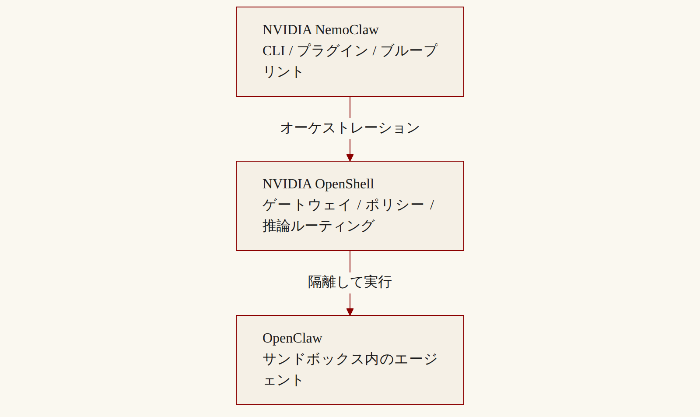
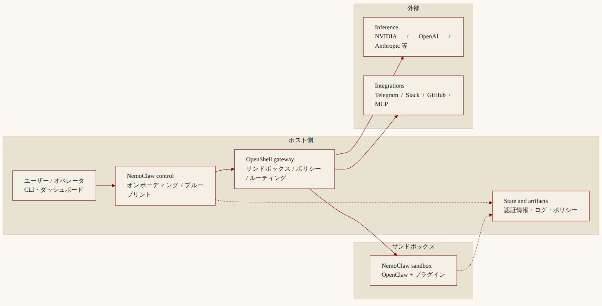
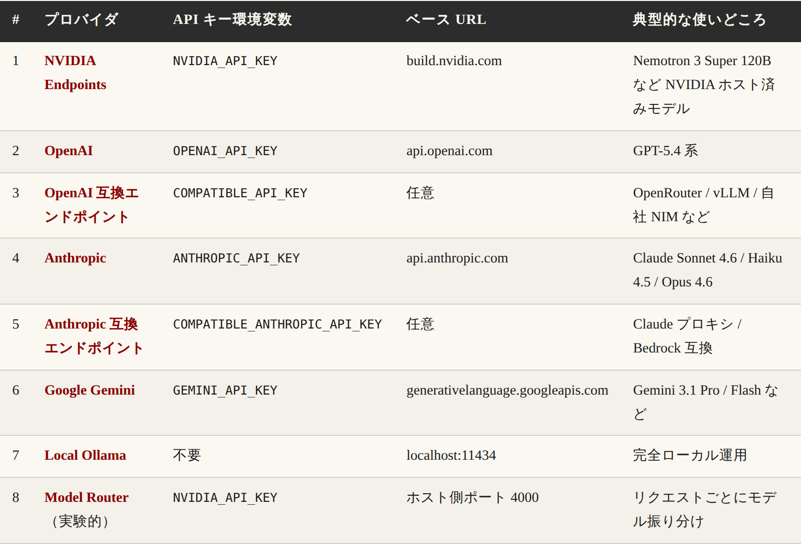

# NVIDIA NemoClaw の解説と使い方 — 常時稼働 AI エージェントを"安全に"動かすリファレンススタック

## リード：常時稼働のエージェントを"あなたの箱"で動かすという選択肢

一言でいえば、[NVIDIA NemoClaw](https://www.nvidia.com/en-us/ai/nemoclaw/) は **OpenClaw（自前ホスト型の AI エージェント基盤）を、サンドボックスの中で安全に動かすための NVIDIA 公式リファレンススタック**である。

発表は **2026年3月16日、GTC 2026 のキーノート**。NVIDIA CEO のジェンスン・フアンが、[OpenClaw の作者ピーター・シュタインベルガー氏と共同開発した](https://techcrunch.com/2026/03/16/nvidias-version-of-openclaw-could-solve-its-biggest-problem-security/)と発表し、ステージ上で「**すべての会社が OpenClaw 戦略を持つべきだ**」と語った。現在はまだ early preview（アルファ段階）だが、すでに [GitHub](https://github.com/NVIDIA/NemoClaw) でソースが公開され、curl 一発でインストールできる状態にある。

何が嬉しいのか。3点に絞ると次のとおりだ。

- **自分のハードに住まわせる**: 自宅の RTX PC や DGX Spark、もしくはクラウド GPU 上で、AI エージェントを 24時間365日走らせられる
- **データが外に出ない**: 推論をローカル完結にできるので、機密情報が外部 API に流れない構成が組める
- **暴走しにくい**: サンドボックスがネットワーク・ファイルシステム・推論先を縛るので、夜中にエージェントが勝手に変なホストへ繋ぎに行く事故を構造的に減らせる

イメージとしては、ChatGPT を毎回開いて指示するのが「外食」だとすれば、NemoClaw は **「家のキッチンに専属シェフを住み込ませる」** 発想に近い。ただし、刃物の扱いはルールで縛ってある——これがこの記事を通じての一貫した比喩になる。

**参考ソース:**
- [Safer AI Agents & Assistants with OpenClaw | NVIDIA NemoClaw](https://www.nvidia.com/en-us/ai/nemoclaw/)
- [RTX PCs and DGX Spark Supercomputers Run AI Agents Locally | NVIDIA Blog](https://blogs.nvidia.com/blog/rtx-ai-garage-gtc-2026-nemoclaw/)
- [Nvidia's version of OpenClaw could solve its biggest problem: security | TechCrunch](https://techcrunch.com/2026/03/16/nvidias-version-of-openclaw-could-solve-its-biggest-problem-security/)
- [Introducing NVIDIA NemoClaw - NVIDIA Developer Forums](https://forums.developer.nvidia.com/t/introducing-nvidia-nemoclaw/363701)

## NemoClaw / OpenShell / OpenClaw — 3つの登場人物を最初に整理する

NemoClaw を理解するうえで最初につまずく場所は、**似たような名前が3つ出てくる**点にある。まずこの3者を切り分けておくと、以降の説明が一気に通る。

要するに、3つは「**シェフ・厨房・段取り係**」の関係である。

- **OpenClaw**: エージェント本体。ランタイム、ツール、メモリ、振る舞いを担う — 厨房で実際に料理を作る**シェフ**
- **OpenShell**: サンドボックス。ネットワーク・FS・プロセス・推論ルーティングを管理 — シェフを閉じ込める**厨房そのもの**
- **NemoClaw**: CLI・ブループリント・オンボーディング。OpenClaw を OpenShell に載せる — シェフを厨房に住まわせる**段取り係**

公式ドキュメントの図を日本語化すると、上下関係はこうなる。




ここで効いてくる事実が1つある。**NemoClaw は OpenClaw も OpenShell も置き換えない**。両者を NVIDIA がおすすめする構成でひと束にした、薄いリファレンス層なのだ。だから「NemoClaw を入れる」と言ったとき、実際には OpenShell ランタイムと OpenClaw 本体も一緒にインストールされる。

**参考ソース:**
- [Overview of NVIDIA NemoClaw](https://docs.nvidia.com/nemoclaw/latest/about/overview.html)
- [NemoClaw Architecture Overview](https://docs.nvidia.com/nemoclaw/latest/about/how-it-works.html)
- [Ecosystem — NVIDIA NemoClaw Developer Guide](https://docs.nvidia.com/nemoclaw/latest/about/ecosystem.html)

## なぜ NemoClaw が必要なのか — 自律エージェントの3つのリスク

段落冒頭で結論から書く。**ガードレールなしで自律エージェントを動かすと、セキュリティ・コスト・コンプライアンスのリスクが同時に膨らむ**。

自律 AI エージェントは、何もしなければ以下のことができてしまう。

- **任意のネットワーク先**に外向き接続できる
- **ホストのファイルシステム**を読み書きできる
- **任意の推論エンドポイント**を呼び出せる（しかも API キーつきで）

つまり、悪意ある指示や、単なるバグ・誤動作で、知らないドメインに勝手に POST したり、`~/.ssh/` を読み込んだり、高額モデルを叩き続けてクレジットを溶かしたりする可能性が常にある。エージェントが「**24時間動き続ける常駐型**」になればなるほど、このリスクは構造的に大きくなる。

[公式ドキュメント](https://docs.nvidia.com/nemoclaw/latest/about/overview.html)はこの問題をシンプルにこう書いている——「Autonomous AI agents can make arbitrary network requests, access the host filesystem, and call any inference endpoint. Without guardrails, this creates security, cost, and compliance risks that grow as agents run unattended.」

NemoClaw が提供する答えは、**最初から鍵がかかった部屋にエージェントを住まわせる**という発想だ。具体的には4層のガードレールを重ねる（次セクション）。

**参考ソース:**
- [Overview of NVIDIA NemoClaw](https://docs.nvidia.com/nemoclaw/latest/about/overview.html)
- [NemoClaw Architecture Overview](https://docs.nvidia.com/nemoclaw/latest/about/how-it-works.html)
- [Nvidia's version of OpenClaw could solve its biggest problem: security | TechCrunch](https://techcrunch.com/2026/03/16/nvidias-version-of-openclaw-could-solve-its-biggest-problem-security/)

## アーキテクチャ — コンポーネント図で全体像を掴む

[公式の High-Level Component Diagram](https://docs.nvidia.com/nemoclaw/latest/about/how-it-works.html) を日本語化して並べると、NemoClaw 構成の登場物は7つに整理できる。




役割を表で押さえておく。

- **Users / operators**: CLI・インストーラ・ダッシュボード・チャネルからの起点
- **NemoClaw control**: 設定収集、オンボーディング、ブループリント準備、OpenShell へのリソース要求
- **OpenShell gateway**: サンドボックスのライフサイクル管理、ネットワーク、ポリシー実行、推論ルーティング、統合 egress
- **NemoClaw sandbox**: OpenClaw 本体 + NemoClaw プラグイン + ブループリント内容 + 補助ツール
- **Inference**: NVIDIA Endpoints / NIM / OpenAI 互換 API へのモデルリクエスト受け口
- **Integrations**: Telegram / Discord / Slack / MCP サーバー / GitHub / モデルハブ
- **State / artifacts**: 認証情報、ログ、ワークスペース、ポリシー、トランスクリプトの永続化

ここで効いてくる設計原則が3つある。

- **Thin plugin, versioned blueprint**: サンドボックス内のプラグインは薄く保ち、ホスト側のブループリントが別ペースで進化できるようにする
- **Supply chain safety**: ブループリントは不変・バージョン管理・digest 検証つきで配布される
- **Reproducible setup**: 同じコマンドを別マシンで再実行すると、同じサンドボックスが立ち上がる

つまり「**NVIDIA が用意した設計図（ブループリント）を、digest 検証つきで取り寄せ、それに従って OpenShell に箱を作らせる**」のが NemoClaw の本質だ。

**参考ソース:**
- [NemoClaw Architecture Overview](https://docs.nvidia.com/nemoclaw/latest/about/how-it-works.html)
- [Architecture — NVIDIA NemoClaw Developer Guide](https://docs.nvidia.com/nemoclaw/latest/reference/architecture.html)

## 6つの主要機能（Key Features）

NemoClaw が OpenShell 単体に対して「上乗せ」しているのは、次の6つの機能である。

- **Guided onboarding**: 1コマンドでクレデンシャル検証・プロバイダ選択・サンドボックス生成 — 「対話形式の最初のセットアップ係」
- **Hardened blueprint**: capability drop・最小権限ネットワーク・宣言的ポリシーを内包した Dockerfile — 「最初から鍵が掛かった部屋」
- **State management**: 認証情報を剥がして他マシンに移行できるエージェント状態管理 — 「引っ越し用パッキング機能」
- **Messaging channels**: Telegram / Discord / Slack を OpenShell 経由で接続 — 「外の連絡口を別室から繋ぐ」
- **Routed inference**: NVIDIA / OpenAI / Anthropic / Gemini / Ollama / vLLM への透過ルーティング — 「モデルを差し替え自由に」
- **Layered protection**: ネットワーク・FS・プロセス・推論の各層を hot-reload またはロック — 「四重の鍵」

ひとつ補足しておきたいのが **State management** である。エージェントを長く育てると、メモリやスキル、設定ファイルがマシン内に蓄積する。これを別マシンに移したいとき、認証情報まで一緒に持っていくと事故の原因になる。NemoClaw は「**認証情報だけを剥がして、それ以外の状態を整合性検証つきで移す**」仕組みを最初から備える。

**参考ソース:**
- [Overview of NVIDIA NemoClaw](https://docs.nvidia.com/nemoclaw/latest/about/overview.html)

## 4層の保護（Protection Layers）— 何を、いつ縛るのか

NemoClaw の安全性の中核は、サンドボックスの**4つの層**にある。それぞれが「何を防ぐか」と「いつ効くか」がはっきり分かれている。

- **Network**: 未許可の outbound 接続をブロック — 実行時に hot-reload 可
- **Filesystem**: `/usr` `/lib` `/etc` などのシステムパスを読み取り専用に。書き込み可は `/sandbox` と `/tmp` のみ — サンドボックス作成時にロック
- **Process**: 特権昇格と危険な syscall をブロック。`ulimit -u 512` で fork-bomb 対策 — サンドボックス作成時にロック
- **Inference**: モデル API 呼び出しを、コントロールされたバックエンドにルーティング — 実行時に hot-reload 可

特に Network 層の挙動が実用上重要だ。エージェントが**ポリシーに無い未登録ホスト**にアクセスしようとすると、OpenShell がリクエストをブロックし、TUI（テキスト UI）でオペレータに承認を求めてくる。承認すれば当該セッション中は通るが、ベースラインのポリシーファイルには書き込まれない——次の起動では再び聞かれる仕組みだ。

要するに「**勝手にやらない、まず聞く**」という挙動がデフォルトで効く。これが「エージェントが夜中に暴走しにくい」と言える根拠でもある。

**参考ソース:**
- [Overview of NVIDIA NemoClaw](https://docs.nvidia.com/nemoclaw/latest/about/overview.html)
- [NemoClaw Architecture Overview](https://docs.nvidia.com/nemoclaw/latest/about/how-it-works.html)
- [Network Policies — NVIDIA NemoClaw Developer Guide](https://docs.nvidia.com/nemoclaw/latest/reference/network-policies.html)
- [Sandbox Image Hardening — NVIDIA NemoClaw Developer Guide](https://docs.nvidia.com/nemoclaw/latest/deployment/sandbox-hardening.html)

## インストール — curl ワンライナーで始まる

ここから「使い方」の話に入る。NemoClaw の入口は、驚くほどシンプルだ。

### 基本コマンド

```bash
curl -fsSL https://www.nvidia.com/nemoclaw.sh | bash
```

これだけで、必要な前提環境のチェックから対話ウィザード起動までを全部やってくれる。具体的にはインストーラが次を順に実行する。

1. Node.js が無ければ自動インストール
2. Linux の場合、Docker が無ければ公式 convenience script を呼んで `sudo` でインストール、systemd があれば Docker サービスも起動
3. `nemoclaw` バイナリを配置
4. 自動的に `nemoclaw onboard`（対話ウィザード）を起動

nvm や fnm で Node.js を管理している場合、インストール直後の現シェルで PATH が更新されないことがある。その場合は `source ~/.bashrc`（zsh なら `~/.zshrc`）か、新しいターミナルを開く。

### ヘッドレス / CI で使う

対話プロンプトを飛ばしたい場合は、環境変数で「同意済み」を伝える。

```bash
curl -fsSL https://www.nvidia.com/nemoclaw.sh \
  | NEMOCLAW_NON_INTERACTIVE=1 NEMOCLAW_ACCEPT_THIRD_PARTY_SOFTWARE=1 bash
```

### DGX Spark / DGX Station の場合

このクラスのマシンでは **express install** が選べる。サードパーティソフトウェアの注意書きに同意すると、推奨されるセキュリティポリシーとマネージドローカル推論パスを一発で適用してくれる。

express を飛ばしたければ `NEMOCLAW_NO_EXPRESS=1`、プロバイダを自分で選びたければ `NEMOCLAW_PROVIDER` をインストーラ起動前にセットしておく。

### Docker グループの罠

Linux でインストール直後、現シェルから Docker ソケットが使えない状態だと、インストーラは「`docker` グループにユーザーを追加して終了する」挙動を取る。次のように新グループでシェルを再起動してから再実行すればよい。

```bash
newgrp docker
curl -fsSL https://www.nvidia.com/nemoclaw.sh | bash
```

**参考ソース:**
- [NemoClaw Quickstart with OpenClaw](https://docs.nvidia.com/nemoclaw/latest/get-started/quickstart.html)
- [Build a More Secure, Always-On Local AI Agent with OpenClaw and NVIDIA NemoClaw | NVIDIA Technical Blog](https://developer.nvidia.com/blog/build-a-secure-always-on-local-ai-agent-with-nvidia-nemoclaw-and-openclaw/)

## オンボードウィザード — 8つの推論プロバイダから選ぶ

インストーラが終わると、`nemoclaw onboard` が自動で立ち上がり、次の順で質問してくる。

1. **推論プロバイダ**
2. **サンドボックス名**
3. **Web 検索を有効にするか**
4. **メッセージングチャネル**（Telegram / Discord / Slack など）
5. **ネットワークポリシーのプリセット**

各プロンプトでは Enter キーで `[ ]` 内のデフォルト値を選ぶ、`back` で前に戻る、`exit` で抜ける、といった操作ができる。

### 推論プロバイダ8種

ウィザードの最初の質問が一番重要なので、ここで一覧表にしておく。



迷ったときの目安はこうだ。

- **NVIDIA のクラウドモデルを使いたい** → 1 (NVIDIA Endpoints)
- **OpenAI / Anthropic / Google を素直に使いたい** → 2 / 4 / 6
- **自社 NIM や OpenRouter などゲートウェイ経由** → 3 (OpenAI 互換) または 5 (Anthropic 互換)
- **完全ローカルでデータを外に出したくない** → 7 (Local Ollama)
- **モデルを動的に振り分けて使い分けたい** → 8 (Model Router)

事前に API キーを `export` しておけば、ウィザードがキーを聞いてくるステップを飛ばせる。

```bash
export NVIDIA_API_KEY=<your-key>
curl -fsSL https://www.nvidia.com/nemoclaw.sh | bash
```

スクリプト化したい場合は、こんな書き方になる。

```bash
NEMOCLAW_PROVIDER=routed NVIDIA_API_KEY=<your-key> nemoclaw onboard --non-interactive
```

**参考ソース:**
- [NemoClaw Quickstart with OpenClaw](https://docs.nvidia.com/nemoclaw/latest/get-started/quickstart.html)
- [Inference Options — NVIDIA NemoClaw Developer Guide](https://docs.nvidia.com/nemoclaw/latest/inference/inference-options.html)

## 動作の流れ — `nemoclaw onboard` の中で何が起きているか

コマンドは1本だが、内部では**4段階の処理**が走っている。

1. **ブループリント解決** — バージョン互換チェックと digest 検証を行う
2. **OpenShell リソース計画** — 作成・更新する gateway / プロバイダ / サンドボックス / ネットワークポリシーを決定
3. **OpenShell CLI 呼び出し** — 実際にリソースを作成
4. **サンドボックス起動** — エージェントの推論先は `inference.local` という内部エンドポイントに向き、本物の認証情報はホスト側に残る

ここで効いてくる仕組みが「**クレデンシャル分離**」だ。サンドボックス内のエージェントは、API キーを直接受け取らない。OpenShell の L7 プロキシが、egress の瞬間にプレースホルダを実際のキーへ解決して通す。つまり、エージェントが暴走して環境変数をダンプしても、そこには本物のキーは入っていない。

要するに NemoClaw onboard は「**部屋の入口に番人（OpenShell ゲートウェイ）を立て、シェフ（エージェント）には合鍵だけを渡し、本鍵はホストの金庫に置く**」段取りを自動でやる、というコマンドだ。

**参考ソース:**
- [NemoClaw Architecture Overview](https://docs.nvidia.com/nemoclaw/latest/about/how-it-works.html)
- [Ecosystem — NVIDIA NemoClaw Developer Guide](https://docs.nvidia.com/nemoclaw/latest/about/ecosystem.html)
- [Architecture — NVIDIA NemoClaw Developer Guide](https://docs.nvidia.com/nemoclaw/latest/reference/architecture.html)

## NemoClaw を使う vs OpenShell だけで組む — 違いを比較する

ここで1つ意外な事実を置いておく。**OpenShell だけでも OpenClaw は動く**。実は OpenShell が community sandbox を提供していて、次のコマンドで OpenClaw 環境を立ち上げられる。

```bash
openshell sandbox create --from openclaw
```

それでもなお NemoClaw を選ぶ理由は何か。公式 Ecosystem ページの[比較](https://docs.nvidia.com/nemoclaw/latest/about/ecosystem.html)を抜き出すと、こうなる。

- **サンドボックス分離**: seccomp / Landlock / 特権ドロップ — 同上 + 上に重ねる制限あり
- **クレデンシャル**: OpenShell プロバイダを**手動**作成 — 自動作成 + ホスト env から機微変数を自動フィルタ
- **イメージ硬化**: 汎用ツール込み — gcc/g++/make/netcat を剥がしてアタックサーフェスを縮小
- **FS ポリシー**: 同梱ポリシーあり — `/usr` `/lib` `/etc` を RO、`/sandbox` 配下を RW に整理
- **推論セットアップ**: サンドボックス内で OpenClaw ウィザードを起動 — ホストから検証＆ OpenShell ルーティングを自動構成
- **チャネル**: 手動設定 — Bot トークンを OpenShell プロバイダとして自動登録
- **ブループリントのバージョン管理**: なし — バージョン + digest 検証あり
- **状態移行**: なし — 認証情報を剥がして整合性検証つきで移行
- **プロセス上限**: 自分で `--ulimit` 指定 — `ulimit -u 512` がエントリポイントで自動適用

要するに、**OpenShell パスは「自分でガラスを切って窓を作る」、NemoClaw パスは「NVIDIA のキットを買って組み立てる」**。実験的に色々試したいなら前者、まず動かして検証したいなら後者、というのが現実的な棲み分けだ。

**参考ソース:**
- [Ecosystem — NVIDIA NemoClaw Developer Guide](https://docs.nvidia.com/nemoclaw/latest/about/ecosystem.html)

## 動作プラットフォーム — どこで動くのか

NemoClaw は実行環境を選ばない。代表的な3カテゴリは次のとおりだ。

- **ローカル PC / ワークステーション**: NVIDIA GeForce RTX PC / RTX PRO Workstation — 自宅マシンで 24/7 ローカル推論
- **デスクサイド・スーパーコンピュータ**: NVIDIA DGX Spark / DGX Station — express install で推奨設定が一発適用
- **クラウド**: 任意の GPU インスタンス — 推論先は OpenAI / Anthropic / Gemini / 自前 NIM など自由

NVIDIA は [Developer Blog で DGX Spark + Nemotron 3 Super 120B + Telegram の組み合わせ](https://developer.nvidia.com/blog/build-a-secure-always-on-local-ai-agent-with-nvidia-nemoclaw-and-openclaw/)を「教科書例」として紹介している。約87GB のモデルをダウンロードし（15〜30分）、20〜30分のアクティブセットアップで「**Telegram から呼び出せる、自宅マシン上の常駐 AI 秘書**」が立ち上がる構成だ。

要件は次のとおり。

- **ハードウェア**: DGX Spark (GB10) + Ubuntu 24.04 LTS + 最新の NVIDIA ドライバ
- **Docker**: 28.x 以上、NVIDIA Container Runtime 構成済み
- **Ollama**: ローカルモデルサーバとして
- **Telegram Bot トークン**: Telegram の @BotFather で発行

ハードウェアを持っていなくても、[build.nvidia.com の NemoClaw ページ](https://build.nvidia.com/nemoclaw) からブラウザ上で試せる Launchable が用意されている。

**参考ソース:**
- [Safer AI Agents & Assistants with OpenClaw | NVIDIA NemoClaw](https://www.nvidia.com/en-us/ai/nemoclaw/)
- [Build a More Secure, Always-On Local AI Agent with OpenClaw and NVIDIA NemoClaw | NVIDIA Technical Blog](https://developer.nvidia.com/blog/build-a-secure-always-on-local-ai-agent-with-nvidia-nemoclaw-and-openclaw/)
- [RTX PCs and DGX Spark Supercomputers Run AI Agents Locally | NVIDIA Blog](https://blogs.nvidia.com/blog/rtx-ai-garage-gtc-2026-nemoclaw/)

## ユースケース — どんな使い方が想定されているか

公式に挙げられている主なユースケースは3つある。

- **Always-on assistant**: 自宅 PC で常駐し、Telegram や Slack 経由で呼び出せる AI 秘書として運用
- **Sandboxed testing**: エージェントに権限を絞った箱の中で挙動を試す、研究・検証用途
- **Remote GPU deployment**: クラウド GPU 上にサンドボックス済みエージェントを永続デプロイし、SSH や Web UI から指示

特に「24/7 ローカル AI 秘書」像は、NVIDIA 自身が一番推している姿だ。

- 自宅 RTX PC や DGX Spark に OpenClaw + Nemotron をローカル展開
- Telegram Bot として外から呼び出せるように設定
- 「資料の整理を頼む」「コードを書き直しておいて」と Telegram で投げる → AI が箱の中で動いて、許可されたリソースだけ触ってくれる

これが**「クラウド AI を使う」から「自分のハードに住む AI を使う」**への移行を象徴するシナリオになる。

**参考ソース:**
- [Overview of NVIDIA NemoClaw](https://docs.nvidia.com/nemoclaw/latest/about/overview.html)
- [Build a More Secure, Always-On Local AI Agent with OpenClaw and NVIDIA NemoClaw | NVIDIA Technical Blog](https://developer.nvidia.com/blog/build-a-secure-always-on-local-ai-agent-with-nvidia-nemoclaw-and-openclaw/)

## 現在の状態と注意点

正直に書いておくべきことが3つある。

- **early preview / アルファ段階**: 2026年3月16日の公開以来、API・ふるまい・CLI フラグは予告なく変わる可能性がある
- **production-ready ではない**: NVIDIA 自身が明記している。["Expect rough edges. We are building toward production-ready sandbox orchestration, but the starting point is getting your own environment up and running"](https://techcrunch.com/2026/03/16/nvidias-version-of-openclaw-could-solve-its-biggest-problem-security/) という公式コメントが TechCrunch に引用されている
- **コミュニティが立ち上がり中**: 質問やバグ報告は [GitHub Discussions](https://github.com/NVIDIA/NemoClaw/discussions) または [NemoClaw Discord](https://discord.com/app/invite-with-guild-onboarding/bef6m4jKS7) に集まる

要するに、個人検証・PoC・学習用としては今すぐ触って問題ない。商用本番投入はもう少し様子見が無難——というのが2026年5月時点の妥当な距離感だ。

**参考ソース:**
- [Safer AI Agents & Assistants with OpenClaw | NVIDIA NemoClaw](https://www.nvidia.com/en-us/ai/nemoclaw/)
- [Introducing NVIDIA NemoClaw - NVIDIA Developer Forums](https://forums.developer.nvidia.com/t/introducing-nvidia-nemoclaw/363701)
- [Nvidia's version of OpenClaw could solve its biggest problem: security | TechCrunch](https://techcrunch.com/2026/03/16/nvidias-version-of-openclaw-could-solve-its-biggest-problem-security/)

## まとめ — NemoClaw を一言で位置づける

最後にひとことで言い切ってしまう。NemoClaw とは、**「自宅 GPU の上に Claude / Codex 級の AI エージェントを、箱付きで住まわせる」ための NVIDIA 公式キット**である。

主役は OpenClaw（シェフ）と OpenShell（厨房）。NemoClaw はその上に**段取りと初期セキュリティ設定をかぶせる、薄いリファレンス層**でしかない。だが、この薄さが大きい。`curl | bash` ワンライナーで「**ある朝突然、自宅の RTX マシンに 24/7 動く AI 秘書が誕生する**」というシナリオへの心理的ハードルを一気に下げてくれる。

GTC 2026 のステージでフアン CEO はこう語った——「Linux があるべきタイミングで現れた。Kubernetes があるべきタイミングで現れた。HTML があるべきタイミングで現れた。OpenClaw も、エージェント時代のあるべきタイミングで現れた」。NemoClaw はその標準テンプレを、NVIDIA がパッケージ化して配ろうとしている試みだと受け取るのが分かりやすい。

まだアルファ段階だが、触ってみる手順は驚くほど短い。

```bash
curl -fsSL https://www.nvidia.com/nemoclaw.sh | bash
```

これで5分後、あなたの箱の中に最初のサンドボックス・エージェントが立ち上がる。

**参考ソース:**
- [Safer AI Agents & Assistants with OpenClaw | NVIDIA NemoClaw](https://www.nvidia.com/en-us/ai/nemoclaw/)
- [RTX PCs and DGX Spark Supercomputers Run AI Agents Locally | NVIDIA Blog](https://blogs.nvidia.com/blog/rtx-ai-garage-gtc-2026-nemoclaw/)
- [Nvidia's version of OpenClaw could solve its biggest problem: security | TechCrunch](https://techcrunch.com/2026/03/16/nvidias-version-of-openclaw-could-solve-its-biggest-problem-security/)
