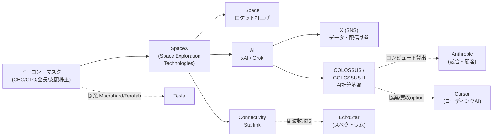

# SpaceX の Form S-1 を読み解く — 史上最大の IPO、目論見書は何を語っているか

2026年5月20日、SpaceX が米証券取引委員会（SEC）に上場のための書類を提出した。報道では、株式公開（IPO）として史上最大規模になる見込みだ。

この記事では、その書類「Form S-1」の中身を一次資料として読み解く。会社が自ら語った数字とリスクから、「何の会社が、いくらで、何のために上場しようとしているのか」を整理する。投資の助言ではなく、開示書類の構造と事実関係を分かりやすく解きほぐすことが目的だ。

## まず Form S-1 とは何か

ひとことで言うと、**Form S-1 は「米国で新規上場するときに SEC へ提出する説明書」**だ。会社の事業・財務・リスクを投資家に開示するための書類で、その中核に置かれるのが「目論見書（プロスペクタス）」と呼ばれる投資家向けの案内文書である。

今回提出されたのは、その下書き段階にあたる**「予備的目論見書（preliminary prospectus）」**だ。表紙には「SUBJECT TO COMPLETION（未完成）」と明記され、肝心の**1株あたりの価格も発行株数も空欄**になっている。価格は、この後の投資家行脚（ロードショー）を経て決まる。

なぜこの空欄だらけの書類を読む価値があるのか。理由はシンプルだ。SpaceX はこれまで非公開企業で、財務の全体像は外からほとんど見えなかった。その数字が、この S-1 で初めて全面的に開示されたからだ。

会社の正式名称は Space Exploration Technologies Corp.（テキサス州法人）。上場先は Nasdaq と Nasdaq Texas で、ティッカー（証券コード）は **「SPCX」** を申請している。

**参考ソース:**
- [Space Exploration Technologies Corp. - Form S-1（2026年5月20日提出）](https://www.sec.gov/Archives/edgar/data/1181412/000162828026036936/spaceexplorationtechnologi.htm)

## いくらで上場するのか — 報道ベースの数字

S-1 本文には金額が書かれていないが、複数の報道は具体的な数字を伝えている。注意点として、**以下はあくまで報道ベースの想定で、S-1 そのものには記載がない**。

報道によれば、想定時価総額は約**1.75兆ドル**、調達額は最大**約750億ドル**規模とされる。ロードショーは6月初旬、価格決定は6月中旬が見込まれている。

この数字がどれほど異例か。過去最大の IPO は2019年のサウジアラムコで、調達額は約294億ドルだった。SpaceX が報道どおりに価格を付ければ、調達額・時価総額のいずれも歴代の記録を大きく塗り替えることになる。

| 項目 | 内容 | 出所 |
|------|------|------|
| ティッカー | SPCX（Nasdaq / Nasdaq Texas） | S-1 |
| 想定時価総額 | 約1.75兆ドル | 報道 |
| 想定調達額 | 最大 約750億ドル | 報道 |
| 上場時期 | 2026年6月中旬（想定） | 報道 |
| 1株価格・発行株数 | **空欄（未定）** | S-1 |

**参考ソース:**
- [Space Exploration Technologies Corp. - Form S-1（2026年5月20日提出）](https://www.sec.gov/Archives/edgar/data/1181412/000162828026036936/spaceexplorationtechnologi.htm)
- [SpaceX SPCX IPO S-1 Full Teardown: $1.75 Trillion Valuation](https://www.thevccorner.com/p/spacex-spcx-ipo-s1-teardown-valuation-2026)
- [SpaceX IPO Date 2026: $1.75T Valuation & Roadshow](https://www.techstackipo.com/ipo/spacex)

## 全体像：3つの事業と関連プレイヤー

SpaceX を理解する鍵は、**「ロケットの会社」という従来のイメージが、もはや実態と合っていない**点にある。S-1 では会社を3つの事業セグメントに分けて開示している。

| セグメント | 中身 | 主力プロダクト | 2025年売上 |
|-----------|------|--------------|-----------|
| Space（宇宙） | ロケット打上げサービス | Falcon 9 / Falcon Heavy / Starship | $4,086M |
| Connectivity（通信） | 衛星インターネット | Starlink / Starlink Mobile / Starshield | $11,387M |
| AI | AI モデルと計算基盤 | Grok / X / COLOSSUS | $3,201M |

注目すべきは、3番目の AI セグメントだ。これは2026年2月2日に SpaceX が **xAI を買収**して新たに生まれたものだ。xAI は2023年設立の AI 企業で、対話 AI「Grok」と SNS「X（旧 Twitter）」を擁する（X は2025年3月に xAI 傘下に入っていた）。

つまり、**この S-1 が描く SpaceX は、2026年に「会社の形」が大きく変わった直後の姿**だ。ロケット・衛星通信・AI という、本来なら別々の会社になりそうな3事業が、イーロン・マスクを頂点に1つの企業へ統合されている。



**参考ソース:**
- [Space Exploration Technologies Corp. - Form S-1（2026年5月20日提出）](https://www.sec.gov/Archives/edgar/data/1181412/000162828026036936/spaceexplorationtechnologi.htm)

## 数字で見る SpaceX — 連結財務の全体像

まず全社（連結）の数字を押さえる。要点を先に言うと、**売上は急成長している一方で、純損益は大きな赤字**だ。

| 指標（百万ドル） | 2023 | 2024 | 2025 | 2026 Q1 |
|---|---|---|---|---|
| 売上 | 10,387 | 14,015 | 18,674 | 4,694 |
| 営業損益 | (3,505) | 466 | (2,589) | (1,943) |
| 純損益 | (4,628) | 791 | (4,937) | (4,276) |
| Adjusted EBITDA | — | — | 6,584 | 1,127 |

ここで「Adjusted EBITDA（調整後 EBITDA）」という言葉が出てくる。これは**会計ルール（GAAP）に基づかない参考指標**で、ざっくり言えば「設備の減価償却や税金・利子などを除いた、本業の現金を稼ぐ力の目安」だ。会社が「本業は稼げている」と示したいときに使う数字なので、純損益とは別物として読む必要がある。

実際、2025年は Adjusted EBITDA が +65.8億ドルなのに、純損益は -49.4億ドルだ。この差は、巨額の減価償却や投資、そして後述する AI セグメントの損失から来ている。

```chart
{
  "type": "bar",
  "data": {
    "labels": ["2023", "2024", "2025"],
    "datasets": [
      { "label": "売上", "data": [10387, 14015, 18674], "backgroundColor": "#8b0000" },
      { "label": "純損益", "data": [-4628, 791, -4937], "backgroundColor": "#c0c0c0" }
    ]
  },
  "options": {
    "plugins": { "title": { "display": true, "text": "連結売上と純損益の推移（百万ドル）" } }
  }
}
```

財務体質で押さえるべき点が2つある。

- **累積赤字**は2026年3月末で **413億ドル**（$41,311M）。創業以来の損失の積み上がりは大きい。
- **手元現金**は1四半期で急減した。2025年末の247億ドル（$24,747M）から、2026年3月末には159億ドル（$15,852M）へ減っている。同四半期の投資キャッシュフローは -167億ドル（$16,724M）にのぼり、その多くを資金調達（財務 +71億ドル）で埋めた格好だ。

なお、この財務数字には1つ注意がある。**xAI と X を「過年度にさかのぼって合算」している**点だ。買収が支配株主（マスク）の下での取引（共通支配下の取引）にあたるため、会計ルール上、2023年まで遡って3社を1つに組み替えた数字になっている。過去の SpaceX 単体の数字とは直接比べられない。

**参考ソース:**
- [Space Exploration Technologies Corp. - Form S-1（2026年5月20日提出）](https://www.sec.gov/Archives/edgar/data/1181412/000162828026036936/spaceexplorationtechnologi.htm)
- [SpaceX SPCX IPO S-1 Full Teardown: $1.75 Trillion Valuation](https://www.thevccorner.com/p/spacex-spcx-ipo-s1-teardown-valuation-2026)

## セグメント①：Space — 圧倒的な打上優位と「Starship 賭け」

Space セグメントは、SpaceX の原点であるロケット打上事業だ。実績は文句なしに圧倒的だ。

- 2023年以降、**世界の軌道投入質量の80%超**を SpaceX が打ち上げている
- Falcon ロケットの**ミッション成功率は99%超**
- 累計で約650回の軌道打上げ、うち540回超は実績のある再使用ロケットによるもの
- 第1段ブースターを最大**34回**再使用した実績がある
- 2025年には、米政府の安全保障打上（NSSL）の中・大型12ミッション中11、そして NASA の有人・補給ミッション5件すべてを担った。S-1 は自らを「米政府の主要打上プロバイダー」と位置づける

| 指標 | 2023 | 2024 | 2025 | 2026 Q1 |
|---|---|---|---|---|
| 打上回数 | 98 | 138 | 170 | 40 |
| 軌道投入質量（トン） | 1,210 | 1,699 | 2,213 | 556 |
| セグメント営業損益（百万ドル） | (1) | 21 | (657) | (662) |

ここで効いてくるのが**「Starship（スターシップ）」**だ。Starship は完全再使用を目指す超大型ロケットで、会社は成長戦略の鍵と位置づけている。次世代衛星「V3」（後述）や、将来の月・火星ミッション、軌道上 AI 計算基盤など、SpaceX の野心はすべて Starship の成功に乗っている。

だが、これがセグメントの赤字要因でもある。Starship の研究開発費は**2025年だけで30億ドル（$3,004M）**、2026年第1四半期も9.3億ドルが投じられた。実績豊富な Falcon で稼ぎながら、その利益を Starship 開発に注ぎ込んでいる構図だ。S-1 自身も、リスク要因の筆頭に「Starship の開発・量産・打上頻度が計画通り進まなければ、成長戦略全体が遅れる」と挙げている。

要するに、**Space は「現在の強さ」と「将来への巨額の賭け」が同居するセグメント**だ。

**参考ソース:**
- [Space Exploration Technologies Corp. - Form S-1（2026年5月20日提出）](https://www.sec.gov/Archives/edgar/data/1181412/000162828026036936/spaceexplorationtechnologi.htm)

## セグメント②：Connectivity — Starlink という唯一の黒字エンジン

Connectivity（通信）は、衛星インターネット「Starlink」を中心とする事業だ。そして**3セグメントの中で唯一、しっかり黒字を出している**。

- 加入者は2026年3月末で**約1,030万**（$10.3M）。164の国・地域でサービスを提供
- 低軌道に約9,600基の衛星を展開。これは2026年3月末時点で、軌道上の稼働中・操縦可能な衛星の**約75%**を占める
- 衛星から直接スマホへつなぐ「Starlink Mobile」も展開し、約30カ国・月間740万台の端末に接続を提供

数字も力強い。2025年の Connectivity 売上は**前年比+49.8%の113.9億ドル**、営業利益は+120.4%の44.2億ドル、セグメント Adjusted EBITDA は+86.2%の71.7億ドルだった。

ただし、見落とせない論点が1つある。**ARPU（加入者1人あたりの月間売上）が下がり続けている**ことだ。

| 指標 | 2023 | 2024 | 2025 | 2026 Q1 |
|---|---|---|---|---|
| 加入者数（百万） | 2.3 | 4.4 | 8.9 | 10.3 |
| ARPU（ドル/月） | 99 | 91 | 81 | 66 |

```chart
{
  "type": "bar",
  "data": {
    "labels": ["2023", "2024", "2025", "2026 Q1"],
    "datasets": [
      { "type": "bar", "label": "加入者数（百万）", "data": [2.3, 4.4, 8.9, 10.3], "backgroundColor": "#8b0000", "yAxisID": "y" },
      { "type": "line", "label": "ARPU（ドル/月）", "data": [99, 91, 81, 66], "borderColor": "#404040", "backgroundColor": "#404040", "yAxisID": "y1" }
    ]
  },
  "options": {
    "plugins": { "title": { "display": true, "text": "Starlink 加入者数と ARPU" } },
    "scales": {
      "y": { "type": "linear", "position": "left", "title": { "display": true, "text": "加入者数（百万）" } },
      "y1": { "type": "linear", "position": "right", "title": { "display": true, "text": "ARPU（ドル/月）" }, "grid": { "drawOnChartArea": false } }
    }
  }
}
```

これは、加入者を増やすために安価な国・プランへ広げているためと読める。加入者数の伸びが単価下落を上回っている間は売上が伸びるが、**「数で稼ぐか、単価で稼ぐか」のトレードオフ**を抱えていることは押さえておきたい。

**参考ソース:**
- [Space Exploration Technologies Corp. - Form S-1（2026年5月20日提出）](https://www.sec.gov/Archives/edgar/data/1181412/000162828026036936/spaceexplorationtechnologi.htm)
- [SpaceX SPCX IPO S-1 Full Teardown: $1.75 Trillion Valuation](https://www.thevccorner.com/p/spacex-spcx-ipo-s1-teardown-valuation-2026)

## セグメント③：AI — バリュエーションを背負う最大の賭け

3つ目の AI セグメントは、2026年2月に買収した xAI が母体だ。対話 AI「Grok」、SNS「X」、そして AI 計算基盤「COLOSSUS／COLOSSUS II」（テネシー州メンフィスなど、合計約1.0ギガワット規模）から成る。

利用者の規模は大きい。Grok と X を合わせた基盤は直近12カ月で13億超のアカウントを支え、月間アクティブ利用者（MAU）は約5.5億、うち約1.17億が Grok の AI 機能を使っている。

問題は財務だ。**AI セグメントは巨額の赤字と巨額の投資が同時進行している**。

- 2025年のセグメント営業損失は **-63.6億ドル**（$6,355M）
- 2026年第1四半期の設備投資は **77.2億ドル**（$7,723M）。同四半期の全社設備投資101億ドルの大半を AI が占める

AI 投資の中身でとくに目を引くのが、外部との契約2件だ。

- **Anthropic への計算能力の貸し出し** — 2026年5月、SpaceX は Anthropic（AI 開発の公益企業）とクラウドサービス契約を結んだ。COLOSSUS／COLOSSUS II の計算能力を提供し、**月12.5億ドル（2029年5月まで）**を受け取る。両者は90日前通知で解約できる。注目すべきは、Anthropic が Grok の直接の競合である点だ。SpaceX は自社の最先端クラスタを、競合に貸して稼ぐという構図を選んでいる。
- **Cursor との提携** — 2026年4月、コーディング支援 AI の Cursor（Anysphere）に計算能力を提供し、同社を**想定企業価値600億ドル**で買収できるオプションも得た。解約時には15億ドルの解約金と85億ドルの繰延サービス料が発生する。

S-1 は AI 事業について、自ら率直なリスクも書いている。「AI モデルの性能は計算量・データ・規模を増やすほど上がるという経験則（スケーリング則）に依存してきたが、それがいつまで成り立つかは不確実だ」という趣旨だ。**AI セグメントは、最も急成長が期待される一方で、最も多く現金を燃やし、最も不確実性が高い**。

**参考ソース:**
- [Space Exploration Technologies Corp. - Form S-1（2026年5月20日提出）](https://www.sec.gov/Archives/edgar/data/1181412/000162828026036936/spaceexplorationtechnologi.htm)
- [SpaceX SPCX IPO S-1 Full Teardown: $1.75 Trillion Valuation](https://www.thevccorner.com/p/spacex-spcx-ipo-s1-teardown-valuation-2026)

## $28.5兆ドルの TAM をどう読むか

S-1 で目を引くのが、SpaceX が掲げる市場規模の数字だ。会社は自社の **TAM（Total Addressable Market＝獲得しうる市場全体の大きさ）を $28.5兆ドル**と見積もり、「人類史上最大の実現可能な TAM」と表現している（中国・ロシアは除外して算出）。

内訳を見ると、その性格がはっきりする。

| セグメント | TAM | 内訳 |
|---|---|---|
| Space | $370B（0.37兆） | 宇宙関連ソリューション |
| Connectivity | $1.6T | ブロードバンド $870B＋モバイル $740B |
| **AI** | **$26.5T** | 企業向けアプリ $22.7T、AI 基盤 $2.4T、消費者向け $760B、広告 $600B |
| **合計** | **$28.5T** | — |

```chart
{
  "type": "bar",
  "data": {
    "labels": ["Space", "Connectivity", "AI"],
    "datasets": [
      { "label": "TAM（兆ドル）", "data": [0.37, 1.6, 26.5], "backgroundColor": ["#c0c0c0", "#808080", "#8b0000"] }
    ]
  },
  "options": {
    "indexAxis": "y",
    "plugins": { "title": { "display": true, "text": "SpaceX が掲げるセグメント別 TAM（兆ドル）" } }
  }
}
```

一目で分かるのは、**TAM の9割超を AI が占めている**ことだ。とりわけ「企業向けアプリ」だけで22.7兆ドルと、他のすべてを足した額を上回る。

ここで距離感を確認しておきたい。**今まさに利益を生んでいる事業（Space と Connectivity）は、この TAM の合計のおよそ1割未満**にすぎない。残りの大部分は、まだ赤字の AI 事業が将来取りに行く市場だ。TAM はあくまで SpaceX 自身の見積りであり、前提次第で大きく変わる数字でもある。報道ベースの時価総額（約1.75兆ドル）の多くは、この「これからの AI」への期待に支えられている、と読むのが素直だろう。

**参考ソース:**
- [Space Exploration Technologies Corp. - Form S-1（2026年5月20日提出）](https://www.sec.gov/Archives/edgar/data/1181412/000162828026036936/spaceexplorationtechnologi.htm)
- [SpaceX SPCX IPO S-1 Full Teardown: $1.75 Trillion Valuation](https://www.thevccorner.com/p/spacex-spcx-ipo-s1-teardown-valuation-2026)

## 統治構造 — マスクの支配と「控除型企業」

上場しても、**SpaceX は実質的にイーロン・マスクが支配する会社であり続ける**。その仕組みが株式の設計にある。

SpaceX は2種類の株式を発行する。

- **Class A 株式** — 1株につき1票
- **Class B 株式** — 1株につき**10票**

マスクはこの構造を通じて議決権の過半を握る。さらに Class B の保有者には、**取締役会の過半を選ぶ権利**が与えられる。一般の投資家が買うのは Class A 株式（1株1票）なので、株主総会で会社の方向性を覆すことは事実上できない。

この結果、SpaceX は Nasdaq のルール上「**controlled company（支配下企業／控除型企業）**」に該当する。難しそうな名前だが、要するに「1人の株主が支配しているので、独立取締役の比率などコーポレートガバナンスの一部ルールを免除してよい会社」という意味だ。SpaceX はこの免除を使う方針を明言している。

もう1つ、S-1 が正直に開示しているのが**利益相反**のリスクだ。

- マスクは Tesla とも協業している（半導体の Terafab、ソフトウェアの Macrohard など、いずれも初期段階）
- charter（定款）上、マスクや関連会社が SpaceX と競合する事業を行うことを妨げない
- マスクが知り得たビジネス機会を、SpaceX ではなく別の自社へ回す可能性がある

つまり、**マスクの存在が最大の強みであると同時に、最大の集中リスクでもある**ことを、会社自身が認めている。

**参考ソース:**
- [Space Exploration Technologies Corp. - Form S-1（2026年5月20日提出）](https://www.sec.gov/Archives/edgar/data/1181412/000162828026036936/spaceexplorationtechnologi.htm)

## リスクの整理 — 赤信号と青信号

S-1 の「Risk Factors」から、投資家が押さえるべき論点を信号で整理する。ここでの「🔴 要注意」は危険という意味ではなく、**不確実性が大きく結果を左右しやすい論点**を指す。

| 論点 | 判定 | 中身 |
|------|------|------|
| Starship 依存 | 🔴 要注意 | 成長戦略の大半が Starship の量産・打上成功に依存。遅延・失敗は連鎖的に影響 |
| 赤字体質・累積赤字 | 🔴 要注意 | 2025年純損失 -49億ドル、累積赤字413億ドル。黒字化の保証はない |
| AI の巨額投資と未証明性 | 🔴 要注意 | セグメント営業損失 -64億ドル/年、設備投資が突出。スケーリング則の持続も不確実 |
| マスク依存・統治構造 | 🔴 要注意 | デュアルクラスで支配、controlled company、利益相反 |
| 米政府への依存 | 🟡 留意 | 売上の相当部分が政府契約。予算・調達ルールの影響を受ける |
| スペクトラム/FCC 依存 | 🟡 留意 | 通信事業は周波数免許に依存。EchoStar からの周波数取得（FCC が2026年5月12日に承認）も進行中 |
| 保険を掛けない方針 | 🟡 留意 | 軌道上の衛星に保険を付けておらず、今後も付けない方針 |
| 内部統制が未整備 | 🟡 留意 | 上場企業に求められる内部統制（SOX法404条）にまだ完全対応していない |
| 収益計上タイミングの変動 | 🟡 留意 | 打上げの前後ずれで四半期業績が振れやすい |
| Starlink の黒字・打上優位 | 🟢 相対的に堅い | Connectivity は明確に黒字。打上シェア・成功率は世界トップ |

**参考ソース:**
- [Space Exploration Technologies Corp. - Form S-1（2026年5月20日提出）](https://www.sec.gov/Archives/edgar/data/1181412/000162828026036936/spaceexplorationtechnologi.htm)

## まとめ — 目論見書は何を語っているか

SpaceX の S-1 を1枚に畳むと、こう言える。**性格のまったく異なる3つの事業を、1つの数字（時価総額）として売り出そうとしている**書類だ。

- **Starlink（Connectivity）** — すでに黒字で、市場が値付けの仕方を知っている事業。1,000万加入者を抱える成長エンジン。ただし ARPU は低下中
- **打上事業（Space）** — 世界シェアでは圧倒的だが、Starship という巨額の賭けで足元は赤字
- **AI** — TAM の9割を背負う一方で、最も多く現金を燃やし、最も不確実

報道ベースで約1.75兆ドルとされる価格のうち、確実に利益を出している部分（Starlink と打上）が説明できるのは一部にすぎない。残りは「これから AI と宇宙で何を実現するか」への期待だ。

IPO の報道を見るときは、華々しい時価総額の数字だけでなく、**①どのセグメントが実際に稼いでいるか、②現金がどれだけのペースで燃えているか、③マスク1人にどれだけ集中しているか**——この3点を S-1 の数字に照らして確認するのがよい。空欄だった価格がやがて埋まったとき、その数字が何への対価なのかを、目論見書はすでに語っている。

**参考ソース:**
- [Space Exploration Technologies Corp. - Form S-1（2026年5月20日提出）](https://www.sec.gov/Archives/edgar/data/1181412/000162828026036936/spaceexplorationtechnologi.htm)
- [SpaceX SPCX IPO S-1 Full Teardown: $1.75 Trillion Valuation](https://www.thevccorner.com/p/spacex-spcx-ipo-s1-teardown-valuation-2026)
