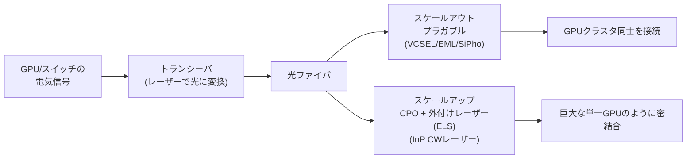
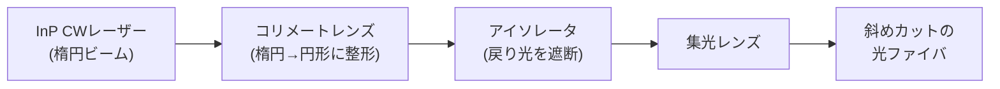
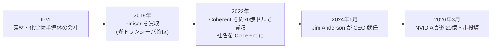

# AIデータセンターの隠れたボトルネックは「レーザー不足」 — 鍵を握るコヒレント

AIの計算競争といえば、普通は NVIDIA の GPU が主役だ。しかし、その GPU を何万個も束ねて「ひとつの巨大な頭脳」として動かすには、GPU 同士をつなぐ配線が要る。そして、その配線が今まさに **銅線から光（レーザー）へ** 置き換わろうとしている。

この記事では、AI データセンターでなぜレーザーが決定的に重要なのかを、物理のレベルから技術的に解き明かす。そして、その光源を作れる西側で数少ない企業 **Coherent（コヒレント）社** を軸に、技術・製品・企業・市場の全体像を見ていく。

---

## 1. はじめに — NVIDIA が2,000億円を投じた「地味な部品」

2026年3月、NVIDIA は **Coherent と Lumentum にそれぞれ約20億ドル（合計約40億ドル）を投資** すると発表した。GPU で世界を席巻する会社が、なぜ「レーザー会社」にこれほどの資金を賭けるのか。

市場の反応は劇的だった。Coherent の株価は52週間で **+424%** 上昇し、2026年6月3日には1株417.43ドル、時価総額は約816億ドルに達した。1年前の時価総額のおよそ10倍である。

一言でいえば、こういうことだ。**AI の計算は、無数の GPU を束ねて初めて成立する。その「束ね役」＝配線が、銅から光へ置き換わりつつある。そして、その光を生み出すレーザーを量産できる会社が、AI インフラの隠れた要石になっている。**

NVIDIA の投資は、その要石を確保しにいく動きだった。GPU をいくら作っても、それらをつなぐ光部品が足りなければクラスタは組めない。実際、レーザーは今や「金を積んでも順番待ち」の戦略物資になっている。

**参考ソース:**
- [Lasers Are The Heartbeat Of The Optical AI Data Center](https://semiengineering.com/lasers-are-the-heartbeat-of-the-optical-ai-data-center/)
- [Coherent Corp. (COHR): A Leader in Optical Transceivers Amid AI Data Center Growth](https://www.insidermonkey.com/blog/coherent-corp-cohr-a-leader-in-optical-transceivers-amid-ai-data-center-growth-1774841/)

---

## 2. 全体像 — 主要技術と関係図

細部に入る前に、データセンターの「配線」がどう構成されているかを俯瞰しておく。ここを押さえておくと、後の技術の話がぐっと分かりやすくなる。

AI データセンターのネットワークは、大きく2つのレイヤーに分かれる。

- **スケールアウト（scale-out）** — ラックをまたいで、GPU クラスタ同士を広く薄くつなぐ網。ここは何十年も前から光ファイバ（プラガブル光トランシーバ）が主役。
- **スケールアップ（scale-up）** — 数十〜数百個の GPU を「1台の巨大な GPU」のように密結合する網。ここは長く銅線が主役だったが、速度が上がりすぎて銅が限界に達し、いま光へ移行しつつある。

そして光に変換するための **レーザー** には、用途別に主に3種類がある。

| レーザーの種類 | カテゴリ | 主な役割・用途 |
|---|---|---|
| VCSEL（垂直共振器面発光レーザー） | 短距離・低コスト | ラック内の数百m以下の接続 |
| EML（電界吸収変調レーザー） | 中〜長距離・高性能 | 800G/1.6T プラガブルの主力 |
| CW DFB レーザー（連続波・分布帰還型） | 中〜長距離・量産向き | シリコンフォトニクス／CPO の光源 |

Coherent の強みは、これらのレーザーだけでなく、その大元の **材料（InP）** から、トランシーバ、さらには光を整えるアイソレータや温度を保つ TEC（熱電クーラー）まで、ほぼ一気通貫で自社で作れる点にある。この「垂直統合」が後の章で何度も効いてくる。



**参考ソース:**
- [Lasers Are The Heartbeat Of The Optical AI Data Center](https://semiengineering.com/lasers-are-the-heartbeat-of-the-optical-ai-data-center/)
- [EML vs VCSEL vs CW Laser: Optical Transceiver Guide (2025)](https://edgeoptic.com/kb_article/eml-vs-vcsel-vs-cw-laser-which-optical-transceiver-laser-is-right-for-you)
- [Datacom Innovation in the AI Era](https://www.coherent.com/news/blog/enabling-ai-next-gen-datacenters)

---

## 3. なぜ光なのか — 銅の物理的な壁

ひとことで言うと、**銅は速くなるほど短くしか届かない**。これが、データセンターが光へ移行する根本理由だ。

電気信号は、銅線の中を進むうちに減衰する。そして厄介なことに、**信号が速くなる（周波数が上がる）ほど、減衰は急になる**。NVIDIA の最新世代の高速インターコネクト（NVLink 級）の速度では、銅線が実用的に届く距離は **1メートル未満** にまで縮む。

この「届く距離」が、AI にとっては死活問題になる。なぜなら、銅の到達距離が **ワールドサイズ** — つまり「1つのスケールアップ網の中で密結合できる GPU の数」 — を物理的に縛ってしまうからだ。GPU を1ラックに収めている間は銅でいい。しかし、クラスタを複数ラックにまたがって広げようとした瞬間、銅では届かなくなる。だからこそ、ラックをまたぐ密結合には光（CPO）が必須になる。

ここで効いてくるのが光子（photon）の性質だ。電気と違って、光は次の点で圧倒的に有利になる。

- **電気抵抗を受けない** — 距離による信号の劣化が桁違いに小さい
- **電磁干渉（ノイズ）を出さない・受けない**
- **3インチ先でも300メートル先でも、信号の品質はほぼ変わらない**

電気が「距離と速度のトレードオフ」に縛られるのに対し、光はそのくびきから自由なのだ。

**例え話**で言えば、銅は近所への手押し車だ。近距離なら速くて安いが、遠くへ運ぼうとすると荷物がどんどんこぼれ落ちる。光は遠距離宅配便で、近くても遠くても中身の品質を保ったまま届ける。

ただし、公平に言えば銅が完全に消えるわけではない。**ラック内のごく短距離では、当面（少なくとも2028年ごろまで）は銅のほうが安くて省電力**であり続ける見込みだ。NVIDIA 自身も、次世代でも超短距離には銅を残す方針を示している。要するに「短いところは銅、長いところは光」という棲み分けが進み、その境界が年々光側へ押し込まれていく、という構図だ。

**参考ソース:**
- [Lasers Are The Heartbeat Of The Optical AI Data Center](https://semiengineering.com/lasers-are-the-heartbeat-of-the-optical-ai-data-center/)
- [The AI Datacenter Optical Interconnect Boom](https://benpouladian.com/the-ai-datacenter-optical-interconnect/)
- [All AI Data Center Interconnects Will Be Optical Within 5 Years](https://semiengineering.com/all-ai-data-center-interconnects-will-be-optical-within-5-years/)

---

## 4. レーザーは光通信の「運び手」— 基礎の仕組み

では、光で情報を送るとはどういうことか。ここでレーザーの役割を一段噛み砕いておく。

レーザーは、情報そのものではなく、情報を載せる **キャリア（搬送波／運び手）** だ。一定の光をまず作り、そこに「振幅・周波数・位相・偏波」のいずれかを変化させてデータを刻み込む。これを **変調（modulation）** という。受信側はその変化を読み取ってデータに戻す。ラジオの電波に音声を乗せるのと考え方は同じで、媒体が電波ではなく光になっただけだ。

光が送信側から受信側に届くまでには、ファイバ・コネクタ・各種光学部品を通るたびに少しずつ信号が失われる。ここで重要になるのが **リンクバジェット（link budget）** という考え方だ。これは「受信側で信号をちゃんと読めるために、途中で許される損失の総量」を指す。

リンクバジェットが余裕を持って収まる（＝損失が少ない）ほど、レーザーの出力を抑えられる。すると **低消費電力・低コスト・低エラー率** につながる。逆に損失が大きいと、それを補うために強いレーザーが必要になり、電力も発熱もコストも増える。後で出てくる「なぜレーザーがそんなに高出力なのか」という話は、このリンクバジェットの裏返しだ。

帯域（送れる情報量）を増やす王道は、**1本のファイバに複数の波長の光を同時に流す**ことだ（WDM。後述）。波長を増やせば帯域は増えるが、その分コストと複雑さも増える、というトレードオフがある。

この市場は、いま猛烈な勢いで膨らんでいる。レーザー技術市場は2024年に **200億ドル超**、2030年には **300億ドル超** に達すると見込まれる。しかもその成長を牽引しているのは AI データセンターで、すでに市場の **半分以上** を占めている。AI 投資の勢いを考えれば、2030年の実際の規模はさらに大きくなる可能性が高い。

```chart
{
  "type": "bar",
  "data": {
    "labels": ["2024年", "2030年(予測)"],
    "datasets": [
      {
        "label": "レーザー技術市場規模（億ドル）",
        "data": [20, 30],
        "backgroundColor": ["#b08968", "#8b0000"]
      }
    ]
  },
  "options": {
    "plugins": {
      "title": { "display": true, "text": "レーザー技術市場の成長（億ドル・概算）" },
      "subtitle": { "display": true, "text": "AIデータセンターが市場の半分以上を占める" }
    },
    "scales": { "y": { "beginAtZero": true, "title": { "display": true, "text": "億ドル" } } }
  }
}
```

**参考ソース:**
- [Lasers Are The Heartbeat Of The Optical AI Data Center](https://semiengineering.com/lasers-are-the-heartbeat-of-the-optical-ai-data-center/)

---

## 5. レーザーの3つの顔 — VCSEL / EML / CW（DFB）

データセンターで使われるレーザーは、用途に応じて主に3種類に分かれる。それぞれ「得意な距離」と「作りやすさ」が違う。順に噛み砕いていく。

### VCSEL（ヴィクセル）— 短距離の働き者

正式名は「垂直共振器面発光レーザー」。難しそうな名前だが、要するに **チップの表面から垂直に光を出すタイプ**のレーザーだ。材料は GaAs（ガリウムヒ素）で、波長は850nm。

特徴は **安い・低消費電力・量産しやすい**。その代わり距離は短く、ラック内の数百メートル以下が守備範囲だ。100G SR4 や 800G SR8 といった短距離モジュールの中にはたいてい VCSEL が入っている。2022〜23年に一度供給が逼迫したが、現在は安定供給に戻っている。

### EML（イーエムエル）— 高速・長距離のエース

「電界吸収変調レーザー」。最大の特徴は、**レーザー（光源）と変調器（情報を刻む部品）を1枚のチップに集積している**ことだ。光を作るのと同時に、その場でデータを刻み込む。集積しているおかげで波形が乱れにくく（チャープが小さく）、高速でも長距離でもきれいな信号を送れる。

そのため EML は、今出荷されている **800G/1.6T プラガブルの主力**になっている。ただし弱点が2つある。**高価**であること、そして **作るのが極めて難しく、2026年時点で深刻な入手難**に陥っていることだ（後述）。

### CW DFB レーザー — 量産で勝つ伏兵

「連続波（CW）・分布帰還型（DFB）レーザー」。CW とは **変調しない、一定の光を出し続ける**という意味だ。では情報はどこで刻むのか。**レーザーの外側、シリコンフォトニクスのチップ（マッハツェンダ変調器）で変調する**。

光源と変調器を分けるこの設計には大きな利点がある。レーザー自体は EML より構造が単純で作りやすく、変調チップのほうは標準的な半導体工場で量産できる。つまり **スケールしやすい**。EML が入手難に陥るなか、クラウド大手が CW＋シリコンフォトニクスへ流れているのはこのためだ。

なお、VCSEL と EML の中間に **DML（直接変調レーザー）** という方式もある。電流を直接変化させて変調するのでEMLより安く低消費電力だが、高速になると波形が乱れやすく、25Gbps で約10kmが目安。「VCSEL では届かないが EML では大げさ」という2〜10km の用途に収まる。

**例え話**で整理すると、EML は「歌う本人」だ。発声（光）と歌詞（データ）が一体になっている。一方 CW は「一定のリズムを刻む伴奏（光源）」で、その上に別の人（変調器）が歌詞を乗せる構図になる。

### 3方式の比較

| 項目 | VCSEL | EML | CW レーザー |
|---|---|---|---|
| 波長 | 850nm（マルチモード） | 1470〜1610nm（C帯、約1550nm） | 1310〜1550nm（シングルモード） |
| 到達距離 | 短距離（10Gbpsで〜300m） | 長距離（10〜80km） | 中〜長距離（外部変調で10〜40km+） |
| 速度 | 〜100G/レーン（200G/レーン登場） | >25Gbps、200G/レーン対応 | シリコンフォトニクスで200G/レーンまで |
| 変調方式 | 直接変調 | DFBレーザー＋電界吸収変調器を集積 | 外部変調（シリコンフォトニクス等） |
| 相対コスト | 低 | 高 | 中 |
| 消費電力 | 非常に低い | 高め（モジュールで4.5W超も） | 中（変調器次第） |

```chart
{
  "type": "bar",
  "data": {
    "labels": ["VCSEL", "DML", "CW(SiPho)", "EML"],
    "datasets": [
      {
        "label": "代表的な最大到達距離（km）",
        "data": [0.3, 10, 40, 80],
        "backgroundColor": ["#8b0000", "#b08968", "#5b8a72", "#2f4858"]
      }
    ]
  },
  "options": {
    "indexAxis": "y",
    "plugins": {
      "title": { "display": true, "text": "レーザー方式別の到達距離レンジ（km）" },
      "subtitle": { "display": true, "text": "VCSELの0.3kmは300m。距離が用途を大きく左右する" }
    },
    "scales": { "x": { "beginAtZero": true, "title": { "display": true, "text": "km" } } }
  }
}
```

「どれが一番優れているか」という問いに意味はない。500メートルのリンクなら VCSEL が勝ち、40キロのリンクなら VCSEL がいくら安くても話にならない。**距離・予算・納期・性能の要件に対して、適材適所で選ぶ**のがこの世界の鉄則だ。なお、データセンター向けの短距離 EML は実際にはO帯（1310nm近辺）を使うことも多く、上の表は一般的な分類として読んでほしい。

**参考ソース:**
- [EML vs VCSEL vs CW Laser: Optical Transceiver Guide (2025)](https://edgeoptic.com/kb_article/eml-vs-vcsel-vs-cw-laser-which-optical-transceiver-laser-is-right-for-you)
- [Lasers Are The Heartbeat Of The Optical AI Data Center](https://semiengineering.com/lasers-are-the-heartbeat-of-the-optical-ai-data-center/)
- [Coherent Introduces 200G Indium Phosphide Electro-Absorption Modulated Lasers](https://www.coherent.com/news/press-releases/coherent-introduces-200g-indium-phosphile-electro-absorption-modulated-lasers)

---

## 6. なぜ「インジウムリン（InP）」なのか — 材料の話

ここまで「InP」という言葉が何度も出てきた。実は、AI データセンター用の高速レーザーで本命視されている材料が、この **InP（インジウムリン）** だ。シリコンとは違う III-V 族の化合物半導体で、レーザーのような発光デバイスを作るのに向いている。

InP が重要なのは、**O帯（O-band、1,260〜1,360nmの赤外線領域）の波長を出せる**からだ。そしてこのO帯には、AI データセンターにとって都合のいい性質がある。

- **色分散（chromatic dispersion）が最小** — 色分散とは「波長ごとに光の進む速度がわずかに違うため、光のパルスが進むうちに時間的に広がってしまう」現象のこと。これが大きいと信号が崩れる。O帯はこの色分散がほぼ最小になる、いわば光通信の「スイートスポット」だ
- ファイバ中の **損失（1メートルあたりの減衰）も比較的小さい**

ちなみに VCSEL が出す700〜900nm とはまったく別の帯域で、用途も違う。

InP がもうひとつ重要なのは、**作るのが難しい＝参入障壁が高い**という点だ。レーザーと変調器を1チップに集積する EML などは、新しい工場をぽんと立ち上げて量産できるような代物ではない。だからこそ、長年の製造ノウハウを持つ少数の企業に価値が集中する。

Coherent はその数少ない1社だ。同社は **数十年で1億個以上のレーザーを実フィールドに投入**してきた InP プラットフォームを持つ。さらに、発光の中核となる量子井戸からアルミを排除することで高い信頼性を実現している。そして製造能力の面でも、業界で初めて **6インチの InP ウェハ**へ移行し、テキサス州シャーマンの新工場で生産能力を従来の **5倍**へ引き上げようとしている。

**参考ソース:**
- [Lasers Are The Heartbeat Of The Optical AI Data Center](https://semiengineering.com/lasers-are-the-heartbeat-of-the-optical-ai-data-center/)
- [Coherent Unveils High-Efficiency Lasers for Silicon Photonics Transceivers](https://www.coherent.com/news/press-releases/high-efficiency-lasers-for-silicon-photonics-transceivers)
- [InP Optoelectronics | Coherent](https://www.coherent.com/networking/optoelectronic-devices/inp-optoelectronics)

---

## 7. スケールアウトの主役 — プラガブル光トランシーバ（800G / 1.6T）

スケールアウト（ラックをまたぐ網）で長年活躍してきたのが **プラガブル光トランシーバ**だ。プラガブルとは「活線挿抜できる」、つまり装置を止めずに抜き差しできる光モジュールのこと。電気信号を光に変換してファイバへ送り出す部品で、データセンターのスケールアウトはほぼすべてこれで動いている。

プラガブルの利点は保守性にある。レーザーが故障しても、モジュールごと安く素早く交換できる。AI クラスタのように膨大な数の光リンクを抱える環境では、この「壊れたら差し替える」設計が効いてくる。

現在は **800G が広く展開され、1.6T が立ち上がり中**だ。シリコンフォトニクスや EML ベースの1.6T が先行して量産に入り、200G VCSEL ベースの1.6T は翌年の立ち上げが予定されている。

Coherent はこの領域で2つの軸を押さえている。

- **200G InP EML** — 2022年に投入。1チップに電界吸収変調器とレーザーを集積し、低コストな非気密パッケージに収められる。これ1種で **800G（4レーン構成）と1.6T（8レーン構成）** の両方をカバーする
- **シリコンフォトニクス向け CW DFB レーザー** — 2024年投入。O帯1310nm で、業界標準比 **約15%の省電力**。70mW・85℃まで非冷却動作と扱いやすく、EML 不足の回避策として採用が広がっている

**参考ソース:**
- [Coherent Introduces 200G Indium Phosphide Electro-Absorption Modulated Lasers](https://www.coherent.com/news/press-releases/coherent-introduces-200g-indium-phosphile-electro-absorption-modulated-lasers)
- [Coherent Unveils High-Efficiency Lasers for Silicon Photonics Transceivers](https://www.coherent.com/news/press-releases/high-efficiency-lasers-for-silicon-photonics-transceivers)
- [Datacom Innovation in the AI Era](https://www.coherent.com/news/blog/enabling-ai-next-gen-datacenters)

---

## 8. スケールアップの新領域 — CPO と「外付けレーザー源（ELS）」

いま光通信で最もホットなのが、スケールアップ（密結合の網）の光化だ。その鍵を握るのが **CPO** と **ELS** という2つの技術になる。

### CPO — 光をスイッチの隣まで持ってくる

**CPO（co-packaged optics、コパッケージド・オプティクス）** とは、光エンジン（光と電気を変換する部品）を、スイッチや GPU と **同じパッケージの中に同居させる**設計のことだ。従来のプラガブルは、装置の前面パネルまで電気信号を引き回してから光に変換していた。CPO はその引き回しを最小化する。

これによって得られるメリットは大きい。電気で引き回す距離が短くなるので、**低消費電力・高い帯域密度・低遅延・良好な信号品質**が一気に実現できる。スケールアップで銅が限界を迎えたいま、その受け皿として CPO が浮上している。

### ELS — なぜレーザーをあえて「外」に置くのか

ここで直感に反する設計が登場する。CPO では光エンジンをスイッチの隣に置くのに、**レーザーだけはあえてパッケージの外に出す**のだ。これを **ELS（External Laser Source、外部レーザー源）** または **ELSFP** と呼ぶ。

なぜ外に出すのか。理由は主に2つある。

- **熱でレーザーの波長がずれるから** — レーザーは温度に極めて敏感だ。InP レーザーの波長は **0.1nm/℃** の割合でドリフトする。これを1,000ワット級の灼熱の GPU の隣に置いたら、波長が安定しない。外付けにして **TEC（熱電クーラー）** と組み合わせ、レーザーの接合部温度を **±20℃以内**の狭い範囲に保つことで、波長を安定させる
- **交換しやすいから** — レーザーが壊れても、GPU パッケージごと捨てずにレーザーだけ差し替えられる

### ELSFP の中身 — レーザーから光ファイバまでの旅

ELS は単にレーザーを置いただけの箱ではない。レーザーから出た光をファイバに正しく送り込むには、いくつもの光学部品を通す必要がある。InP レーザーが出す光は楕円形のビームで、丸いファイバにそのまま当てると **3分の2以上の光が外れてしまう**からだ。



途中の **アイソレータ**は、ファイバ側からレーザーへ光が反射して戻るのを防ぐ部品だ。YIG（イットリウム鉄ガーネット）という磁気光学素子でできており、磁気で偏波を制御して戻り光を遮断する。ちなみに、このアイソレータも **世界の大半を Coherent が製造している**という。

これだけ多くの部品（マイクロコントローラを含め数十点）を通すため、ELSFP の **ウォールプラグ効率（コンセントから取った電力のうち光に変わる割合）は10〜15%**にとどまる。残りはすべて熱になる。

### なぜレーザーがそんなに高出力なのか

CPO 用の InP CW UHP（ultra-high power）レーザーは、典型的に **300〜400mW、一部は600mW** に達する。CMOS チップの感覚では微々たる数字だが、レーザーとしては破格に高い（数年前は50mW未満が普通だった）。しかも放熱はその **3〜4倍**になる。

なぜこれほど高出力が要るのか。理由は3つある。**1つのレーザーで4本・8本・16本ものファイバを同時に駆動する**こと、ELSFP 内部での損失が大きいこと、そして送信から受信までの経路で損失が積み重なること。第4章のリンクバジェットの話が、ここで効いてくる。

### WDM と OCI-MSA — さらに帯域を増やす

帯域をさらに増やす王道が **WDM（波長分割多重）** だ。1本のファイバに複数波長の光を流し、しかも双方向に使う。限界はO帯の幅（100nm）と、波長をどれだけ精密に詰められるか（現在2nm間隔、将来1nmへ）にある。

業界はここで足並みを揃え始めた。**OCI-MSA（Optical Computer Interconnect Multi-Source Agreement）** は、AMD・Broadcom・Meta・Microsoft・NVIDIA・OpenAI が策定したスケールアップ用のオープンな相互接続規格で、**8波長（各方向4波長）**を提案している。これを実現する ELSFP には、それぞれの波長に正確にチューニングされた8個の InP レーザーが必要になる。前述の温度安定化（TEC）が、波長同士の混信を防ぐためにここでも不可欠になる。

### Coherent の CPO 戦略

Coherent は2026年3月の OFC 2026 で、複数の CPO 方式を同時にデモした。

- **6.4T（32×200G）ソケット型 CPO** — シリコンフォトニクスに、自社の高出力 InP CW レーザーを使った ELS を組み合わせたもの
- **VCSEL を使ったマルチモード・ソケット型 CPO**
- **シリコン上の InP 変調器**を400G/レーンで動作させ、さらに400G/レーンの InP 変調器アレイも提示

「どの方式が勝つかはまだ分からない。だから顧客が選ぶ技術を全部支えられるようにしておく」というのが同社の戦略だ。InP レーザー・シリコンフォトニクス・VCSEL・先端パッケージングの全部を持つ垂直統合だからこそ取れる構えと言える。

**参考ソース:**
- [Lasers Are The Heartbeat Of The Optical AI Data Center](https://semiengineering.com/lasers-are-the-heartbeat-of-the-optical-ai-data-center/)
- [Why Co-Packaged Optics Uses External Lasers Instead of Integrated Sources](https://www.viksnewsletter.com/p/why-cpo-uses-external-lasers)
- [Coherent Demonstrates Multiple Technologies for Co-packaged Optics (CPO) at OFC 2026](https://www.coherent.com/news/press-releases/coherent-co-packaged-optics-cpo-technologies-ofc-2026)
- [Coherent shows 6.4T CPO, 400G lanes at OFC 2026](https://www.stocktitan.net/news/COHR/coherent-demonstrates-multiple-co-packaged-optics-cpo-technologies-9b9rcc85qq6s.html)

---

## 9. Coherent という会社 — 素材からレーザーまで一気通貫

ここまで何度も登場した Coherent とは、どんな会社なのか。

意外なことに、もともとは **II-VI（トゥー・シックス）** という素材（エンジニアド・マテリアル）の会社だった。そこから買収を重ねて、いまの姿になった。



途中で買収した **Finisar** は、データセンター用光トランシーバで22年にわたり首位を走ってきた老舗だ。これにより Coherent は、素材から光部品までを揃えた会社になった。2024年6月には、Lattice Semiconductor の元 CEO で AMD・Intel・Broadcom の要職を歴任した **Jim Anderson** が CEO に就任している。

Coherent 最大の強みは、繰り返しになるが **垂直統合**だ。InP EML・InP CW・VCSEL という3種類のレーザーを、すべて自社で量産できる。これができる会社は世界に一握りしかない。さらにアイソレータや TEC まで内製しており、「西側で唯一、サーバ間をつなぐ光トランシーバを量産できる主要メーカー」と評される。

業績も AI 追い風で伸びている。**FY2025（2025会計年度）の売上は57.81億ドル**で、前年の47.08億ドルから **+22.8%**。粗利率37.9%、EPS は3.45ドル。直近四半期（2025年9月末まで）では、Datacenter & Communications 部門だけで10.9億ドルを稼いだ。その後の四半期（FY2026 第3四半期）も売上18億ドル（前年同期比+21%）と伸びが続いている。

```chart
{
  "type": "bar",
  "data": {
    "labels": ["FY2024", "FY2025"],
    "datasets": [
      {
        "label": "売上高（百万ドル）",
        "data": [4708, 5781],
        "backgroundColor": ["#b08968", "#8b0000"]
      }
    ]
  },
  "options": {
    "plugins": {
      "title": { "display": true, "text": "Coherent の売上高推移（百万ドル）" },
      "subtitle": { "display": true, "text": "AIデータセンター需要で前年比 +22.8%" }
    },
    "scales": { "y": { "beginAtZero": true, "title": { "display": true, "text": "百万ドル" } } }
  }
}
```

同社の見立てでは、レーザートランシーバや光部品の既存市場が500億ドル超、それに加えて AI サーバ向けの新市場（光回路スイッチ、CPO、マルチレール光技術など）が200億ドル超になるという。

**参考ソース:**
- [Coherent Corp. (COHR): A Leader in Optical Transceivers Amid AI Data Center Growth](https://www.insidermonkey.com/blog/coherent-corp-cohr-a-leader-in-optical-transceivers-amid-ai-data-center-growth-1774841/)
- [Powering Innovation with Photons: A Q&A with Coherent's CMO](https://www.coherent.com/news/blog/powering-innovation-with-photons)
- [Datacom Innovation in the AI Era](https://www.coherent.com/news/blog/enabling-ai-next-gen-datacenters)

---

## 10. 供給制約と勢力図 — レーザーが「金を積んでも買えない」時代

AI バブルの本当のボトルネックは、GPU ではなくレーザーかもしれない。それくらい、いま光部品の供給は逼迫している。

まず勢力図から。レーザー供給は **Coherent・Lumentum・Sumitomo（住友）の大手3社で約68%** のシェアを握る（Fact.MR 調べ）。残りを Broadcom・三菱・MACOM・Applied Opto などが分け合う。

需要の伸びは尋常ではない。800G 超の光トランシーバ出荷は、**2025年の2,400万個から2026年には約6,300万個へ、2.6倍**に跳ねると予測される。

```chart
{
  "type": "bar",
  "data": {
    "labels": ["2025年", "2026年(予測)"],
    "datasets": [
      {
        "label": "800G+ 光トランシーバ出荷（百万個）",
        "data": [24, 63],
        "backgroundColor": ["#b08968", "#8b0000"]
      }
    ]
  },
  "options": {
    "plugins": {
      "title": { "display": true, "text": "800G超 光トランシーバの出荷見込み（百万個）" },
      "subtitle": { "display": true, "text": "1年で約2.6倍。レーザー供給が追いつかない" }
    },
    "scales": { "y": { "beginAtZero": true, "title": { "display": true, "text": "百万個" } } }
  }
}
```

特に深刻なのが **EML 不足**だ。NVIDIA が主要サプライヤ（Lumentum、Coherent/Finisar、三菱、住友、Broadcom）の生産枠を先押さえしたことで、他社の納期は **2027年超**へ押し出された。McKinsey の試算では、800G 光トランシーバの生産は2027年まで需要に **40〜60%届かない**見込みで、EML がその主因とされる。

その結果、Lumentum も Coherent も「売り切れ・前金が必要」という異常事態にある。両社の時価総額が1年で約10倍に膨らんだのも、この需給の歪みを映している。NVIDIA が両社に各20億ドルを投じたのは、まさにこの供給と米国内製造を押さえにいく動きだった。

供給状況を信号で整理すると、こうなる。

| 項目 | 信号 | 状況 |
|---|---|---|
| 需要（AI データセンター） | 🟢 | 爆発的。800G超出荷が1年で2.6倍 |
| EML 供給 | 🔴 | 深刻な不足。納期2027年超、新規参入困難 |
| CW レーザー供給 | 🟡 | EML より作りやすいが、装置リードタイムが長く拡張は緩やか |
| VCSEL 供給 | 🟢 | 2022〜23年の不足から回復、安定供給 |
| 生産能力（Coherent） | 🟡→🟢 | 6インチ InP・テキサス新工場で増強中。InP 出力は2026年に倍増、2027年にさらに倍増へ |

**参考ソース:**
- [EML vs VCSEL vs CW Laser: Optical Transceiver Guide (2025)](https://edgeoptic.com/kb_article/eml-vs-vcsel-vs-cw-laser-which-optical-transceiver-laser-is-right-for-you)
- [Lasers Are The Heartbeat Of The Optical AI Data Center](https://semiengineering.com/lasers-are-the-heartbeat-of-the-optical-ai-data-center/)
- [Coherent Corp. (COHR): A Leader in Optical Transceivers Amid AI Data Center Growth](https://www.insidermonkey.com/blog/coherent-corp-cohr-a-leader-in-optical-transceivers-amid-ai-data-center-growth-1774841/)

---

## 11. 今後の展望

もう一歩引いて、この先5年の流れを見ると、方向ははっきりしている。**スケールアップの配線が「全銅」から「主に CPO（一部は中間段階の NPO、一部は VCSEL）」へ移行する**。NVIDIA のロードマップでも、CPO は2028年から本格的に乗ってくる。

技術面では、レーン速度が **200G → 300G → 400G/レーン**へと駆け上がる。Coherent は ECOC 2025 で300G/レーンを、OFC 2026 で400G/レーンの InP 変調器を見せており、この階段を着実に上っている。さらに WDM の多波長化（O帯100nm幅に波長を詰め込む）で、1本のファイバの帯域はまだまだ伸びる余地がある。

一方でリスクもある。

- **供給逼迫**が解消するめどが立っていない（特に EML）
- **CPO の歩留まりと保守性** — レーザーは外付けにできても、光エンジンをスイッチに同居させる以上、故障時の交換は従来のプラガブルより難しくなる
- **銅の延命** — 短距離では銅が想定より粘る可能性があり、CPO の普及ペースを左右する
- **地政学リスク** — 材料・製造が一部の企業・地域に集中している

こうしたなか Coherent が賭けているのは、結局のところ「**供給力こそが競争優位になる**」という読みだ。6インチ InP への移行、テキサスの新工場、そして素材から部品までの垂直統合。技術で1歩リードするだけでなく、「実際に量産して届けられる」ことに資源を集中している。NVIDIA の20億ドルは、その読みに対する強力な裏書きと言える。

**参考ソース:**
- [Lasers Are The Heartbeat Of The Optical AI Data Center](https://semiengineering.com/lasers-are-the-heartbeat-of-the-optical-ai-data-center/)
- [Coherent Unveils Next-Gen Optical Portfolio at ECOC 2025](https://www.stocktitan.net/news/COHR/coherent-showcases-next-generation-optical-innovations-at-ecoc-qxip7hmycqtk.html)
- [All AI Data Center Interconnects Will Be Optical Within 5 Years](https://semiengineering.com/all-ai-data-center-interconnects-will-be-optical-within-5-years/)

---

## 12. まとめ

AI の計算競争は、最後まで突き詰めると「**光を作って、正確に運ぶ**」競争でもある。

GPU がどれだけ速くても、それらを束ねる配線が追いつかなければクラスタは組めない。その配線が銅から光へ移り、光を生み出す **レーザーが AI データセンターの心拍**になった。なぜ光なのか — 銅は速くなるほど短くしか届かないから。なぜ高出力で温度に神経質なレーザーが要るのか — 1本のレーザーで何本ものファイバを駆動し、波長を精密に保たなければならないから。技術の細部はすべて、この「速く・遠く・低電力で運ぶ」という要請から導かれている。

そして Coherent は、その心臓部の **素材（InP）・光源（EML/CW/VCSEL）・周辺部品（アイソレータ・TEC）を一気通貫で握る**、西側で数少ない会社だ。派手さはないが、AI インフラの土台を静かに支える要石になっている。次に AI の進化のニュースを目にしたとき、その裏側で無数のレーザーが赤外線を灯し続けていることを思い出してほしい。
