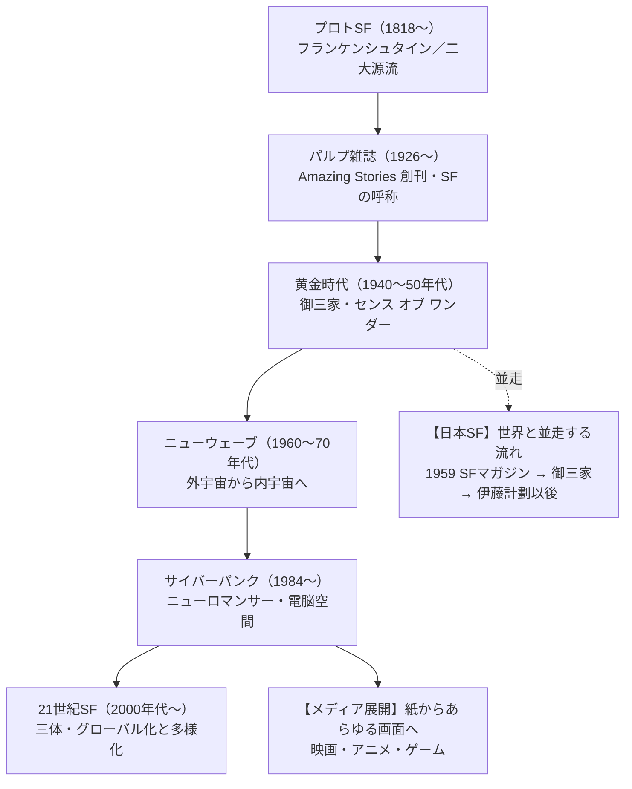

# SF小説ガイド — 200年の歴史・ジャンル・代表作を一望する

「もし〜だったら」。その一言から、SFは始まる。

メアリー・シェリーが『フランケンシュタイン』を世に出した1818年から、SFはおよそ200年の歴史を重ねてきた。科学と空想が交わる場所で、それは時代ごとに姿を変えてきた。宇宙への憧れ、機械への不安、管理社会への警告、そして電脳空間の幻視。SFは、その時々の人々が抱えた希望と恐れを映す鏡だった。

そしていま、SFは小説の枠を大きく超えている。映画、配信ドラマ、アニメ、ゲーム――物語は媒体を乗り換えながら、いまも「もし〜だったら」を問い続けている。

この記事は、その200年の地図を一望するためのガイドだ。とくに、中国SFの台頭や新世代の作家、映像・ゲームへの広がりといった、**2000年代以降の「いまのSF」を厚く扱う**。どこから読み始めても、SFという広大な土地のどこに自分がいるかが分かるようにした。

## この記事の歩き方

全体は5つの編で構成している。歴史を縦糸に、ジャンルと地域を横糸にして、SFの全体像を編み上げる。

- **第1編 世界のSF史** — プロトSFから21世紀まで、SFが姿を変えてきた流れをたどる
- **第2編 メディアを横断するSF** — 映画・配信・アニメ・ゲームへ広がった現代のSFを見る
- **第3編 SFのジャンル地図** — ハードSFやスペースオペラなど、SFの枝分かれを整理する
- **第4編 日本SF** — 御三家から伊藤計劃以後まで、日本独自の流れを追う
- **第5編 読書・鑑賞ガイド** — タイプ別に「はじめの一冊・一本」を選ぶ

各章は左のナビゲーションから直接開ける。歴史を順に追ってもいいし、気になるジャンルや「おすすめ」から逆に入ってもいい。

## 全体俯瞰① — SF史の系譜

まず、SFが200年でどう枝分かれしてきたかを一枚の図で見ておこう。世界のSFが背骨を作り、日本のSFがそれと並走し、現代では映像・ゲームへと枝を伸ばしている。

ひとことで言うと、SFの重心は「外」から「内」へ、そして「紙」から「あらゆる画面」へと移ってきた。初期は宇宙や未来技術という"外の世界"への驚きが中心だった。やがて人間の心や社会という"内の世界"へ目が向き（ニューウェーブ）、電脳空間という新しい"内宇宙"が描かれ（サイバーパンク）、いまは映像やゲームを通じて誰もがその世界に入り込めるようになった。

## 全体俯瞰② — SF全史タイムライン

もう少し細かく、時代ごとのキーワードと代表作を表で押さえておく。この一覧が、記事全体の見取り図になる。

| 時代 | 年代 | キーワード | 代表作（小説・他メディア） |
|---|---|---|---|
| プロトSF | 1818〜 | SFの源流、二大源流 | 『フランケンシュタイン』『海底二万里』『タイム・マシン』 |
| パルプと「SF」の誕生 | 1920年代〜 | SF専門誌、ファンダム | 雑誌『Amazing Stories』（1926） |
| 黄金時代 | 1940〜50年代 | センス・オブ・ワンダー、御三家 | アシモフ／クラーク／ハインライン |
| ニューウェーブ | 1960〜70年代 | 内宇宙、実験的な文体 | 『闇の左手』、ディックの諸作 |
| サイバーパンク | 1980〜90年代 | 電脳空間、巨大企業の支配 | 『ニューロマンサー』（1984） |
| 21世紀SF | 2000年代〜 | グローバル化、多様化 | 『三体』（2015）『プロジェクト・ヘイル・メアリー』 |
| メディアの時代 | 2000年代〜 | 映画・配信・アニメ・ゲーム | 『メッセージ』『ブラック・ミラー』『攻殻機動隊』『サイバーパンク2077』 |

この表で「世界のSF史」の背骨と「メディアの時代」を示した。これと並走する**日本SF**の流れ（1959年の『S-Fマガジン』創刊から御三家、伊藤計劃以後まで）は第4編で、ハードSFやサイバーパンクといった**ジャンルの枝分かれ**は第3編で、それぞれ詳しく見ていく。

では、最初のページ「SFとは何か」から、200年の旅を始めよう。

**参考ソース:**
- [サイエンス・フィクション - Wikipedia](https://ja.wikipedia.org/wiki/サイエンス・フィクション)
- [History of science fiction - Wikipedia](https://en.wikipedia.org/wiki/History_of_science_fiction)
- [Science fiction - Wikipedia](https://en.wikipedia.org/wiki/Science_fiction)
- [日本SF小説史 - 小説丸](https://shosetsu-maru.com/essay/japanese-sf)
- [SF映画 - Wikipedia](https://ja.wikipedia.org/wiki/SF映画)
