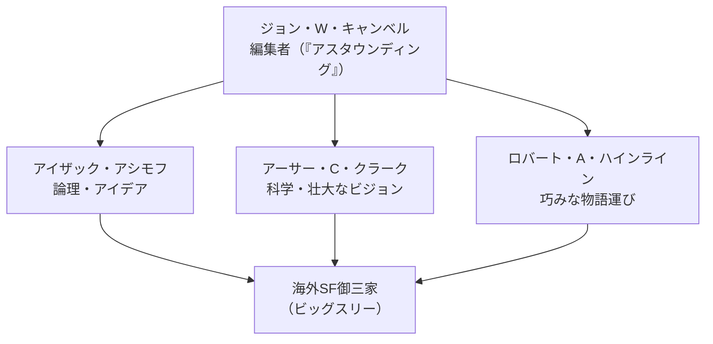

# 黄金時代と御三家

1940〜50年代のSFは「黄金時代（Golden Age）」と呼ばれる。ひとことで言えば、奇抜なアイデアと「センス・オブ・ワンダー（未知に触れたときの驚き）」を前面に押し出した作品が、雑誌を舞台に次々と生まれた時代だ。

この時代の作家たちは、新しい科学技術や宇宙の広大さを物語の核に据えた。読者は、ページをめくるたびに見たこともない世界に出会えた。その驚きこそが、当時のSFの魅力だった。

そして黄金時代を代表するのが、海外SFの「御三家（ビッグスリー）」と呼ばれる3人だ。アイザック・アシモフ、アーサー・C・クラーク、ロバート・A・ハインライン。この章では、まず黄金時代の起点を押さえ、それから3人を順に紹介していく。

## 黄金時代の幕開け：キャンベルと『アスタウンディング』

黄金時代の起点は、1人の編集者の就任だとされる。1937年、ジョン・W・キャンベル（John W. Campbell, Jr.）が雑誌『アスタウンディング（Astounding Science Fiction）』の編集長に就いた。この就任が黄金時代の始まりと位置づけられている。

キャンベルが何をしたのか。要するに、SFの軸を「派手な冒険活劇」から「科学的な発想を真剣に描く物語」へと移したのだ。それまでのSFは、パルプ雑誌（安価な大衆向け娯楽誌）の中の娯楽の一種にすぎなかった。キャンベルはそこに、科学的なリアリティと文章の質を持ち込んだ。

ここで効いてくるのが、キャンベルの育成力だ。彼は若手作家を集め、強い影響を与えながら作品を磨かせた。アシモフは後にこう振り返っている。「私たちは彼の延長線上にあった。彼の文学上のクローンだった」。実際、アシモフ・クラーク・ハインラインといった作家たちがこの雑誌から世に出て、SFは「真面目に読むに値する文学」としての地位を得ていった。

時代区分でいうと、黄金時代の位置づけはこうなる。

- **前**：パルプ時代（娯楽中心の大衆向けSF）
- **黄金時代**：おおむね1938〜1950年。アイデアと科学的リアリティを重視
- **後**：ニューウェーブ（1960年代以降の実験的・文学的な潮流）

終わりの時期については諸説あり、1940年代半ばから1960年代初頭まで幅がある。だが「キャンベルの『アスタウンディング』が黄金時代を作った」という点では、見方がおおむね一致している。

**参考ソース:**
- [Golden Age of Science Fiction - Wikipedia](https://en.wikipedia.org/wiki/Golden_Age_of_Science_Fiction)
- [History of science fiction - Wikipedia](https://en.wikipedia.org/wiki/History_of_science_fiction)

## 御三家（ビッグスリー）の全体像

黄金時代を象徴するのが、海外SF御三家だ。アシモフ・クラーク・ハインラインの3人を指す。英語では「ビッグスリー（Big Three）」と呼ばれる。

3人はそれぞれ作風が違う。ざっくり言えば、アシモフは「論理とアイデアの人」、クラークは「科学と壮大なビジョンの人」、ハインラインは「物語の語り口がうまい人」だ。まずは表で全体像をつかんでほしい。

| 作家 | 作風 | 代表作 | ひとこと |
|------|------|--------|----------|
| アイザック・アシモフ | 論理とアイデア重視。ロボットや銀河規模の歴史を体系的に描く | 『ファウンデーション』シリーズ、『われはロボット（I, Robot）』 | ロボット工学三原則を世に広めた |
| アーサー・C・クラーク | 豊富な科学知識に基づくハードSFと、人類の宇宙的進化を描く壮大なビジョン | 『幼年期の終わり』『2001年宇宙の旅』 | 近未来をリアルに描く科学者肌 |
| ロバート・A・ハインライン | 巧みな物語運び。エンターテインメント性が高く、作品ごとに多彩な顔を見せる | 『夏への扉』『月は無慈悲な夜の女王』『宇宙の戦士』 | 物語作家としての腕が際立つ |

「ハードSF」という言葉も押さえておきたい。難しそうな名前だが、要するに「実際の科学知識に忠実に、つじつまを合わせて書かれたSF」のことだ。クラークがその代表格になる。

3人の関係をもう少し整理すると、こうなる。

**参考ソース:**
- [History of science fiction - Wikipedia](https://en.wikipedia.org/wiki/History_of_science_fiction)
- [アーサー・C・クラーク - Wikipedia](https://ja.wikipedia.org/wiki/アーサー・C・クラーク)

## アイザック・アシモフ：論理が動かすロボットと銀河

アシモフ（1920〜1992年）の持ち味は、論理とアイデアだ。要するに、ひとつの設定を決めたら、その帰結を最後までていねいに突き詰めて物語にする作家だった。

代表作は大きく2系統ある。

- **ロボットもの**：短編集『われはロボット（I, Robot）』（1950年）など。ロボットと人間が共存する世界を描く
- **ファウンデーションもの**：『ファウンデーション』シリーズ。銀河規模の歴史の興亡を、長い時間軸で描く

ロボットものの中でアシモフが打ち出したのが、「ロボット工学三原則」だ。これは、ロボットがどう行動すべきかを定めた3つの倫理規則のこと。難しそうに聞こえるが、中身は「ロボットは人間を守り、人間に従い、最後に自分を守る」という優先順位を決めただけだ。

> **ロボット工学三原則**
>
> 第一条　ロボットは人間に危害を加えてはならない。また、その危険を看過することによって、人間に危害を及ぼしてはならない。
>
> 第二条　ロボットは人間に与えられた命令に服従しなければならない。ただし、与えられた命令が、第一条に反する場合は、この限りでない。
>
> 第三条　ロボットは、前掲第一条および第二条に反するおそれのないかぎり、自己を守らなければならない。

この三原則は、後の作家や思想家がロボット・人工知能を扱うときの土台になった。アシモフ自身も、化学者としての知識を背景に、こうした論理的なルールを物語の駆動装置として使った。なお『われはロボット』に収められた一連の作品は、まさにこの三原則がどう働くか（そしてどこで矛盾するか）を試す物語群になっている。

なお、三原則の正確な条文については、参照したアシモフのソース本文には三原則への言及はあるものの、各条の逐語的な文言までは記載されていなかった。ここでは『われはロボット』で広く知られる定訳に基づいて記載している。

**参考ソース:**
- [アイザック・アシモフ - Wikipedia](https://ja.wikipedia.org/wiki/アイザック・アシモフ)

## アーサー・C・クラーク：科学とビジョンのハードSF

クラーク（1917〜2008年）は、イギリス出身のSF作家であり、科学解説者としても知られた。一言でいえば、確かな科学知識と、人類の未来を見渡す壮大なビジョンを併せ持つ作家だ。

作風には2つの柱がある。

- **ハードSF**：豊富な科学知識に裏打ちされた、近未来を舞台にしたリアルな作品群
- **宇宙的進化**：「人類が次の段階へと進化していく」という壮大なテーマを描く作品群

代表作は『幼年期の終わり』と『2001年宇宙の旅』。どちらも、人類という存在そのものをはるか遠くから見つめ直すスケールを持つ。御三家の他の2人がエンターテインメントやSF叙事詩を志向したのに対し、クラークの個性は、この「科学的リアリティ」と「宇宙規模の進化のビジョン」の組み合わせにある。

経歴も作風に直結している。第二次世界大戦中はイギリス空軍でレーダー技師を務めた。1945年には人工衛星による通信システムを提案している。後年はスリランカ（移住当時はセイロン）に移り、晩年までそこで小説を書き続けた。技術への深い理解が、作品のリアリティを支えていた。

**参考ソース:**
- [アーサー・C・クラーク - Wikipedia](https://ja.wikipedia.org/wiki/アーサー・C・クラーク)

## ロバート・A・ハインライン：物語を操る多彩な顔

ハインライン（1907〜1988年）の強みは、何より物語作家としての巧みさだ。要するに、読者を引き込む語り口がうまい。そして作品ごとにまったく違う顔を見せる、振れ幅の大きな作家でもあった。

その多彩さは、代表作の並びを見るとよく分かる。

- **『夏への扉』**：ロマンティックなタイムトラベル物。特に日本で人気が高く、SFファンのオールタイム・ベスト投票で度々1位になっている
- **『宇宙の戦士』**：軍隊と社会を扱い、その兵士の描写から「右翼的」とも評された
- **『月は無慈悲な夜の女王』**：月の独立をめぐる物語。社会主義的な色合いから「左翼的」とも評された
- **『異星の客』**：宗教や愛のかたちを扱い、当時の若者文化に大きな反響を呼んだ

つまり、同じ作家でありながら、作品ごとに政治的・思想的な立場の読まれ方すら変わる。それだけ幅広いテーマを物語として成立させられた、ということだ。初期は「未来史」シリーズなど科学小説寄りのSFを書き、次第に社会性を強めていった。

評価も高く、『宇宙の戦士』『ダブル・スター』『異星の客』『月は無慈悲な夜の女王』で、長編小説部門のヒューゴー賞を計4回受賞している。御三家の中で、物語の語りと振れ幅の広さという点では、ハインラインが際立っている。

**参考ソース:**
- [ロバート・A・ハインライン - Wikipedia](https://ja.wikipedia.org/wiki/ロバート・A・ハインライン)
