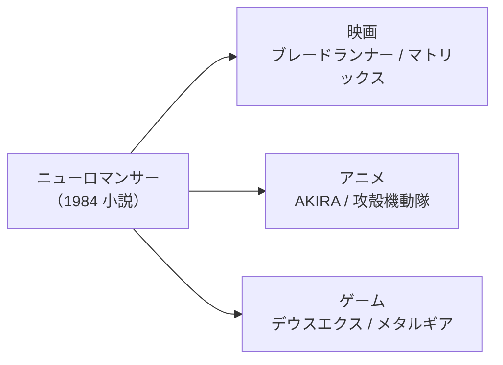

# サイバーパンクと20世紀末

ひとことで言うと、1980年代に登場した「サイバーパンク」が、SFの描く未来像をまるごと塗り替えた。それまでのSFが宇宙や遠い未来を見上げていたのに対し、サイバーパンクはカメラを地上へ向けた。舞台は近未来の地球。荒れた都市の路地裏で、コンピューターと薬物と巨大企業がせめぎ合う。

合言葉は「ハイテク・ローライフ」だ。高度なテクノロジーと、退廃した社会・底辺の暮らしが同居する。きらびやかなネオンと、その下でうごめくならず者たち。この相反する2つを1つの画面に収めたところに、サイバーパンクの新しさがあった。

この章では、サイバーパンクとは何かを噛み砕き、その原点となった一冊の小説を紹介する。そして、この潮流が小説を飛び出して映画・アニメ・ゲームへ広がっていく流れまでをたどる。

## サイバーパンクとは何か

まず、言葉の意味を整理しておく。サイバーパンクとは、近未来のディストピア（理想とは逆の、抑圧された暗い社会）を舞台にしたSFのサブジャンルだ。テクノロジーが極度に発達した世界で、腐敗した体制に反抗しようとする人々を描く。

ジャンルの特徴を、構成要素ごとに分けると分かりやすい。

- **電脳空間（サイバースペース）** — コンピューターのネットワークを、人が意識ごと入り込める「空間」として視覚化したもの。要するに、データの世界を風景のように歩き回るイメージだ。
- **人体改造（サイバネティクス）** — 体に機械を組み込み、能力を拡張する技術。生身の人間と機械の境目があいまいになる。
- **巨大企業（メガコープ）** — 政府よりも強い力を持ち、経済も社会も牛耳る企業群。ギブスンの作品では「財閥（ザイバツ）」と呼ばれる。
- **退廃した近未来都市** — フィルム・ノワール（暗く陰のある犯罪映画）の雰囲気をまとった、猥雑で薄汚れた都市が舞台になる。

物語のプロットも、共通したかたちを持つ。人工知能・ハッカー・巨大企業のあいだの抗争を、近未来の地球を舞台に描く。遠い未来や宇宙には向かわない。ここがそれまでのSFと大きく違う点だ。

このジャンルを象徴するフレーズがある。「ストリートはおのずからその用途を見いだす」だ。技術は、発明者が想定もしなかった使われ方をしていく。社会の底辺にいる人間が、ハイテクを思いがけない形で乗りこなす。そうした逆転の感覚が、サイバーパンクの魂と言える。

「サイバーパンク」という名前自体は、ブルース・ベスキの1983年の短編タイトルに由来する。これを批評家のガードナー・ドゾワが1984年12月の「ワシントン・ポスト」紙の記事で取り上げ、一気に広まった。1986年には作家ブルース・スターリングがアンソロジー『ミラーシェード』を編み、運動としての輪郭を固めていった。

**参考ソース:**
- [サイバーパンク - Wikipedia](https://ja.wikipedia.org/wiki/サイバーパンク)

## 原点『ニューロマンサー』

サイバーパンクの原点を1冊挙げるなら、ウィリアム・ギブスンの『ニューロマンサー』（1984年）だ。このジャンルの代名詞であり、その後の未来像の型をつくった一冊である。

著者のウィリアム・ギブスンは1948年生まれ。アメリカ・サウスカロライナ州の出身で、ベトナム戦争の徴兵を避けて1967年にカナダへ渡り、以後カナダに住む。サイバーパンクを代表する作家だ。

「電脳空間（サイバースペース）」という言葉は、もともとギブスンが1982年の短編「クローム襲撃」で作り出した造語だった。それを『ニューロマンサー』で本格的に描き切り、概念として世に広めた。人体改造や巨大企業といった、いまでは当たり前のサイバーパンク的モチーフも、多くがこの小説を起点にしている。

注目すべきは、ギブスン自身がコンピューターにほとんど詳しくなかったことだ。『ニューロマンサー』は1927年製の手動タイプライターで書かれた。技術の中身を知らないからこそ、ハッカーやネットワークの未来を大胆に「想像」できた、という逆説がここにある。

物語の主人公は、ケイスという凄腕のハッカー。かつて電脳空間に意識ごと潜入して企業情報を盗んでいたが、制裁として脳神経を焼かれ、その能力を失っている。その彼が、ある依頼をきっかけに再び危険な世界へ引き戻されていく。詳しい筋は読んでのお楽しみだが、電脳空間を駆けるスリルと、薄汚れた都市の手触りが全編を貫く。

そして日本の読者に見逃せないのが、その舞台だ。物語の冒頭、ケイスが暮らしているのは日本の**千葉**である。作中で「チバ・シティ」と呼ばれる千葉は、闇クリニックや違法なサイバネ技術が集まるアンダーグラウンドな街として描かれる。執筆当時、ギブスンは千葉がどんな場所か知らなかったというが、その後の日本でサイバーパンクが愛される一因になった。

**参考ソース:**
- [ニューロマンサー - Wikipedia](https://ja.wikipedia.org/wiki/ニューロマンサー)
- [ウィリアム・ギブスン - Wikipedia](https://ja.wikipedia.org/wiki/ウィリアム・ギブスン)

## 三冠が示した衝撃

『ニューロマンサー』がどれほど画期的だったかは、受賞歴がよく物語っている。この作品は、SFの主要3賞をすべて受賞した。いわゆる「三冠」である。内訳は以下の通りだ。

| 賞 | 受賞年 | 位置づけ |
|----|-------|---------|
| ネビュラ賞 長編小説部門 | 1984年 | 作家団体が選ぶ賞 |
| フィリップ・K・ディック賞 | 1984年 | 優れたペーパーバック作品に贈られる賞 |
| ヒューゴー賞 長編小説部門 | 1985年 | ファン投票による賞 |

この3つを1作で制覇したのは『ニューロマンサー』が史上初だった。専門家の評価と一般読者の支持、その両方を同時につかんだということだ。例えるなら、文学界の主要な賞を同じ年にまとめて獲るようなもので、当時としては前代未聞の快挙だった。

商業的にも成功した。最初は派手に迎えられたわけではなく、口コミでじわじわ広がるかたちでヒットし、最終的に全世界で650万部以上を売り上げた。

ギブスンはこのあと『カウント・ゼロ』（1986年）、『モナリザ・オーヴァドライヴ』（1988年）を発表し、同じ世界を舞台にした「電脳空間三部作（スプロール三部作）」を完成させた。1999年にはガーディアン紙から「過去20年間で最も重要な小説家」と評されている。

**参考ソース:**
- [ニューロマンサー - Wikipedia](https://ja.wikipedia.org/wiki/ニューロマンサー)
- [ウィリアム・ギブスン - Wikipedia](https://ja.wikipedia.org/wiki/ウィリアム・ギブスン)

## 小説からスクリーンへ

サイバーパンクの影響は、小説の世界だけにとどまらなかった。むしろその真価は、映像や他のメディアへ広がっていったところにある。

流れの起点として外せないのが、映画『ブレードランナー』（1982年）だ。フィリップ・K・ディックの小説『アンドロイドは電気羊の夢を見るか?』を原作とし、リドリー・スコット監督が手がけた。雨に濡れたネオンの夜景は、その後のサイバーパンク作品の定番となる。『ニューロマンサー』とほぼ同時期に、活気と退廃が同居する世界の「見た目」を決定づけた一作だ。

日本も、このジャンルの一大拠点になった。大友克洋の漫画『AKIRA』が1982年に連載を始め、1988年のアニメ映画化で世界に広まった。その後『攻殻機動隊（GHOST IN THE SHELL）』へと続き、日本のサイバーパンクは独自の存在感を放つようになる。

メディアごとに代表作を並べると、広がりの全体像が見えてくる。

| 作品 | 年 | 媒体 | ひとこと |
|------|----|------|---------|
| ブレードランナー | 1982年 | 映画 | サイバーパンクの「見た目」を確立 |
| AKIRA | 1982年（漫画）/ 1988年（アニメ） | 漫画・アニメ | 日本サイバーパンクの出発点 |
| ニューロマンサー | 1984年 | 小説 | ジャンルの原点・電脳空間の代名詞 |
| 攻殻機動隊 | 1995年（映画） | アニメ | 押井守による電脳世界の傑作 |
| マトリックス | 1999年 | 映画 | 攻殻機動隊などに影響を受けた金字塔 |
| デウスエクス / メタルギア | 1990年代以降 | ゲーム | 対話的にサイバーパンク世界を遊ぶ |

これらの作品がたがいに影響を与え合い、ジャンルは自己増殖していった。例えば『マトリックス』（1999年）は、首の後ろの穴からネットワークに接続する設定などを『攻殻機動隊』から取り入れている。さらに『ニューロマンサー』のキャラクターや「マトリックス」という言葉そのものからも着想を得ていた。

ひとつの小説が起点となり、映像とゲームへ枝分かれしていく様子は、図にすると分かりやすい。

サイバーパンクは、もはやSFの片隅の一派ではなくなった。映画・アニメ・音楽・ファッション・ゲームへと染み出し、20世紀末のカルチャー全体を彩る存在になっていく。この映像方面への広がりについては、第2編であらためてくわしく見ていく。

**参考ソース:**
- [サイバーパンク - Wikipedia](https://ja.wikipedia.org/wiki/サイバーパンク)
- [History of science fiction - Wikipedia](https://en.wikipedia.org/wiki/History_of_science_fiction)
- [ウィリアム・ギブスン - Wikipedia](https://ja.wikipedia.org/wiki/ウィリアム・ギブスン)
