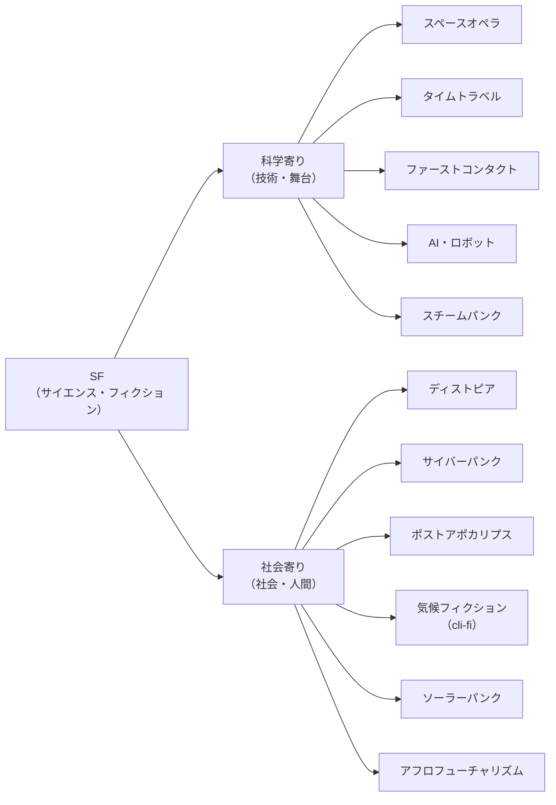

# サブジャンルの広がり

一言でいえば、SFは「何を問うか」でさらに細かく枝分かれする。この章では、その枝分かれを一枚の地図として一望する。

SFは「サイエンス・フィクション」という大きな傘だ。その下に、扱うテーマごとに無数の小ジャンル（サブジャンル）がぶら下がっている。宇宙戦争を描けばスペースオペラ、暗い管理社会を描けばディストピア、というように、関心の置きどころで呼び名が変わる。

ここでは、まず昔から定番の古典サブジャンルを押さえる。そのあと、2000年代以降に存在感を増した新しいサブジャンルを手厚く見ていく。最後に一覧表とMermaidの分類図で全体を俯瞰する。

ひとつ注意したい。ジャンルの境界はあいまいだ。1つの作品が複数のサブジャンルにまたがることは珍しくない。地図はあくまで読書の入口を整理するための便宜的なものだと思ってほしい。

## 古典・定番のサブジャンル

結論から言うと、SFの定番サブジャンルは「舞台」か「ガジェット（仕掛け）」で名前が付くことが多い。宇宙、終末後の世界、時間旅行、異星人との出会い、人工知能。これらはSFの黄金時代から繰り返し描かれてきた王道だ。

代表的な古典サブジャンルを並べる。

- **ディストピア** — 管理・抑圧された暗い未来を描く。一見すると平等で秩序正しい理想社会（ユートピア）に見えるが、実態は徹底的な監視・統制が敷かれ、人間の尊厳が否定されている。要するに「否定的に描かれたユートピア」、つまり逆ユートピアのことだ。ジョージ・オーウェルの『[1984年](https://ja.wikipedia.org/wiki/1984年_(小説))』（1949年、イギリス）が代表格。ほかにオルダス・ハクスリー『すばらしい新世界』、ザミャーチン『われら』、レイ・ブラッドベリ『華氏451度』などがある。
- **タイムトラベル（時間旅行もの）** — 登場人物が時間を前後に移動する。SFの定番中の定番で、これ自体を独立ジャンルと見るか、単なる「仕掛け」と見るかは意見が分かれる。
- **ポストアポカリプス／終末もの** — 文明が崩壊したあとの世界を描く。崩壊の瞬間そのものを描くのが「アポカリプス（終末）もの」、崩壊後の生き残りを描くのが「ポストアポカリプス」だ。
- **ファーストコンタクト** — 人類と異星知性（エイリアン）が初めて接触する場面を描く。異質な存在とどう向き合うか、という問いが核になる。
- **AI・ロボットもの** — 人工知能やロボットを主役に据える。知能を持った機械と人間の関係を問う。
- **〇〇パンク** — 特定の技術や美学を世界観の核に据えた一群。代表はサイバーパンク（後述）。スチームパンクは、蒸気機関が発達し続けた「もしも」の改変歴史を舞台にする。現実の歴史とは違う技術発展を空想する点が持ち味だ。

このうちサイバーパンクは、次節以降で見る新しいサブジャンルとも深くつながる。サイバーパンクは「低俗な暮らし（low life）と高度な技術（high tech）」を掛け合わせたジャンルだ。ウィリアム・ギブスンの長編『ニューロマンサー』（1984年）がジャンルとしての確立に大きく貢献した。なお「サイバーパンク」という言葉自体は、ブルース・ベスキが1980年に書いた短編「サイバーパンク」（1983年に雑誌掲載）が初出である。サイバーパンクは近未来の地球を舞台にした退廃的なディストピアを描くことが多く、ディストピアの強い影響下にある。

**参考ソース:**
- [1984年 (小説) - Wikipedia](https://ja.wikipedia.org/wiki/1984年_(小説))
- [ディストピア - Wikipedia](https://ja.wikipedia.org/wiki/ディストピア)
- [サイバーパンク - Wikipedia](https://ja.wikipedia.org/wiki/サイバーパンク)
- [Don't get lost in space: a guide to science fiction subgenres - Pan Macmillan](https://www.panmacmillan.com/blogs/science-fiction-and-fantasy/science-fiction-subgenres)
- [Science fiction - Wikipedia](https://en.wikipedia.org/wiki/Science_fiction)

## 2000年代以降に存在感を増したサブジャンル

ここで効いてくるのが「視点の転換」だ。古典サブジャンルの多くは舞台や仕掛けで名前が付いていた。これに対し、近年伸びてきたサブジャンルは「現代社会が抱える具体的な問題」を主題に据える。気候変動、持続可能性、人種と未来。SFが、より直接的に「いまの世界」と向き合うようになったと言える。

### 気候フィクション（クライファイ／cli-fi）

ひとことで言うと、気候フィクションは「気候変動を主題にするSF」だ。英語では climate fiction を縮めて cli-fi（クライファイ）と呼ぶ。

舞台は「いまの世界」そのままのこともあれば、近未来のこともあり、気候変動に見舞われた架空世界のこともある。共通するのは、天候や自然災害一般ではなく、人間の活動が引き起こした気候変動を正面から扱う点だ。気候工学や気候適応といった技術が、社会に与える影響を描く作品も多い。

「cli-fi」という語は、フリーの記者で気候活動家のダン・ブルームが2007年か2008年に作ったとされる。20世紀の先駆者としてはJ・G・バラードやオクテイヴィア・E・バトラーが挙げられ、マーガレット・アトウッドのディストピア作品はこのジャンルの直接の前身としてしばしば引かれる。2010年以降の代表的な書き手は、キム・スタンリー・ロビンソン、リチャード・パワーズ、パオロ・バチガルピ、バーバラ・キングソルヴァーなど。ロビンソンの『The Ministry for the Future（未来省）』（2020年）はジャンルの定着を後押しし、大統領や国連の言及を生むほどの反響を呼んだ。

### ソーラーパンク

ソーラーパンクは、サイバーパンクの暗さを裏返したジャンルだと考えると分かりやすい。サイバーパンクが「退廃した近未来」を描くのに対し、ソーラーパンクは自然と技術が調和した楽観的で持続可能な未来を描く。

中身を整理すると、こうなる。

- **「ソーラー」** — 太陽光などの再生可能エネルギーを象徴する。破滅を前提とする悲観論を否定し、明るい未来像を指す。
- **「パンク」** — そうした未来を自分たちの手で作ろうとする、反体制的・カウンターカルチャー的な姿勢を指す。
- **核にあるテーマ** — 持続可能性、環境への配慮、コミュニティ重視。気候変動や環境汚染といった現代の課題を、人類が解決することに成功した世界を想像する。

「ソーラーパンク」という言葉が初めて登場したのは、2008年に投稿されたあるブログ記事だ。持続可能な技術に焦点を当てたフィクションのジャンルとして提唱された。その後2014年にアーティストのオリヴィア・ルイーズがこの概念をTumblrに投稿したことで広まっていった。2019年の「ソーラーパンク・マニフェスト」では、「持続可能な文明とはどのようなものか、そしてどうすればそれを達成できるのか」という問いに答えようとする運動だと定義された。サイバーパンクやスチームパンクの「ディストピア的で機械的」な世界観とは異なり、「楽観的で再生的」な未来を描くのが特徴だ。

### アフロフューチャリズム

アフロフューチャリズムは、黒人文化と、未来・宇宙・テクノロジーを結びつける想像力のことだ。アフリカ系ディアスポラ（離散した人々）の文化を、科学技術と交差させる美学であり哲学でもある。

この言葉は、アメリカの文化批評家マーク・デリーが1993年のエッセイ「Black to the Future」で命名した。SFと最もよく結び付けられるが、ファンタジーや改変歴史、マジックリアリズム、さらには音楽など、より広い分野にまたがる。文学の代表的な書き手としては、サミュエル・R・ディレイニーやオクテイヴィア・バトラーが挙げられる。音楽ではサン・ラーやパーラメント・ファンカデリックなどが先駆とされ、現代のジャネール・モネイらに受け継がれている。

なお、ソーラーパンクはアフロフューチャリズムから強い影響を受けている。アフロフューチャリズムを通じて、多様な文化への志向や、人種的・ジェンダー的な平等への関心が、ソーラーパンクの中で強まったとされる。新しいサブジャンルどうしが互いに影響し合っている好例だ。

**参考ソース:**
- [Climate fiction - Wikipedia](https://en.wikipedia.org/wiki/Climate_fiction)
- [ソーラーパンク - Wikipedia](https://ja.wikipedia.org/wiki/ソーラーパンク)
- [Afrofuturism - Wikipedia](https://en.wikipedia.org/wiki/Afrofuturism)

## サブジャンル一覧

ここまで挙げたサブジャンルを、定義と代表作で一覧にする。古典と近年のものを並べることで、SFという傘の広さが一目で分かる。

| サブジャンル | ひとことの定義 | 代表作 |
|---|---|---|
| ディストピア | 管理・抑圧された暗い未来（逆ユートピア） | 『1984年』『すばらしい新世界』『華氏451度』 |
| サイバーパンク | 低俗な暮らしと高度な技術が同居する退廃的近未来 | 『ニューロマンサー』 |
| スチームパンク | 蒸気機関が発達し続けた「もしも」の改変歴史 | （蒸気技術ベースの改変世界もの） |
| タイムトラベル | 時間を前後に移動する仕掛けを軸にする | （時間旅行もの全般） |
| ポストアポカリプス | 文明崩壊後の世界を描く | 『The Road（ザ・ロード）』 |
| ファーストコンタクト | 人類と異星知性の初接触を描く | （異星人との初遭遇もの） |
| 改変歴史（オルタネート・ヒストリー） | 「もし歴史が違っていたら」を空想する | （連合国が敗れた世界を描く作品など） |
| 気候フィクション（cli-fi） | 気候変動を主題にするSF | 『未来省』 |
| ソーラーパンク | 自然と技術が調和した楽観的・持続可能な未来 | （持続可能な未来を描く作品群） |
| アフロフューチャリズム | 黒人文化と未来・宇宙・技術を結ぶ想像力 | サミュエル・R・ディレイニー／オクテイヴィア・バトラーの作品 |

**参考ソース:**
- [Don't get lost in space: a guide to science fiction subgenres - Pan Macmillan](https://www.panmacmillan.com/blogs/science-fiction-and-fantasy/science-fiction-subgenres)
- [1984年 (小説) - Wikipedia](https://ja.wikipedia.org/wiki/1984年_(小説))
- [Climate fiction - Wikipedia](https://en.wikipedia.org/wiki/Climate_fiction)
- [Afrofuturism - Wikipedia](https://en.wikipedia.org/wiki/Afrofuturism)

## 分類図で俯瞰する

もう一歩引いて全体を見ると、サブジャンルは大きく2つのレイヤーに分けて整理できる。

- **科学寄りのレイヤー** — 科学技術や、その舞台（宇宙、機械、時間）に関心が向くもの。
- **社会寄りのレイヤー** — 技術が社会や人間に与える影響、社会のあり方に関心が向くもの。

下の図は、SFを中心に置き、この2つのレイヤーへサブジャンルをぶら下げたものだ。境界はあくまで目安で、両方にまたがる作品も多いことに注意してほしい。

つまり、こういうことだ。古典サブジャンルの多くは「科学寄り」に集まり、2000年代以降に伸びたサブジャンルは「社会寄り」に集まる傾向がある。SFの重心が、技術そのものへの驚きから、技術と社会の関わりへと少しずつ移ってきた——この地図はそんな流れも映している。

**参考ソース:**
- [Don't get lost in space: a guide to science fiction subgenres - Pan Macmillan](https://www.panmacmillan.com/blogs/science-fiction-and-fantasy/science-fiction-subgenres)
- [Science fiction - Wikipedia](https://en.wikipedia.org/wiki/Science_fiction)
