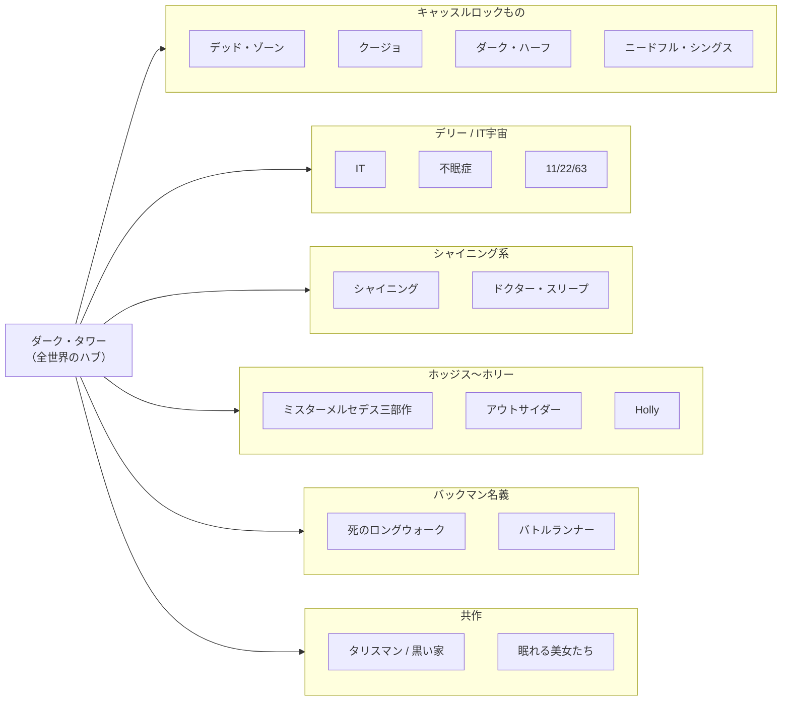

# スティーヴン・キング全作品ガイド — どこから読む？ 世界がつながる「キングの宇宙」を一望する

「ホラーの帝王」スティーヴン・キング。名前は知っていても、作品が多すぎて「どれから読めばいいのか分からない」という人は多い。1974年のデビューから50年。長編だけで60作を超え、短編まで含めれば200作以上ある。

しかも、その大半が**一つの世界**でゆるくつながっている。

この記事は、キングの全作品（長編・短編集・中編集・ノンフィクション・別名義・共作）を一望できる地図だ。各作品には**ネタバレ控えめの短い紹介**と**日本語版の有無**を付けた。入口は3つ用意した。

- **世界観のつながりで読む** — ダーク・タワーやキャッスルロックなど、作品同士のリンクをたどる（第4章）
- **独立した一作から読む** — 他作とつながりのない名作から入る（第5章）
- **タイプ別に選ぶ** — 「短い／泣ける／映画から」など好みで選ぶ（第9章）

## はじめに — なぜキングの作品は全部つながっているのか

ひとことで言うと、キングは**自分専用の架空のアメリカ**を作り、そこで何十もの物語を書き続けてきた。

舞台の多くはアメリカ北東部の**メイン州**。そこに『**キャッスルロック**』『**デリー**』『**ジェルサレムズ・ロット**』といった架空の町が点在する。ある作品の脇役が別の作品で主役になる。ある町で起きた事件が、別の小説でうわさ話として語られる。読み進めるほど、点と点が線でつながっていく。

そして、それらすべてを貫く背骨が『**ダーク・タワー**』シリーズだ。キング自身が「自分のすべての作品はダーク・タワーに通じる」と語っており、細かいリンクをたどると、ほぼ全作品が一つの宇宙に属している。

要するに、キングを読むことは「一冊の小説を読む」ことであると同時に「巨大な世界の一角をのぞく」ことでもある。これがキング読書の最大の面白さだ。

### 日本語版の有無：この記事の見方

各作品の「日本語版」欄は、以下の記号で示す（**2026年6月時点**の状況）。

| 記号 | 意味 |
|:---:|------|
| ◎ | 文庫などで入手しやすい（現役の邦訳あり） |
| ○ | 邦訳あり（単行本のみ・品切れ／古書中心を含む） |
| △ | 短編集・中編集の一部として邦訳あり（単独の邦訳書はない） |
| ✕ | 未訳（原書のみ） |

刊行・品切れの状況は変動する。最新の入手可否は各出版社・書店で確認してほしい。

**参考ソース:**
- [スティーヴン・キング - Wikipedia](https://ja.wikipedia.org/wiki/スティーヴン・キング)
- [Stephen King - Wikipedia](https://en.wikipedia.org/wiki/Stephen_King)

## 全体像 — キングの「宇宙」の地図

結論から言う。キングの作品世界は、**『ダーク・タワー』を中心に、メイン州の架空の町を結節点としてつながっている**。

まずは関係図で全体をつかんでほしい。中心にダーク・タワーがあり、そこから各シリーズ・作品群が枝分かれする構造だ。



つながりの「結節点」を整理すると、次のようになる。

| 結節点 | 性質 | 代表作 |
|--------|------|--------|
| ダーク・タワー | 全世界のハブ。多くの作品がここに通じる | 『ガンスリンガー』ほかシリーズ全7巻＋関連作 |
| キャッスルロック | メイン州の架空の町。事件が連鎖する | 『デッド・ゾーン』『クージョ』『ダーク・ハーフ』『ニードフル・シングス』 |
| デリー | 悪が周期的によみがえる町 | 『IT』『不眠症』『11/22/63』『ドリームキャッチャー』 |
| ジェルサレムズ・ロット | 吸血鬼に侵食された町 | 『呪われた町』 |
| ホリー・ギブニー | 探偵ホリーを軸にした現代もの | 『ミスターメルセデス』三部作・『アウトサイダー』・『Holly』 |

ひとつ面白い試みも紹介しておく。キングは『**レギュレイターズ**』と『**デスペレーション**』という2作で、**まったく同じ登場人物と題材を、まったく違う視点・展開で描く**という実験をしている。2冊をセットで読むと仕掛けが見えてくる。

**参考ソース:**
- [スティーヴン・キング - Wikipedia](https://ja.wikipedia.org/wiki/スティーヴン・キング)

## 数字で見るキング — 50年の仕事量

キングのすごさは、何より**止まらないこと**だ。デビューから半世紀、一度もペースを落とさずに長編を出し続けている。

```chart
{
  "type": "bar",
  "data": {
    "labels": ["1970年代", "1980年代", "1990年代", "2000年代", "2010年代", "2020年代※"],
    "datasets": [
      {
        "label": "主な長編の刊行数（概数・別名義含む）",
        "data": [7, 16, 13, 11, 13, 6],
        "backgroundColor": "#8b0000"
      }
    ]
  },
  "options": {
    "plugins": {
      "title": { "display": true, "text": "10年ごとの長編刊行数（2020年代は2025年まで）" }
    },
    "scales": { "y": { "beginAtZero": true } }
  }
}
```

形態別の内訳を見ると、長編が中心だが、短編・中編の名手でもあることが分かる。映画化された『スタンド・バイ・ミー』や『ゴールデンボーイ』は、実は短い中編だ。

```chart
{
  "type": "doughnut",
  "data": {
    "labels": ["長編", "短編集・中編集", "ノンフィクション・その他"],
    "datasets": [
      {
        "data": [65, 13, 4],
        "backgroundColor": ["#8b0000", "#c0392b", "#7f8c8d"]
      }
    ]
  },
  "options": {
    "plugins": {
      "title": { "display": true, "text": "形態別のおおよその冊数（原書ベース・概数）" }
    }
  }
}
```

ちなみに、キングは初期に「**リチャード・バックマン**」という別名義も使っていた。理由は単純で、当時のアメリカ出版界には「作家は年に1冊」という不文律があったから。多作なキングは、別名義をもう一つ持つことで年2冊出そうとしたわけだ。

**参考ソース:**
- [スティーヴン・キング - Wikipedia](https://ja.wikipedia.org/wiki/スティーヴン・キング)
- [Stephen King bibliography - Wikipedia](https://en.wikipedia.org/wiki/Stephen_King_bibliography)
- [Stephen King - Wikipedia](https://en.wikipedia.org/wiki/Stephen_King)

## シリーズ・関連作で読む

ここからが本体だ。世界観でつながった作品群を、グループごとに紹介する。「一つの物語を読んだら次へ」とたどれる読み方ができる。

### ダーク・タワー・シリーズ

キングのライフワーク。**ガンスリンガー（最後の銃士）ローランドが、世界を貫く「暗黒の塔」を目指す**、西部劇とファンタジーと終末SFが混ざった長大な旅の物語だ。約30年かけて完結させた。他のキング作品の人物や設定が次々に合流してくるので、**キングをひととおり読んだ後の総仕上げ**として読むファンも多い。

| 作品名 | 原題 | 刊行年 | かんたんな紹介（ネタバレ控えめ） | 日本語版 |
|--------|------|:---:|------|:---:|
| ガンスリンガー | The Gunslinger | 1982 | 荒野を行く孤独な銃士ローランド。旅の幕開けとなる第1巻 | ◎ |
| ザ・スリー（運命の三人） | The Drawing of the Three | 1987 | 現代ニューヨークから「3人の仲間」を引き寄せる第2巻 | ◎ |
| 荒地 | The Waste Lands | 1991 | 巨大な熊や謎の列車が立ちはだかる第3巻 | ◎ |
| 魔道師の虹（魔道師と水晶球） | Wizard and Glass | 1997 | ローランドの若き日の恋を描く第4巻 | ◎ |
| 鍵穴を吹き抜ける風 | The Wind Through the Keyhole | 2012 | 第4巻と第5巻の間に位置する番外編（4.5巻） | ◎ |
| カーラの狼 | Wolves of the Calla | 2003 | 子供をさらう「狼」から村を守る第5巻 | ◎ |
| スザンナの歌 | Song of Susannah | 2004 | 仲間を救うため二つの世界を行き来する第6巻 | ◎ |
| 暗黒の塔 | The Dark Tower | 2004 | ついに塔へ。シリーズ完結の第7巻 | ◎ |

> 関連作: 『**タリスマン**』『**黒い家**』『**不眠症**』『**心霊電流**』などは、ダーク・タワーの世界とつながっている。シリーズを読んだ後だと、これらの作品が二重に味わえる。

**参考ソース:**
- [スティーヴン・キング - Wikipedia](https://ja.wikipedia.org/wiki/スティーヴン・キング)
- [スティーヴン・キング(Stephen King) - ameqlist 翻訳作品集成](https://ameqlist.com/sfk/king_s.htm)

### キャッスルロックもの

メイン州の小さな町**キャッスルロック**を舞台にした作品群。普通の田舎町で、なぜか異常な事件が次々に起きる。町そのものが一種の主役で、ある作品の事件が次の作品の前提になっていく。

| 作品名 | 原題 | 刊行年 | かんたんな紹介（ネタバレ控えめ） | 日本語版 |
|--------|------|:---:|------|:---:|
| デッド・ゾーン | The Dead Zone | 1979 | 事故で予知能力を得た男が、ある政治家の未来を視てしまう | ◎ |
| クージョ | Cujo | 1981 | 狂犬病にかかった大型犬と、車に閉じ込められた母子の恐怖 | ◎ |
| ダーク・ハーフ | The Dark Half | 1989 | 別名義を「捨てた」作家を、その名義の人格が襲い始める | ◎ |
| ニードフル・シングス | Needful Things | 1991 | 望みの品を売る新装開店の店。代金は「ちょっとした悪意」 | ◎ |
| スタンド・バイ・ミー | The Body | 1982 | 4人の少年がひと夏に出かける小さな冒険（中編『恐怖の四季』所収） | ◎ |

**参考ソース:**
- [スティーヴン・キング - Wikipedia](https://ja.wikipedia.org/wiki/スティーヴン・キング)
- [スティーヴン・キング(Stephen King) - ameqlist 翻訳作品集成](https://ameqlist.com/sfk/king_s.htm)

### デリーと「IT」の宇宙

もう一つの架空の町**デリー**。ここには「**それ（IT）**」と呼ばれる古い悪が潜み、周期的によみがえっては子供たちを襲う。デリーを舞台にした作品は互いにつながり、登場人物がさりげなく行き来する。

| 作品名 | 原題 | 刊行年 | かんたんな紹介（ネタバレ控えめ） | 日本語版 |
|--------|------|:---:|------|:---:|
| IT（イット） | It | 1986 | ピエロの姿で現れる悪と戦う、7人の子供たちの27年にわたる物語 | ◎ |
| 不眠症 | Insomnia | 1994 | 眠れなくなった老人が、常人には見えない世界を見始める | ○ |
| 骨の袋 | Bag of Bones | 1998 | 妻を亡くした作家が、湖畔の別荘で奇妙な現象に遭遇する | ○ |
| ドリームキャッチャー | Dreamcatcher | 2001 | 雪山の山荘に集まった旧友4人と、ある侵略 | ◎ |
| 11/22/63 | 11/22/63 | 2011 | 過去へ通じる扉を見つけた男が、ケネディ暗殺を止めようとする | ◎ |

**参考ソース:**
- [スティーヴン・キング - Wikipedia](https://ja.wikipedia.org/wiki/スティーヴン・キング)
- [スティーヴン・キング(Stephen King) - ameqlist 翻訳作品集成](https://ameqlist.com/sfk/king_s.htm)

### シャイニング系

キング初期の代表作『シャイニング』と、その**約36年後に書かれた続編**。あわせて読むと、一人の少年のその後の人生が見えてくる。

| 作品名 | 原題 | 刊行年 | かんたんな紹介（ネタバレ控えめ） | 日本語版 |
|--------|------|:---:|------|:---:|
| シャイニング | The Shining | 1977 | 冬季閉鎖のホテルに住み込んだ一家を襲う、孤立と狂気 | ◎ |
| ドクター・スリープ | Doctor Sleep | 2013 | 『シャイニング』の少年が大人になり、ある少女を守る | ◎ |

**参考ソース:**
- [スティーヴン・キング - Wikipedia](https://ja.wikipedia.org/wiki/スティーヴン・キング)
- [スティーヴン・キング(Stephen King) - ameqlist 翻訳作品集成](https://ameqlist.com/sfk/king_s.htm)

### ビル・ホッジス三部作 〜 ホリー・ギブニーもの

キング後期の柱が、この現代ミステリ路線だ。退職刑事ビル・ホッジスを主役にした三部作から始まり、そこで生まれた**探偵ホリー・ギブニー**が人気を集め、独立した主役になっていく。ホラー要素は控えめで、**ミステリやサスペンスとして読みやすい**入口でもある。

| 作品名 | 原題 | 刊行年 | かんたんな紹介（ネタバレ控えめ） | 日本語版 |
|--------|------|:---:|------|:---:|
| ミスターメルセデス | Mr. Mercedes | 2014 | 退職刑事が、無差別殺人犯と頭脳戦を繰り広げる三部作の第1作 | ◎ |
| ファインダーズ・キーパーズ | Finders Keepers | 2015 | 失われた作家の幻の原稿をめぐる三部作の第2作 | ◎ |
| 任務の終わり | End of Watch | 2016 | 退職刑事と宿敵の決着を描く三部作の完結編 | ◎ |
| アウトサイダー | The Outsider | 2018 | 鉄壁のアリバイを持つ容疑者。論理が通じない事件にホリーが挑む | ◎ |
| Holly（ホリー） | Holly | 2023 | 探偵ホリーが単独主役。失踪事件を追う | ✕ |

**参考ソース:**
- [スティーヴン・キング - Wikipedia](https://ja.wikipedia.org/wiki/スティーヴン・キング)
- [スティーヴン・キングの新刊情報まとめ【2026年最新】 | ネイネイブックス](https://neyney-books.jp/newbook/stephen-king-list/)
- [Holly (novel) - Wikipedia](https://en.wikipedia.org/wiki/Holly_(novel))

### リチャード・バックマン名義

キングが別名義で発表した作品群。**ホラー色は薄く、人間が極限に追い込まれるサスペンス**が多い。後に正体が明かされた。『死のロングウォーク』は、実はキングが大学時代に書いた事実上の処女作だ。

| 作品名 | 原題 | 刊行年 | かんたんな紹介（ネタバレ控えめ） | 日本語版 |
|--------|------|:---:|------|:---:|
| ハイスクール・パニック | Rage | 1977 | 教室を占拠した高校生。後にキング自身が絶版を望んだ問題作 | ○ |
| 死のロングウォーク | The Long Walk | 1979 | 止まれば射殺。少年たちがひたすら歩き続ける残酷なゲーム | ◎ |
| ロードワーク | Roadwork | 1981 | 立ち退きを拒む男が、行政と社会に静かに反逆する | ○ |
| バトルランナー | The Running Man | 1982 | 命がけのTVゲーム番組に挑む、近未来のディストピア | ◎ |
| 痩せゆく男 | Thinner | 1984 | 呪いをかけられた男が、止まらずに痩せ続けていく | ◎ |
| レギュレイターズ | The Regulators | 1996 | 平和な住宅街が突然、暴力に支配される（『デスペレーション』と対の作品） | ◎ |
| Blaze | Blaze | 2007 | 大男の誘拐犯を描く、初期に書かれて長く眠っていた作品 | ✕ |

**参考ソース:**
- [スティーヴン・キング - Wikipedia](https://ja.wikipedia.org/wiki/スティーヴン・キング)
- [スティーヴン・キング(Stephen King) - ameqlist 翻訳作品集成](https://ameqlist.com/sfk/king_s.htm)

### 共作

キングは他の作家との共作も手がけている。盟友ピーター・ストラウブとの2作はダーク・タワーの世界につながり、息子オーウェン・キングや、リチャード・チズマーとも組んでいる。

| 作品名 | 原題 | 刊行年 | 共作者 | かんたんな紹介（ネタバレ控えめ） | 日本語版 |
|--------|------|:---:|------|------|:---:|
| タリスマン | The Talisman | 1984 | ピーター・ストラウブ | 少年が母を救うため、二つの世界をまたいで旅をする | ○ |
| 黒い家（ブラック・ハウス） | Black House | 2001 | ピーター・ストラウブ | 『タリスマン』の少年が大人になった続編 | ○ |
| 眠れる美女たち | Sleeping Beauties | 2017 | オーウェン・キング | 女性だけが眠り続ける奇病が世界を覆う | ◎ |
| グウェンディズ・ボタン・ボックス（未訳） | Gwendy's Button Box | 2017 | リチャード・チズマー | 少女が「ボタンの箱」を託される中編シリーズ第1作 | ✕ |

**参考ソース:**
- [スティーヴン・キング - Wikipedia](https://ja.wikipedia.org/wiki/スティーヴン・キング)
- [スティーヴン・キング(Stephen King) - ameqlist 翻訳作品集成](https://ameqlist.com/sfk/king_s.htm)

## 単独で読める長編

シリーズや町のつながりを気にせず、**一冊で完結して楽しめる**長編を刊行年順にまとめた。映画で有名な作品も多い。「まず1作」を探すなら、この表が使いやすい。

| 作品名 | 原題 | 刊行年 | かんたんな紹介（ネタバレ控えめ） | 日本語版 |
|--------|------|:---:|------|:---:|
| キャリー | Carrie | 1974 | いじめられっ子の少女が、特別な力に目覚める。記念すべきデビュー作（映画化） | ◎ |
| 呪われた町 | Salem's Lot | 1975 | 静かな田舎町が、何者かに少しずつ侵食されていく | ◎ |
| ザ・スタンド | The Stand | 1978 | 致死性の疫病で文明が崩壊した後の、善と悪の対決を描く超大作 | ◎ |
| ファイアスターター | Firestarter | 1980 | 発火能力を持つ少女と、それを追う政府機関 | ◎ |
| クリスティーン | Christine | 1983 | 一台の古い車に取り憑かれていく少年（映画化） | ◎ |
| ペット・セマタリー | Pet Sematary | 1983 | 「死んだものが還ってくる」という墓地をめぐる物語（映画化） | ◎ |
| ドラゴンの眼 | The Eyes of the Dragon | 1987 | キングには珍しい、王国を舞台にした正統派ファンタジー | ◎ |
| ミザリー | Misery | 1987 | 事故で動けない作家を、熱狂的な「ファン」が監禁する（映画化） | ◎ |
| トミーノッカーズ | The Tommyknockers | 1987 | 森に埋まった謎の物体が、町の人々を変えていく | ◎ |
| ジェラルドのゲーム | Gerald's Game | 1992 | 山荘で手錠につながれたまま取り残された女性の極限状況（映画化） | ◎ |
| ドロレス・クレイボーン | Dolores Claiborne | 1993 | ある女性が、長年の人生を一人語りで告白していく（映画化） | ○ |
| ローズ・マダー | Rose Madder | 1995 | 夫から逃げた女性と、一枚の不思議な絵 | ◎ |
| グリーン・マイル | The Green Mile | 1996 | 死刑囚棟にやってきた大男をめぐる、感動的な物語（映画化） | ◎ |
| デスペレーション | Desperation | 1996 | 砂漠の町で旅人たちが捕らえられる（『レギュレイターズ』と対の作品） | ◎ |
| トム・ゴードンに恋した少女 | The Girl Who Loved Tom Gordon | 1999 | 森で迷子になった少女が、野球選手を心の支えに生き延びようとする | ◎ |
| 回想のビュイック8 | From a Buick 8 | 2002 | 警察署に保管された、車の形をした「何か」 | ◎ |
| コロラド・キッド | The Colorado Kid | 2005 | 海辺の町で起きた身元不明死体の謎を、新聞記者たちが語る | ◎ |
| セル | Cell | 2006 | 携帯電話の「ある信号」が、人々を凶暴化させる | ◎ |
| リーシーの物語 | Lisey's Story | 2006 | 亡き作家の夫が遺した秘密を、妻がたどっていく | ◎ |
| 悪霊の島 | Duma Key | 2008 | 事故で腕を失った男が移り住んだ島で、絵の才能と異変に出会う | ○ |
| アンダー・ザ・ドーム | Under the Dome | 2009 | 町が突然、透明なドームに閉じ込められる群像劇 | ◎ |
| ジョイランド | Joyland | 2013 | 寂れた遊園地で働く青年の、ひと夏の青春とミステリ | ◎ |
| 異能機関 | The Institute | 2019 | 超能力を持つ子供をさらう謎の施設からの脱出劇 | ◎ |
| ビリー・サマーズ | Billy Summers | 2021 | 「最後の仕事」を引き受けた殺し屋が、小説を書き始める | ◎ |
| 死者は嘘をつかない | Later | 2021 | 死者が見える少年をめぐる、ホラー寄りのサスペンス | ◎ |
| フェアリー・テイル | Fairy Tale | 2022 | 少年が異世界へ通じる扉を見つける、現代のおとぎ話 | ◎ |
| Elevation | Elevation | 2018 | 体重だけが減り続ける男を描く、小品の人生賛歌 | ✕ |
| Never Flinch | Never Flinch | 2025 | 探偵ホリーが再登場する最新作 | ✕ |

> 補足: 上の表にある『デスペレーション』と『レギュレイターズ』（バックマン名義）は、**同じ人物・題材を別の視点で描いた対の作品**。2冊そろえて読むのがおすすめだ。

**参考ソース:**
- [スティーヴン・キング - Wikipedia](https://ja.wikipedia.org/wiki/スティーヴン・キング)
- [Stephen King bibliography - Wikipedia](https://en.wikipedia.org/wiki/Stephen_King_bibliography)
- [スティーヴン・キング(Stephen King) - ameqlist 翻訳作品集成](https://ameqlist.com/sfk/king_s.htm)
- [スティーヴン・キングの新刊情報まとめ【2026年最新】 | ネイネイブックス](https://neyney-books.jp/newbook/stephen-king-list/)

## 短編集・中編集で読む

「長編は重い」という人には、こちらがおすすめ。キングは短編・中編の名手でもある。**映画化された『スタンド・バイ・ミー』『ゴールデンボーイ』は、もとは中編**だ。

注意点が一つ。原書の1冊が、日本では**複数冊に分けて出版される**ことが多い。下の表では原書を基準にし、主な邦題（分冊名）を併記した。

| 原題（原書） | 刊行年 | 主な邦題（分冊を含む） | かんたんな紹介 | 日本語版 |
|--------|:---:|------|------|:---:|
| Night Shift | 1978 | 『深夜勤務』『トウモロコシ畑の子供たち』 | 初期の短編を集めた、恐怖の見本市のような一冊 | ◎ |
| Different Seasons | 1982 | 『ゴールデンボーイ』『スタンド・バイ・ミー』 | ホラーを離れた4つの中編。映画化作の宝庫 | ◎ |
| Skeleton Crew | 1985 | 『骸骨乗組員』『神々のワードプロセッサ』『ミルクマン』 | 名作中編「霧（ミスト）」を含む短編集 | ◎ |
| Four Past Midnight | 1990 | 『ランゴリアーズ』『図書館警察』ほか | 真夜中をめぐる4つの中編 | ◎ |
| Nightmares & Dreamscapes | 1993 | 『いかしたバンドのいる街で』『ドランのキャデラック』ほか | バラエティ豊かな短編を多数収録 | ◎ |
| Hearts in Atlantis | 1999 | 『アトランティスのこころ』 | 1960年代を背景にした、連作風の中短編集 | ◎ |
| Everything's Eventual | 2002 | 『第四解剖室』『幸福の25セント硬貨』 | 14の短編・中編を収めた一冊 | ◎ |
| Just After Sunset | 2008 | 『夜がはじまるとき』『夕暮れをすぎて』 | 円熟期の短編集 | ◎ |
| Full Dark, No Stars | 2010 | 『1922』『ビッグ・ドライバー』 | 救いの少ない、暗く重い4つの中編 | ◎ |
| The Bazaar of Bad Dreams | 2015 | 『マイル81』『夏の雷鳴』 | 各話に自作解説を添えた短編集 | ◎ |
| If It Bleeds | 2020 | 『もし血が流れれば イフ・イット・ブリーズ』 | 表題作ほか4つの中編。2026年5月に邦訳刊行 | ◎ |
| You Like It Darker | 2024 | （未訳） | 「もっと暗いのが好きだろう？」と題した近作の短編集 | ✕ |

**参考ソース:**
- [スティーヴン・キング - Wikipedia](https://ja.wikipedia.org/wiki/スティーヴン・キング)
- [スティーヴン・キング(Stephen King) - ameqlist 翻訳作品集成](https://ameqlist.com/sfk/king_s.htm)
- [『もし血が流れれば イフ・イット・ブリーズ』スティーヴン・キング | 単行本 - 文藝春秋](https://books.bunshun.jp/ud/book/num/9784163921068)

## ノンフィクション

小説以外も書いている。とくに『書くことについて』は、**作家志望者の定番**として今も読み継がれる名著だ。

| 作品名 | 原題 | 刊行年 | かんたんな紹介 | 日本語版 |
|--------|------|:---:|------|:---:|
| 死の舞踏 | Danse Macabre | 1981 | ホラーというジャンルを、キング自身が論じた評論 | ○ |
| 書くことについて | On Writing | 2000 | 半生記と創作論を一冊にまとめた実践的なエッセイ（旧訳『小説作法』） | ◎ |

**参考ソース:**
- [スティーヴン・キング - Wikipedia](https://ja.wikipedia.org/wiki/スティーヴン・キング)
- [スティーヴン・キング(Stephen King) - ameqlist 翻訳作品集成](https://ameqlist.com/sfk/king_s.htm)

## 日本でまだ読めない作品（2026年6月時点）

キングは今も新作を出し続けている。そのため、**原書はあるが邦訳がまだない**作品もいくつかある。英語で読める人なら、いち早く最新作に触れられる。

| 作品名 | 原題 | 刊行年 | 種別 |
|--------|------|:---:|------|
| Elevation | Elevation | 2018 | 中編 |
| Holly | Holly | 2023 | 長編（ホリー・ギブニーもの） |
| You Like It Darker | You Like It Darker | 2024 | 短編集 |
| Never Flinch | Never Flinch | 2025 | 長編（ホリー・ギブニーもの） |
| グウェンディ・シリーズ | Gwendy's Button Box trilogy | 2017–2022 | 中編シリーズ（共作） |
| Blaze | Blaze | 2007 | 長編（バックマン名義） |

※ 邦訳状況は変動する。とくにホリー・ギブニーものは人気が高く、今後の翻訳刊行に期待したい。

**参考ソース:**
- [Stephen King bibliography - Wikipedia](https://en.wikipedia.org/wiki/Stephen_King_bibliography)
- [スティーヴン・キングの新刊情報まとめ【2026年最新】 | ネイネイブックス](https://neyney-books.jp/newbook/stephen-king-list/)
- [Holly (novel) - Wikipedia](https://en.wikipedia.org/wiki/Holly_(novel))

## はじめての一冊 — タイプ別おすすめの入口

「結局どれから読めばいいの？」という人のために、好みに合わせた入口を用意した。ここから一冊選んで、気に入ったら世界を広げていくのがいい。

| こんな人に | おすすめ作 | 理由 |
|------|------|------|
| まず短くて読みやすい一冊を | 『ミザリー』『死のロングウォーク』 | 設定がシンプルで一気に読める。緊張感が持続する |
| 泣ける・感動する物語を | 『グリーン・マイル』『スタンド・バイ・ミー』 | ホラーというより、人間ドラマとして心に残る |
| 長大な傑作に挑みたい | 『IT』『ザ・スタンド』 | キングの実力が全開。読み終えた後の満足感が大きい |
| 映画から原作に入りたい | 『シャイニング』『ペット・セマタリー』 | 映像で知った恐怖を、原作でより深く味わえる |
| ミステリ・サスペンスが好き | 『ミスターメルセデス』『アウトサイダー』 | ホラー控えめ。犯人との知恵比べが楽しめる |
| キングの世界を一気に味わいたい | 『ダーク・タワー』シリーズ | 他作品とのつながりが集約された総決算 |

**参考ソース:**
- [スティーヴン・キング - Wikipedia](https://ja.wikipedia.org/wiki/スティーヴン・キング)

## まとめ

スティーヴン・キングの50年を、一望してきた。

長編60作超、短編200作超。その数だけでも圧倒的だが、本当の魅力は**一作一作がどこかでつながっている**ことにある。一冊読むたびに、メイン州の地図に新しい町が書き込まれ、見覚えのある名前が再登場する。やがて、ばらばらだった物語が一つの巨大な世界に像を結ぶ。

だから、キングの入口はどこでもいい。気になった一冊から始めればいい。その物語は、必ず次の物語へとあなたを連れていく。それがダーク・タワーへ続く道なのか、キャッスルロックの裏通りなのかは、読み進めてみてのお楽しみだ。

**参考ソース:**
- [スティーヴン・キング - Wikipedia](https://ja.wikipedia.org/wiki/スティーヴン・キング)
- [Stephen King - Wikipedia](https://en.wikipedia.org/wiki/Stephen_King)
