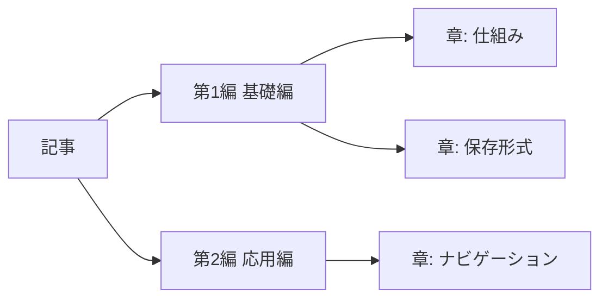

# 多階層記事デモ — 1記事を複数ページで読む

> 編＞章＞節＞項の階層を Web 記事に落とし込む試み

この記事は、多階層化（1つの記事を章ごとのページに分割する仕組み）の動作確認用デモです。扉ページにはリード文と全体俯瞰を置き、各章は別ページとして読みます。

## このデモの全体像

下の図は、書籍の階層と Web ページの対応を示しています。

| 書籍 | Web | 実体 |
|------|-----|------|
| 編 | グループ見出し | frontmatter `part` |
| 章 | 1ページ | 章 `.md` |
| 節 | H2 | `##` |
| 項 | H3 | `###` |
