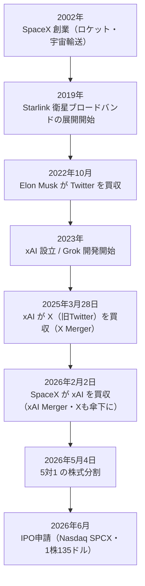

# SpaceX、史上最大のIPOへ ― 宇宙・通信・AIを束ねた1.77兆ドル帝国

2026年6月3日、SpaceX（Space Exploration Technologies Corp.）が米証券取引委員会（SEC）に上場目論見書（Form S-1/A）を提出した。ひとことで言うと、**人類史上最大のIPO**である。

想定発行価格は1株135ドル。公開するのはClass A普通株 5億5,555万株。これだけで純額**約744億ドル**（オーバーアロットメント込みで857億ドル）を調達する。これまでの最大記録だったサウジアラムコ（2019年・256億ドル）の約3倍だ。上場後の時価総額は**約1.77兆ドル**に達する見込みで、これは上場時点として世界最大級の評価になる。

しかもこの会社は、もはや単なるロケット企業ではない。**ロケット（Falcon／Starship）・衛星通信（Starlink）・AI（xAI／Grok／X＝旧Twitter）** という3つの事業を一つに束ねた、垂直統合の巨大複合体になっている。2026年2月にSpaceXがxAIを買収し、そのxAIは2025年にX（旧Twitter）を取り込んでいた。つまり今回上場するのは「SpaceX＋Grok＋X」が合体した会社だ。

この記事では、史上最大のIPOの中身を、財務・3事業・支配構造・リスクの順に読み解いていく。各章は左のナビゲーションから読める。

> **原典について ― この記事は何を読み解いたものか**
>
> 本記事の出典は、SpaceXがSECに提出した目論見書（Form S-1/A、修正第2号）です。
>
> 📄 **[Space Exploration Technologies — Form S-1/A（SEC原文）](https://www.sec.gov/Archives/edgar/data/1181412/000162828026040364/spaceexplorationtechnologib.htm)**（2026年6月3日提出 / Registration No. 333-296070）
>
> 「目論見書（もくろみしょ、prospectus）」とは、会社が株式を上場するときに投資家へ向けて開示する公式文書のことです。事業の中身・財務諸表・リスク・株式の条件などが、数百ページにわたって詳細に記載されます。Form S-1はその米国版（登録届出書）で、末尾の「/A」は提出後の修正版を意味します。本記事の数値・事実は、原則としてこの原文に基づいています。
>
> なお円換算は便宜上1ドル=150円で示し、「約◯円」と表記します。

## IPOの要点

| 項目 | 内容 |
|------|------|
| 上場市場 | Nasdaq / Nasdaq Texas（ティッカー **SPCX**） |
| 公開株式 | Class A 普通株 5億5,555万株（追加最大8,333万株） |
| 想定発行価格 | 1株 **135ドル** |
| 調達額（純額） | **約744億ドル**（約11.2兆円） |
| 想定時価総額 | **約1.77兆ドル**（約265兆円） |
| 議決権 | 創業者 Elon Musk が約 **82.4%** を保有（controlled company） |
| 法人 | テキサス州法人（本社 Starbase, Texas） |
| 提出 | 2026年6月3日 Form S-1/A（修正第2号） |

## 3つの事業 ― 全体像

SpaceXは3つの報告セグメント（Space・Connectivity・AI）を持つ。お金の流れを一言でまとめると、**「Starlinkが稼ぎ、AIが溶かす」**構造だ。

| セグメント | 中身 | 2025年 売上 | 2025年 営業損益 | 位置づけ |
|---|---|--:|--:|---|
| **Space** | Falcon・Starship・Dragon（打ち上げ） | $4,086M | $(657)M | 全事業の打ち上げ基盤 |
| **Connectivity** | Starlink（衛星約9,600基・契約約1,030万） | $11,387M | **+$4,423M** | 唯一の収益エンジン |
| **AI** | xAI／Grok・X（旧Twitter） | $3,201M | $(6,355)M | 最大の投資先・最大の赤字源 |
| **連結** | ― | **$18,674M** | $(2,589)M | ― |

下のグラフは、3事業の営業損益（2025年）を並べたものだ。黒字はStarlink（Connectivity）だけで、AIの巨額赤字が全体を赤字に引きずり下ろしている構図が一目で分かる。

```chart
{
  "type": "bar",
  "data": {
    "labels": ["Connectivity（Starlink）", "Space（Falcon/Starship）", "AI（xAI/Grok/X）"],
    "datasets": [
      {
        "label": "営業損益（百万ドル）",
        "data": [4423, -657, -6355],
        "backgroundColor": ["#1f7a4d", "#b8860b", "#8b0000"]
      }
    ]
  },
  "options": {
    "plugins": {
      "title": { "display": true, "text": "セグメント別 営業損益（2025年・百万ドル）" },
      "legend": { "display": false }
    }
  }
}
```

## 史上最大のIPOという意味

調達額744億ドルがどれほど突出しているかは、過去の巨大IPOと並べると分かる。サウジアラムコ・アリババ・ソフトバンクといった歴代の記録を、桁違いに塗り替える。

```chart
{
  "type": "bar",
  "data": {
    "labels": ["SpaceX (2026)", "サウジアラムコ (2019)", "アリババ (2014)", "ソフトバンク (2018)", "NTTドコモ (1998)", "Visa (2008)"],
    "datasets": [
      {
        "label": "IPO調達額（10億ドル）",
        "data": [74.4, 25.6, 21.7, 21.3, 18.4, 17.9],
        "backgroundColor": ["#8b0000", "#888888", "#888888", "#888888", "#888888", "#888888"]
      }
    ]
  },
  "options": {
    "indexAxis": "y",
    "plugins": {
      "title": { "display": true, "text": "史上最大のIPO（調達額・10億ドル）" },
      "legend": { "display": false }
    }
  }
}
```

## 一つになるまでの道のり

今回上場する会社は、複数の企業が数年かけて一つに統合された結果できあがった。下の年表は、SpaceXが「宇宙×通信×AI」の複合体になるまでの流れだ。



**参考ソース:**

- [Space Exploration Technologies — Form S-1/A（SEC目論見書）](https://www.sec.gov/Archives/edgar/data/1181412/000162828026040364/spaceexplorationtechnologib.htm)
- [Biggest IPOs of All Time: Top 19 by Capital Raised（Dealroom）](https://dealroom.net/blog/biggest-ipos-of-all-time)
- [SpaceX Valuation History（Sacra）](https://sacra.com/c/spacex/valuation/)
