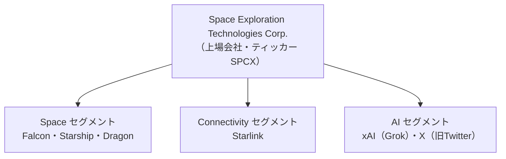

# 帝国の統合 ― SpaceX＋xAI＋X

ここで一歩引いて、「なぜこの3社が一つになったのか」を見ておきたい。今回上場する会社は、もともと別々だった企業が数年かけて合体した結果できあがっている。その成り立ちを理解すると、財務数値の意味も、会社の狙いも、はっきり見えてくる。

## 一つになるまでの順番

統合は2段階で進んだ。順を追うとこうなる。

1. **2022年10月** … Elon MuskがTwitterを買収（個人として）
2. **2023年3月** … xAI（X.AI Corp）が始動。Grokの開発が始まる
3. **2025年3月28日** … xAIがX（旧Twitter）を買収（**X Merger**）。XはxAIの完全子会社に
4. **2026年2月2日** … SpaceXがxAI（Xを含む）を買収（**xAI Merger**）。xAIはSpaceXの完全子会社に
5. **2026年5月4日** … 5対1の株式分割を実施
6. **2026年6月** … IPO申請

## なぜ財務が「3社合算」で語られるのか

ここで会計上の大事なポイントがある。目論見書の財務諸表は、過去にさかのぼって**3社を合算したかたち**で作り直されている。だから「2025年の連結売上187億ドル」といった数字には、当時まだ別会社だったxAIやXの分も含まれている。

なぜそんなことができるのか。答えは「**共通支配下（common control）**」だ。SpaceX・xAI・Xは、いずれもMuskが議決権の過半を握って支配していた。法律上は別会社でも、支配しているのは同じ一人。そのため会計ルール上、これらの統合は「他人の会社を買った（M&A）」ではなく「もともと同じ支配下にあったものの組み替え」として扱われる。

この扱いの結果、次のことが起きている。

- 過去の決算が、3社を最初から一体だったものとして**再表示**された
- 通常のM&Aで生じる「のれん（買収プレミアム）」は計上されていない
- これは「報告主体の変更」にあたる

つまり、私たちがこの記事で見てきた財務数値は、「3社が最初から一つの会社だったら、こう見えたはず」という再構成された姿だ。読むときはこの前提を頭の片隅に置いておきたい。

## なぜ束ねるのか ― 垂直統合という思想

では、そもそもなぜMuskはこれらをSpaceXの下に集めたのか。表向きの事業はバラバラに見える。ロケット、衛星通信、AI、SNS――共通点が分かりにくい。

だが、SpaceXの描く未来図では、これらは一本の線でつながる。鍵は「**軌道上のAIデータセンター**」構想（05章）だ。これを実現するには、3つすべてが要る。

- **打ち上げ（Space）** … 数百万基のAI計算衛星を、安く大量に軌道へ運ぶ（Starship）
- **通信（Connectivity）** … 宇宙のAIと地上の利用者を低遅延でつなぐ（Starlink）
- **AI（xAI/Grok/X）** … 軌道で動かす中身そのもの（モデルと計算インフラ）

要するに、「宇宙にAIインフラを築く」という一つのゴールから逆算すると、3事業は別々ではなく、同じプロジェクトの3つの部品になる。これが垂直統合（自分で全部の層を握る）の発想だ。外注の都合や他社のボトルネックに左右されず、設計から打ち上げ、運用、AIまで一気通貫で回す。

この思想は、すでに広がりつつあるパートナー網にも表れている。

| 相手 | 関係 | 狙い |
|---|---|---|
| Tesla | 「Terafab」で年1テラワットの計算ハード製造、「Macrohard」でソフト開発 | チップ・ハードまで自前化 |
| Intel | 2026年4月にTerafabへ参加 | 高性能チップの設計・製造 |
| Anthropic | 計算能力を提供（月12.5億ドル・2029年5月まで） | 余剰コンピュートの外販 |
| Cursor（Anysphere） | 計算提供＋買収オプション（想定企業価値600億ドル） | 開発者データとアプリ層の取り込み |

ロケット会社が、チップ工場やAIスタートアップやSNSまで抱える――一見ちぐはぐなこの構成は、「宇宙にAIを持っていく」という最終目標から見れば、すべて必要な部品として説明がつく。今回のIPOは、その壮大な構想を一つの上場会社として束ね上げた瞬間でもある。

**参考ソース:**

- [Space Exploration Technologies — Form S-1/A（SEC目論見書）](https://www.sec.gov/Archives/edgar/data/1181412/000162828026040364/spaceexplorationtechnologib.htm)
